# 用 Scikit 学习 Python 线性回归的初学者指南

> 原文：<https://medium.com/analytics-vidhya/a-beginners-guide-to-linear-regression-in-python-with-scikit-learn-6b0fe70b32d7?source=collection_archive---------6----------------------->

最重要的算法


照片由 [Unsplash](https://unsplash.com?utm_source=medium&utm_medium=referral) 上的 [h heyerlein](https://unsplash.com/@heyerlein?utm_source=medium&utm_medium=referral) 拍摄

## 什么是机器学习

ML 是一个研究领域，它赋予计算机无需编程就能学习的能力。

这意味着程序将根据经验自己训练，这意味着通过观察数据他们可以做出决定。

# 监督学习

在监督学习中，我们获得了一个数据集，我们已经知道了与变量的关系，我们使用训练数据集训练机器，并基于该数据集，机器将预测未知数据的结果。

示例:

(a)回归——在回归问题中，我们试图在连续输出中预测结果。

(b)分类——相反，我们试图预测离散输出的结果。换句话说，我们试图将输入变量映射到离散的类别中。

# 无监督学习

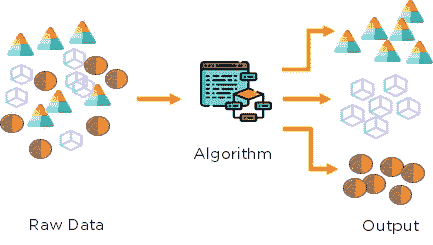

无监督学习允许我们在很少或根本不知道我们的结果应该是什么样的情况下处理问题。我们可以从数据中推导出结构，而不一定知道变量的影响。

我们可以通过基于数据中变量之间的关系对数据进行聚类来得到这种结构。

对于无监督学习，没有基于预测结果的反馈。

**无监督学习的类型**

无监督学习有两种类型。它们是:

*   **聚类:**聚类用于对不包含预先标记的类或类属性的数据进行分析和分组。
*   **关联:**关联发现集合中项目同时出现的概率。

# 线性回归是监督学习的一部分

回归分析是一种统计技术，用于描述变量之间的关系

最简单的例子是一个变量 Y，称为因变量或目标变量，与一个变量 X 相关，称为自变量或解释变量，或简单地称为阻遏物。

如果 Y 和 X 之间的关系被认为是线性的，那么直线的方程可能是合适的:

Y = β1 + β2X，其中β1 是截距项，β2 是斜率。

## 使用的库:

[**Scikit-learn**](https://scikit-learn.org/stable/auto_examples/release_highlights/plot_release_highlights_0_23_0.html)**:T**his 是一个开源的机器学习库，用于回归、分类、聚类等各种算法。

[**seaborn**](https://seaborn.pydata.org/) : Seaborn 代表统计数据可视化，用于交互式可视化。

**我们开始吧:**

```
Pip install sklearn
```

一旦你运行以上代码，Scikit 学习库将被安装在你的系统中。

在本教程中，我将使用 [**波士顿**](https://www.kaggle.com/c/boston-housing) 房屋数据集，其中包含波士顿不同房屋的信息。在该数据集中，包括目标变量在内，有 506 个样本和 14 个特征变量。

首先，我将导入重要的库:

```
import numpy as np
import pandas as pdimport matplotlib.pyplot as plt
import seaborn as sns
```

接下来，我将导入波士顿数据集:

```
# importing boston dataset
df=pd.read_excel('Boston_Housing.xls')
df.head()
```

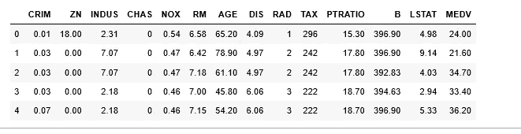

数据帧

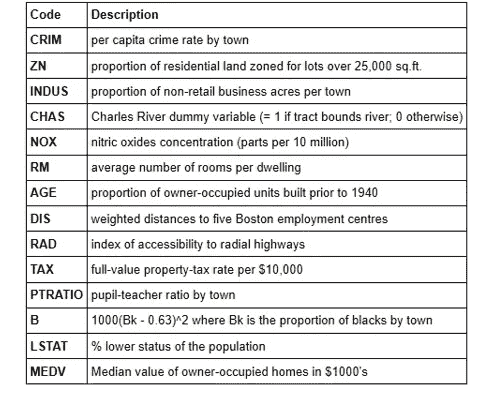

变量描述。

MEDV 是我们的目标变量，也就是 y。

# 数据预处理:

查看数据中是否有任何缺失值是一种很好的做法。我们使用`isnull()`计算每个特征的缺失值的数量

```
df.isnull().sum()
```

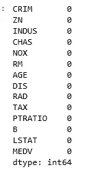

这意味着我们在这个数据集中没有任何空值。

一旦我们加载了数据框，现在最重要的事情是我们需要确定哪个特征(我们将在回归算法中需要的变量)这是我们应该关注的一个方面，因为回归模型的准确性将取决于我们将使用的变量。

## **EDA(探索性数据分析)**

EDA 是正确理解数据的一个非常重要的步骤，我们将创建一些可视化并查看相关性，以及查看哪些变量与模型更相关。

```
df.describe()
```

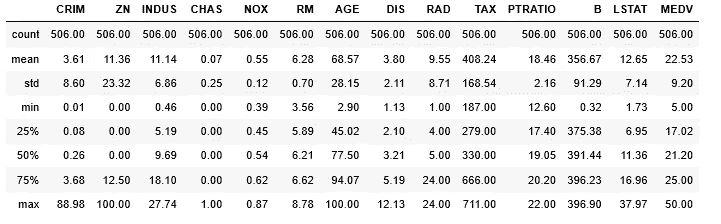

数据的描述

从上面的输出中，我将尝试了解数据集的性质，当我说性质时，这意味着数据集是否遵循正态分布？或者数据集有噪声，在这种情况下，我们将看到列方向的趋势。

因此，我们将观察平均值、标准差、最小值、中值(中值代表第 50 个百分位或数据的中间值)和最大值。

如果我们看到卷曲列的最小值和最大值之间存在巨大差异，它们的平均值和中值也存在差异，这意味着该列有噪声。类似地，如果您观察所有列，RM 似乎或多或少遵循正态分布，为了更加清晰，让我们创建一些可视化。

```
sns.pairplot(df,height=1)# there are lots of featers in the graph so its hard to see the trend tough if you observe RM ,
#LSTAT are following normal distrinution other than that NOX , LETS SEE THE Correlation matrix
```

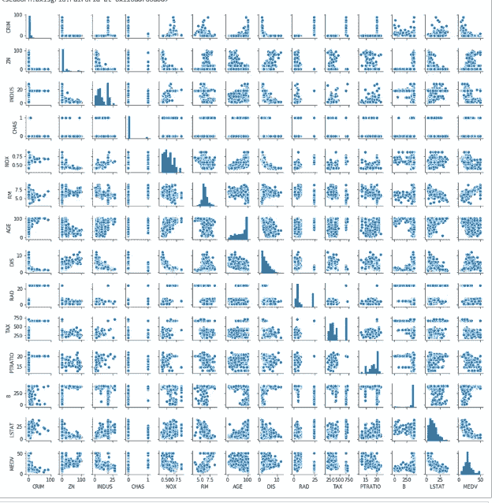

```
col_study = ['ZN', 'INDUS', 'NOX', 'RM']
sns.pairplot(df[col_study], size=2.5);
plt.show
```

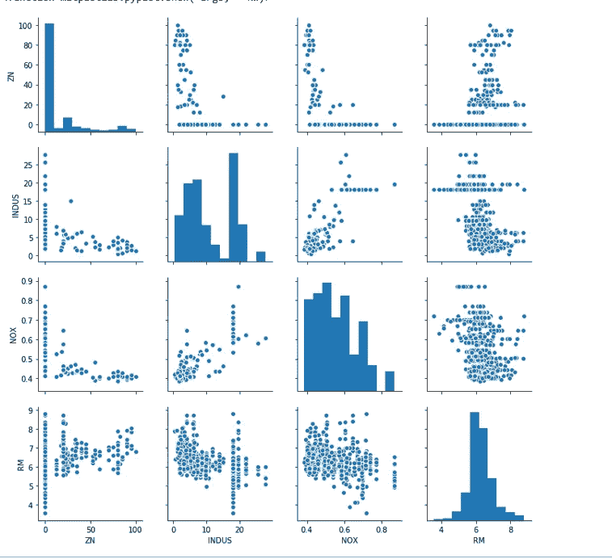

从上面的可视化中，您可以看到 RM 遵循正态分布，尽管有一些异常值。

其他滤波器我们使用相关系数进行特征选择正如我之前所讨论的，让我们来看看相关系数:

```
df.corr()
```

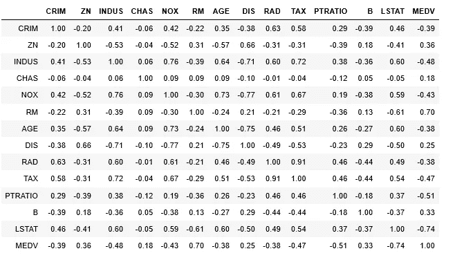

相关矩阵

从上面的矩阵中，如果你看到 RM**相对于 MEDV 有 0.7 的系数，这是正相关的，这意味着如果公寓中有更多的房间，价格就会很高，这是显而易见的。**

如果你看到 **LSTAT** 的系数为-0.74，这意味着负相关。

为线性回归模型选择特征的另一个要点是检查多重共线性。特征`RAD`、`TAX`具有 0.91 的相关性。这些特征对彼此之间有很强的相关性。我们不应该同时选择这两个特征来训练模型。特征`DIS`和`AGE`也是如此，其相关性为-0.75。

```
plt.figure(figsize=(16,10))
sns.heatmap(df.corr(), annot=True)
plt.show()
```

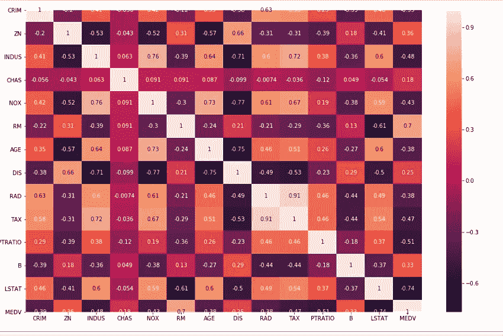

热图

因此，在本教程中，我选择 RM 作为 X(独立变量)，为了练习，您可以使用多个特征，也许您可以包括 LSTAT，并尝试查看预测。现在，让我们用 RM。

**Y (MEDV)= β1 + β2X(RM)**


凯文·Ku 在 [Unsplash](https://unsplash.com?utm_source=medium&utm_medium=referral) 上拍摄的照片

```
X= df['RM'].values.reshape(-1,1)
X
```

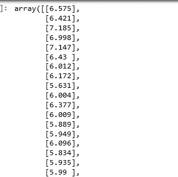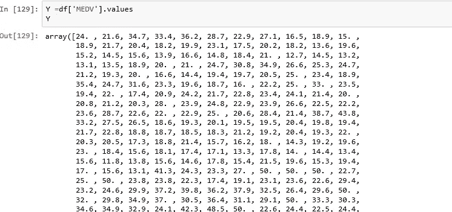

```
from sklearn import linear_model
from sklearn.linear_model import LinearRegression
```

在本教程中，我不会将数据集分为训练和测试，我将在下一个教程中演示。

```
model=LinearRegression()
model.fit(X,Y)
```

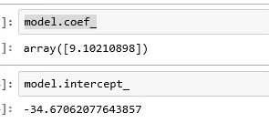

```
plt.figure(figsize=(10,5))
sns.regplot(X,Y)
plt.xlabel('RM')
plt.ylabel('MEDV')
```

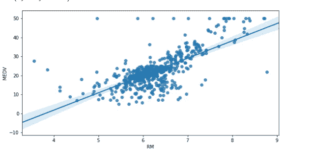

在上图中，你可以看到有一些异常值。所以让我们根据 RM 来预测价格。

```
k=np.array([5,10,15,2,1]).reshape(-1,1)
model.predict(k)
```

输出:

数组([ **10.83992413，56.35046904，101.86101394，-16.46640281，-25.5685118** ])

**结论:**

线性回归是非常简单和令人惊奇的算法，线性回归模型的最大优点是线性:它使估计过程简单，最重要的是，这些线性方程在模块级别上有一个容易理解的解释。在下一个教程中，我们将讨论模型的准确性和性能以及更多内容。

我希望这篇文章能帮助你并节省大量的时间。如果你有任何建议，请告诉我。

快乐编码。

***Prabhat Pathak****(*[*Linkedin 简介*](https://www.linkedin.com/in/prabhat-pathak-029b6466/) *)是助理分析师。*


[Evie S.](https://unsplash.com/@evieshaffer?utm_source=medium&utm_medium=referral) 在 [Unsplash](https://unsplash.com?utm_source=medium&utm_medium=referral) 上拍摄的照片