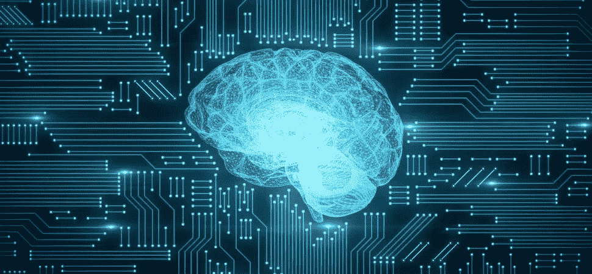
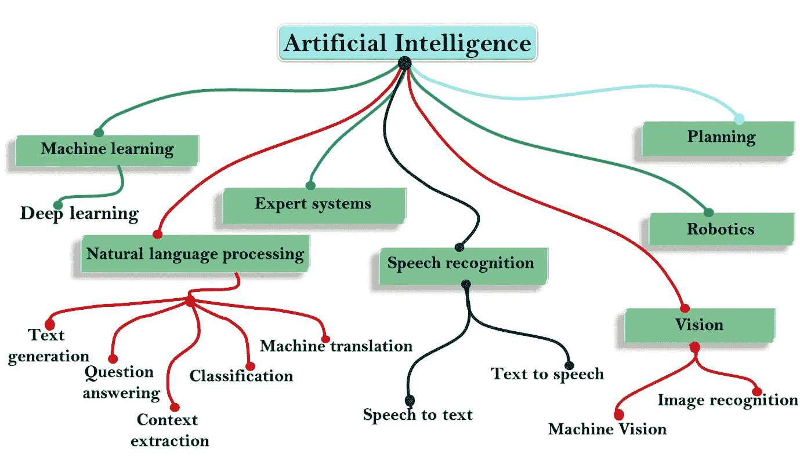
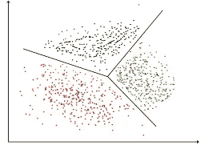
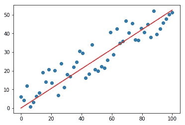
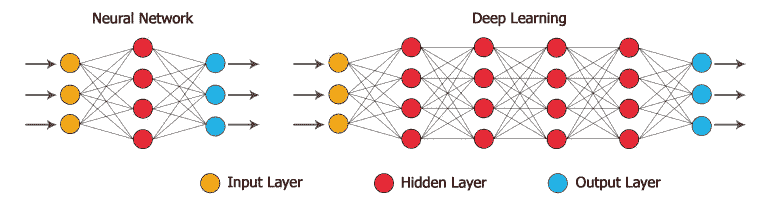
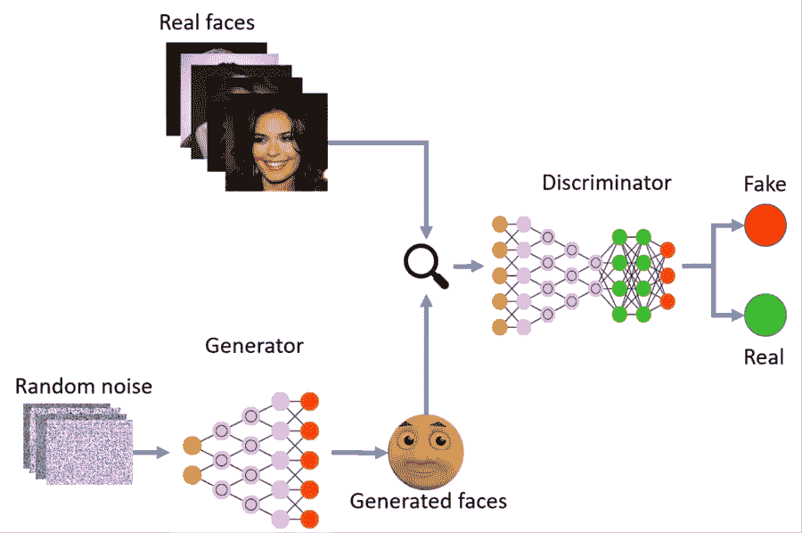

# 机器学习初学者指南

> 原文：<https://medium.com/analytics-vidhya/a-beginners-guide-to-machine-learning-6f6ac495d8eb?source=collection_archive---------22----------------------->

你有没有想过网飞如何选择推荐什么电影，Siri 如何响应你的命令，或者自动驾驶汽车如何在路上导航？嗯，这都要归功于被称为**人工智能**——简称 AI——的研究领域。

但是 AI 的领域到底是什么，关注的是什么？

[https://www . Inc . com/Andrew-Thomas/50 亿美元产业将被人工智能改变-ai.html](https://www.inc.com/andrew-thomas/5-billion-dollar-industries-that-will-be-changed-by-artificial-intelligence-ai.html)

嗯，AI 简单来说就是指**机器**对人类流程的模拟。换句话说，它本质上是寻求建造能够推理、学习和智能行动的机器。

很简单，对吧？

但是人工智能是许多更具体的子类别或“分支”以及许多表现形式的总称。

[https://www.javatpoint.com/subsets-of-ai](https://www.javatpoint.com/subsets-of-ai)

我们来看看 AI 最常见的分支:**机器学习**。

# 机器学习

> *机器学习是用数据来回答问题。*

然而，在机器能够将输入的数据转化为答案之前，它必须首先接受训练。这个过程被称为**数据挖掘**，有 3 种不同的方法可以完成:

## 1.无监督学习

当输入的数据**是** **而不是**时，无监督学习发生。机器被迫接受数据并自己发现关于数据的信息。机器通过在给定的输入数据中模拟任何**隐藏模式**或**潜在结构**来做到这一点。

[https://www . geeks forgeeks . org/clustering-in-machine-learning/](https://www.geeksforgeeks.org/clustering-in-machine-learning/)

这方面的一个例子是**聚类分析**。从视觉上看，它就像右图一样。根据机器选择的相似性，输入的数据点被分成 3 组。这个算法被称为 **K-Means** 。

另一个应用是**异常检测**。例如，在上面提供的数据中，黑色集群的顶部有一个绿色数据点。该点作为异常值，可能是一个欺骗性的数据点。

当试图使用无监督学习时可能出现的问题是，机器可以从许多不同的角度对输入的数据进行分类。有时，机器可能无法预测，并以你不希望的方式对数据进行排序。

## 2.监督学习

另一方面，监督学习发生在输入数据**被标记为**时。带标签的数据是已经有对应的输出附加到每个数据点的输入数据。然后，机器使用标记的数据来学习和训练自己。

在用大量数据训练自己之后，机器的算法将能够准确地**预测**未标记数据点的输出将基于未标记数据点最适合的标记数据点。

监督学习的两个有用的例子是图像分类和回归。

[https://www . mathworks . com/solutions/deep-learning/convolutionary-neural-network . html](https://www.mathworks.com/solutions/deep-learning/convolutional-neural-network.html)

**图像分类**是通过**卷积神经网络**完成的。CNN 的工作方式是首先拍摄一个特定物体的大量照片——就像上图中的汽车。从这个输入的数据中，它将重要性(权重)分配给对象的各个方面，以便将对象的图像与其他对象的图像区分开。当输入另一幅图像时，它检查该图像的特征的权重，并将其与已学习的特征的权重进行比较，以便对输入的图像进行分类。

[https://gilberttanner.com/blog/linear-regression-explained](https://gilberttanner.com/blog/linear-regression-explained)

监督学习的另一个简单得多的例子是**回归**，它用于预测连续值。这方面的一个例子是左侧所示的线性回归。它建立了一条线的模型，该线根据数据点的 x 值预测数据点的 y 值。

尝试使用监督学习时可能出现的一个问题是**过拟合**的想法。如果机器过于强调标记数据和新数据的放置的准确性，机器可能会崩溃。

## 3.强化学习

当机器通过**试错法**努力实现一个目标时，强化学习就会发生。该机器采用的理念是每次试验的累积奖励**最大化**。它能够通过利用来自先前失败尝试的反馈来增加其奖励，直到它最终达到最佳结果并实现其目标。

强化学习的一种使用方式是当机器试图击败视频游戏时，例如几何冲刺。起初，机器不知道该做什么。但是，经过多次迭代后，它会慢慢地计算出需要在什么时候跳跃才能完成这一关。

[https://giphy.com/gifs/cycles-s3kjB4ghuUAyQ](https://giphy.com/gifs/cycles-s3kjB4ghuUAyQ)

但是**深度学习**是如何进入这一切的呢？

# 深度学习

深度学习是机器学习的一个分支，其中**自学**系统使用现有数据，通过算法发现的模式对新数据进行预测。

深度学习机器可以通过无监督学习或监督学习来训练，它们通过使用模拟人脑神经元的人工**神经网络**来工作。

[https://towards data science . com/applied-deep-learning-part-1-artificial-neural-networks-d 7834 f 67 a4 f 6](https://towardsdatascience.com/applied-deep-learning-part-1-artificial-neural-networks-d7834f67a4f6)

使用的神经网络有三层:输入层、隐藏层和输出层。

1.  **输入层**是将初始数据引入系统的地方。
2.  **隐藏层**位于输入层和输出层的中间，是所有“深度学习”实际发生的地方。它通过对加权输入执行可学习的计算来产生净输入，然后应用非线性激活函数来产生最终输出。
3.  **输出层**为给定的输入数据产生结果。

传统的机器学习神经网络和深度学习神经网络的区别在于隐含层的**复杂度**。深度学习神经网络具有多个隐藏层，允许算法对非线性关系进行建模。

[https://alpha bold . com/neural-networks-and-deep-learning-an-overview/](https://alphabold.com/neural-networks-and-deep-learning-an-overview/)

现在我们知道了什么是深度学习，让我们来看看一个有用的应用。

# 生成对抗网络

GAN 的目标是生成新样本。

在一个 GAN 中，有 2 组神经网络:发生器**和鉴别器**。

[https://medium . com/sigmoid/a-brief-introduction-to-gans-and-how-to-code-them-2620 ee 465 c 30](/sigmoid/a-brief-introduction-to-gans-and-how-to-code-them-2620ee465c30)

GAN 首先被赋予**训练集数据**——就像上图中的人脸一样。然后生成器试图**从符合训练集数据的随机噪声中生成假样本**。鉴别器将试图通过输出样本为真的概率(0–1)来确定生成的样本是**真的还是假的**。生成器会慢慢提高假样本的质量。然而，与此同时，鉴别器也将提高识别假样本的能力。它们都将不断改进，直到生成的样本与来自原始训练集数据的样本几乎**相同**。

感谢您花时间阅读我关于 AI 的文章。我希望你喜欢它，并学到了新的东西！如果你想做一些自己的研究，我建议你去看看下面的网站(我也把它们作为资料来源):

 [## 用于目标检测的深度神经网络

### 部分:神经信息处理系统进展 26 (NIPS 2013)深度神经网络(DNNs)最近…

papers.nips.cc](https://papers.nips.cc/paper/5207-deep-neural-networks-for-object-detection)  [## 卷积神经网络综合指南 ELI5 方法

### 人工智能见证了人类能力差距的巨大增长…

towardsdatascience.com](https://towardsdatascience.com/a-comprehensive-guide-to-convolutional-neural-networks-the-eli5-way-3bd2b1164a53)  [## 介绍深度学习和神经网络——新手的深度学习(1)

### 在 Twitter 上关注我，了解更多关于深度学习创业公司的生活。

towardsdatascience.com](https://towardsdatascience.com/introducing-deep-learning-and-neural-networks-deep-learning-for-rookies-1-bd68f9cf5883)  [## 监督学习与非监督学习-最好的 7 个有用的比较

### 监督学习和非监督学习都是机器学习任务。监督学习只是一个过程…

www.educba.com](https://www.educba.com/supervised-learning-vs-unsupervised-learning/)  [## AI-Java 点的子集

### 到目前为止，我们已经了解了什么是人工智能，现在我们将在这个主题中了解人工智能的各种子集。跟随…

www.javatpoint.com](https://www.javatpoint.com/subsets-of-ai)  [## 什么是强化学习？-来自 Techopedia 的定义

### 强化学习 RL 的定义-强化学习，在人工智能的背景下，是一种…

www.techopedia.com](https://www.techopedia.com/definition/32055/reinforcement-learning-rl)