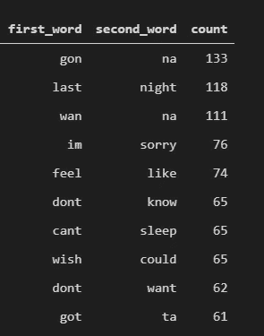
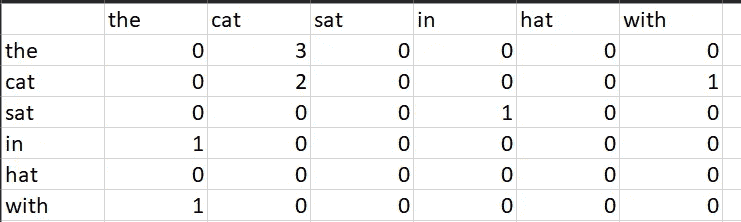
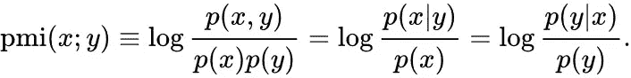

# 自然语言处理入门指南—第 2 部分

> 原文：<https://medium.com/analytics-vidhya/a-beginners-guide-to-natural-language-processing-part-2-fdf73667df13?source=collection_archive---------14----------------------->

预处理和文本清理在向人们介绍 NLP 的本系列文章的第 1 部分中有所介绍。在这篇文章中，你会发现:

1.  代币。
2.  N-grams。
3.  共生矩阵。
4.  PMI——逐点互信息。

# 代币

标记是构成句子的单位。它可以是一系列字符、数字、标点符号或它们的组合，通常用空格隔开。

根据所使用的包的不同，令牌的识别方式也不同。对于一些包，像 **NLTK** ，标点符号也被视为单独的标记。所以单词**T5 不能 会拆分成 2 个令牌**ca和**n 不能 。但是有了像 Spacy 这样的库，它将仍然是一个单词。然而，它通过将标点符号附加到它所伴随的单词上，产生了另一个问题。如下例所示， ***叹息，*** 由 NLTK 制作了 2 个令牌，而由 Spacy 制作了一个令牌。******

NLTK 中的过程似乎更容易，因为它给出了一个列表作为回报。然而，在扩展到更大的数据集和更下游的过程时，尽管有开销，Spacy 做得更快。

令牌作为单独的实体通常没有什么意义。虽然它们确实向机器传达了字典的意思，但它们没有给出任何上下文，也没有给出句子的方向。为了解决这个问题，我们使用 N 元语法。

# N-Grams

N-gram 是通常同时出现的 N 个标记的组合。比如***new****这个词在很多语境中出现，但是 ***york*** 这个词却和 ***new 频繁出现。*** 所以我们把两者结合起来，得到 ***纽约*** 给出更好的信息。*

*组合两个代币(**一**克)给我们一个**比**克。高阶**n**-gram 由 2 (n-1)个 gram 组成。2 个二元组给出一个**三元组**克，2 个三元组形成一个**四元组**克，以此类推。*

*在 [Twitter 数据集](https://www.kaggle.com/coder98/twitter-data/version/1)中发现的几个常见二元模型及其频率如下所示。*

**

*从推特收集的 10 个大人物。*

*正如你所看到的，像*got*、*got*和 *wanna* 这样的词经常与撇号一起使用，并被分成两个词。名单上的其他人，对我们来说似乎很容易预测。但是当数据集不熟悉时，或者当它比我们所能理解的大得多时，我们可能无法从数据中获得很多意义来验证我们自己的二元模型。*

*因此，当有许多二元模型具有相同的第一个标记或相同的最后一个标记时，统计度量在更准确地识别二元模型和定义它们的优先级方面是有用的。*

# *共现*

*我们能想到的最简单的方法之一，就是计算它们一起出现的次数，来找出记号之间的紧密联系。用专业术语来说，这叫做共现。它简单地计算一个标记跟随另一个标记的次数，并形成评分标准。通常，这被表示为 n*n 阶的矩阵，其中 n 是一组字符串/文档中唯一标记的总数。*

*对于集合串:
'猫坐'，'猫坐在帽子里'，'戴帽子的猫'，共现矩阵看起来是这样的。*

**

*共现矩阵来查找二元模型，其中行名是第一个单词，列名是第二个单词。*

*然而，这是一种相当幼稚的方法，因为它只提供计数。我们需要一种更健壮的方法，同时考虑其他参数，比如一个标记在整个语料库中出现了多少次，以及它作为二元模型的一部分出现了多少次。*

## *逐点互信息(PMI)*

*如果令牌 *play* 在语料库中总共出现 100 次，并且紧接在令牌 *cricket* 之前出现 5 次，则用 *play cricket* 替换令牌 *play* 是不合逻辑的。但是，如果它紧接在令牌*足球*之前出现 95 次，那么将令牌*玩*替换为*玩足球*似乎在直觉上是正确的。*

*考虑到形成 N 元语法的目的是减少独特标记的数量以形成健壮的语料库，这个过程似乎是恰当的。PMI 是以相对方式形成二元模型的可用指标之一。*

*PMI 是使用条件概率计算的。*

**

*PMI 计算公式。*

*p(x|y) =在记号 y 之后找到记号 x 的概率
p(y|x) =在记号 x 之后找到记号 y 的概率
p(y) =记号 y 在整个语料库中的概率。p(x) =标记 x 在整个语料库中的概率。*

*下面给出了使用 NLTK 查找 PMI 分数和二元模型的示例代码段。*

*在本系列的[下一部分](https://chraviraj.medium.com/a-beginners-guide-to-natural-language-processing-part-3-edad0799397a)中，您将会发现——词性标注、词干提取和词汇化。*

*我真的希望你喜欢这篇文章。如果这篇文章有帮助，请为它鼓掌。欢迎任何建议或批评。感谢阅读！*