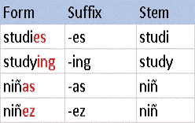
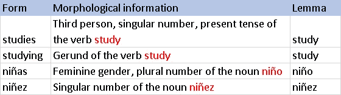

# 自然语言处理入门指南—第 3 部分

> 原文：<https://medium.com/analytics-vidhya/a-beginners-guide-to-natural-language-processing-part-3-edad0799397a?source=collection_archive---------15----------------------->

作为对 NLP 的介绍，本系列文章的第 2 部分中的[部分介绍了带有评分指标的令牌和 N 元文法。](https://chraviraj.medium.com/a-beginners-guide-to-natural-language-processing-part-2-fdf73667df13)


[Edho Pratama](https://unsplash.com/@edhoradic?utm_source=medium&utm_medium=referral) 在 [Unsplash](https://unsplash.com?utm_source=medium&utm_medium=referral) 上的照片

在本文中，在简单讨论了数据解析之后，您会发现:

1.  位置标记。
2.  堵塞。
3.  词汇化。

# 什么是数据解析？

传统的句子分析是作为理解句子或单词的确切含义的方法来完成的。通常解释主语和谓语等各种划分的重要性。对于计算机来说，数据解析是一个类似的过程，它通过将字符串分解成各个组成部分来分析字符串，每个组成部分都变成对系统有意义的片段。

## 为什么需要数据解析？

经过预处理和清理后，对人类思维来说，这似乎是直观的，文本现在是干净的，很容易理解有意义的单词序列。我们理解词类，我们理解主语和谓语的概念。然而，对机器来说，它们仍然不是有用的形式。文本仍然是多余的，并且没有向机器传达任何语法规则。

对人类来说，单词的顺序——“拉维打出来的信”和“拉维打出来的信”一样有意义但是对于机器来说，这两种说法都没有任何意义。它仍然不理解“ravi”是主语，也不理解“typed”是动词的过去式。让你对自己的想法心存感激，不是吗？为了引导系统并让它对单词有所了解，我们通常会执行一系列步骤。

## 词性标注

这是向系统解释不熟悉文本的语法规则的第一步。我们知道 RUN 是一个动词，因为它意味着行动。虽然机器可以访问字典来理解 RUN 的定义，但它需要通过定义被告知它是一个动词。就像一个一年级学生通过他的老师理解动词一样，在这一步中，标记是一年级机器的老师。

POS 代表词性。词性标注是根据上下文和定义将语料库中的单词标记到语音标签的相应部分的过程。

有许多方法可以实现这一点:

1.  基于词汇的方法——指定的词性标签是在训练语料库中单词出现频率最高的标签。
2.  基于规则的方法—分配的 POS 标签基于规则。例如，有一条规则规定，以“ed”或“ing”结尾的单词必须分配给动词。
3.  概率方法—分配的 POS 标签基于特定标签序列出现的概率。
4.  深度学习方法——也有递归神经网络可以用于词性标注。

```
from nltk import pos_tag
pos_tag(['the', 'cat', 'sat', 'in', 'the', 'hat'])# Output
# [('the', 'DT'),('cat', 'NN'),('sat', 'VBD'),('in', 'IN'),
# ('the', DT'),('hat', 'NN')]
```

在上面的结果中:

*   DT —限定词
*   名词单数或复数
*   VBD —动词过去式
*   介词 IN

## 词干化和词汇化

在某些情况下，句子的状态很重要，而在某些情况下则无关紧要。在例子中，我们可以看到 SAT 被相应地归类为过去式。然而，举例来说，当我构建一个应用程序来检测动词并将句子分类为表示某种动作的句子时，时态并不重要。同样，在很多应用中，我们只需要单词最简单的形式。为了解决这个问题，我们有了词干化和词汇化这样的概念。

词干化是将单词缩减为词干、词根或词根形式的过程。这里，我们使用表示时态的常见后缀，并将它们从单词中删除。



词干的例子。

如果你看左边的表格，就会发现一个明显的问题，不是吗？ *Studi* 似乎不是任何一个英语单词的词根。删除像 *ed* 和 *es* 这样的后缀是一种试图删除不必要开销的幼稚方法。解决这个问题的另一种方法是，确保像被研究的单词*追溯到单词*研究*，我们使用词汇化。*

词元化是将一个单词的不同形式组合在一起的过程，这样它们就可以作为一个单独的项目进行分析，通过单词的词元或词典形式来识别。它需要一个清晰的字典来将一个单词的所有变体映射到它自己的词根。与词干不同，在字典的帮助下，它



词汇化的例子。

确保单词准确映射到原始词根。

如图所示，词干分析将*研究*转换为*研究*，将*研究*转换为*研究*。尽管有词干，仍然有两个不同的单词应该被机器处理。另一方面，词汇化将研究的*和研究*的*都映射到单词*研究*。因此，效率提高了，但是由于字典查找，对数据进行词汇化所花费的时间比对数据进行词干化所花费的时间要多得多。*

在本系列的下一部分，您将会看到向量和矢量器。

*祝大家学习愉快！我希望我的文章能有所作为，帮助你了解更多。如果有什么我需要改进的地方，一定要告诉我！拍手，跟帖，分享！*