# 主成分分析初学者指南

> 原文：<https://medium.com/analytics-vidhya/a-beginners-guide-to-principal-component-analysis-b26d90debefd?source=collection_archive---------12----------------------->

> 可以换一种方式看世界！

的确如此，如果数据对你来说意味着一切的话。

嗨，在这篇文章中，我们将看看机器学习的一个美丽的话题，它用于降低我们的数据的维度，称为主成分分析(缩写为 PCA)。

在开始之前，让我们先了解一下为什么我们需要降低数据的维度？

1. [*维度的诅咒*](/@anujshrivastav97/curse-of-dimensionality-the-curse-that-all-ml-engineers-need-to-deal-with-5d459d39dc8a)

*2。* *数据可视化:-* 显然，我们无法可视化维度大于 3 的数据，因此我们需要某种方式来表示我们的数据，如果不能，就用 2D 或 3D(或任何其他所需的维度数)来表示重要的特征，以便我们可以了解我们的数据是如何分布的。

让我们看看 PCA 中涉及的核心思想:

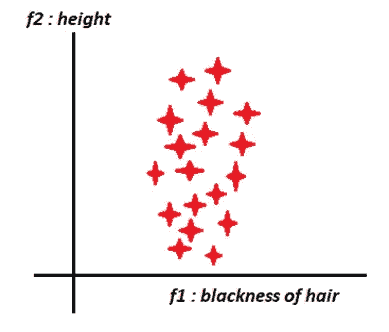

[来源:我的电脑]

> *如果我要求您将 2D 数据转换成 1D 数据，您会选择哪种功能？*

你显然会选择 f2= height，*为什么？*

你可以看到头发的黑色没有太多的传播/信息在里面。所以即使去掉它，只用高度来表示所有的点就足够了。

[来源:谷歌图片]

如果我给你以下数据:

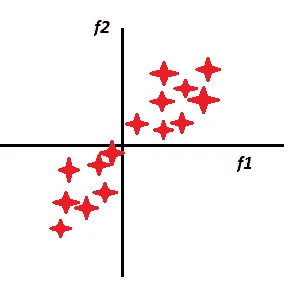

[来源:我的电脑]

*你现在能想出一个特色吗？*

特征 f1 和 f2 具有几乎相等的分布，因此我们提出新的特征如下:

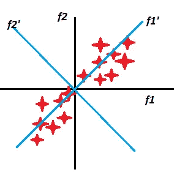

[来源:我的电脑]

现在，它变得和以前的问题相似了。

特征 f1’具有大量分布/信息，而 F2’没有。所以我们只选择 f1 '并删除 f2 '。

**核心思想:**选择/提取方差大的特征，去掉方差小的特征。

将 2D 数据简化为 1D 数据的步骤:

找出 f₁'和 f₂'，使得 f₁'有最大方差

放下 f₂'

将 xᵢ's 的所有点投影到 f₁'上

*这可以概括为将我们的数据从 d 维减少到 d’(d’<d)，但是为了简单起见，让我们只关注将 2D 数据减少到 1D 数据。*

在继续学习 PCA 背后的数学之前，请确保您精通以下主题

**特征值和特征向量**

**协方差矩阵**

**解决约束优化问题**

记住我们需要做的:我们需要找到沿着 f₁'的**或**(单位向量),并将所有 xᵢ投影到其上，以获得相应的 xᵢ'。**或**的选择应使 xᵢ'方差最大。

点 x₁在 x₁上的投影。**或**

投射所有的点，

我们得到了

xᵢ' = ûᵀ。xᵢ

还有，x̅=ûᵀ。x̅

即

mean(xᵢ') = ûᵀ。平均值(x ᵢ)

求③使得 x ᵢ}ᵢ ₌ ₁ ₜₒ ₙ投影的方差最大

或者麦克斯·ᵤ·瓦尔·ûᵀ.x ᵢ }

或者

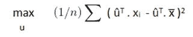

在对我们的数据进行列标准化之后，

x̅ **=**

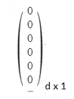

因此，

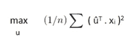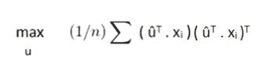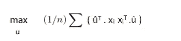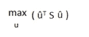

在哪里，

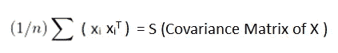

受到…的限制

ûᵀ.= 1(因为是单位向量)

***【解决约束优化问题(使用拉格朗日乘数)***

L (u，λ) = ûᵀ。s .λ((ûᵀ。û) -1)

偏导数 w . r . t . u，我们得到

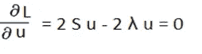

这将引导我们:

S.u = λ。u

这个等式是否让你想起了什么？

[来源:谷歌图片]

嗯，这是找出矩阵(在这种情况下，协方差矩阵 S)的特征值和特征向量的方程式

***嘭*** *！！！PCA 的整个问题归结为在标准化之后找到我们的数据的协方差矩阵的特征值和特征向量。*

我将把寻找特征值和特征向量的部分留给你。

*还记得吗，对于一个 k 维的方阵，我们会得到 k 个彼此正交的本征向量？*

[来源:谷歌图片]

这意味着我们将通过计算 X 的协方差矩阵的特征向量来获得我们的新特征集，但是获得的特征向量的数量将*等于*我们的数据的维度。

那么，我们怎样才能降低数据的维数呢？

为此，我们需要知道λ(特征值)意味着什么。

λᵢ讲述了向量 uᵢ的信息量。

让我们举一些例子:

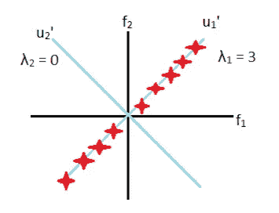

[来源:我的电脑]

在这个例子中，沿 u₁保留的方差/信息的分数将是

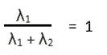

让我们看另一个例子

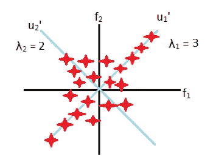

[来源:我的电脑]

沿 u₁保存的方差/信息的分数为

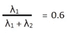

这意味着，如果我们去掉 u₂'，60%的差异/信息可以保留

一般来说，我们需要将数据从 d 维转换到 d '维(d' < d) , or reduce dimensions such that x% of variance/information is preserved .

*,我们该怎么做呢？*

答案很简单。

我们将首先计算标准化后 X 的协方差矩阵的特征值和特征向量

把它们分类。

选择顶部 d '特征值，并将所有点投影到相应的特征向量上

如果给定了 x%,选择最大的 p 个特征值，使得

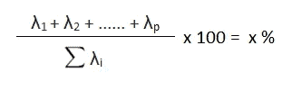

并将所有点投影到相应的 p 个特征向量。

Woah！你现在知道了主成分分析的所有基础知识

[来源:谷歌图片]