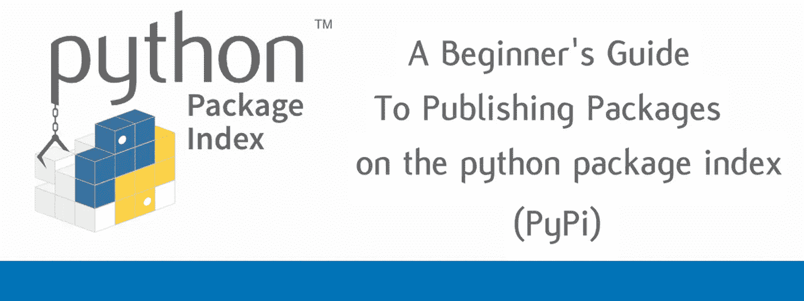
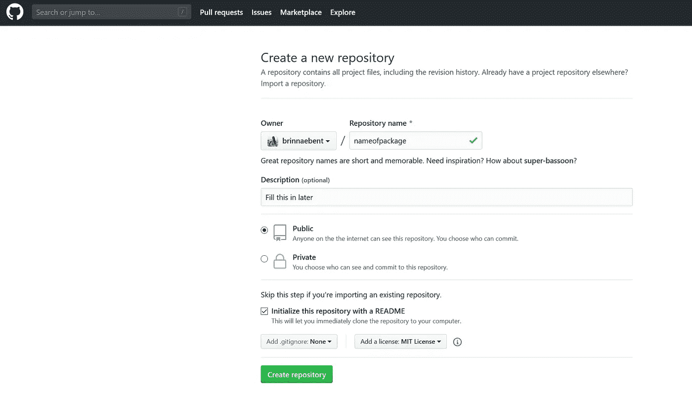
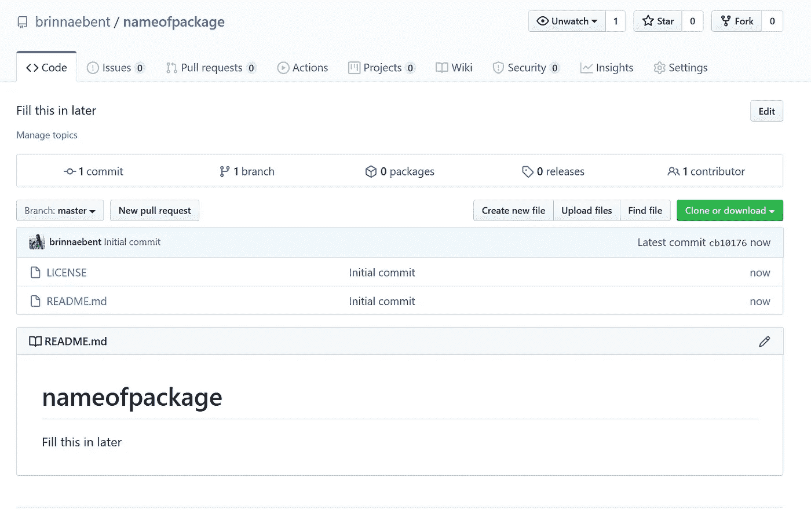
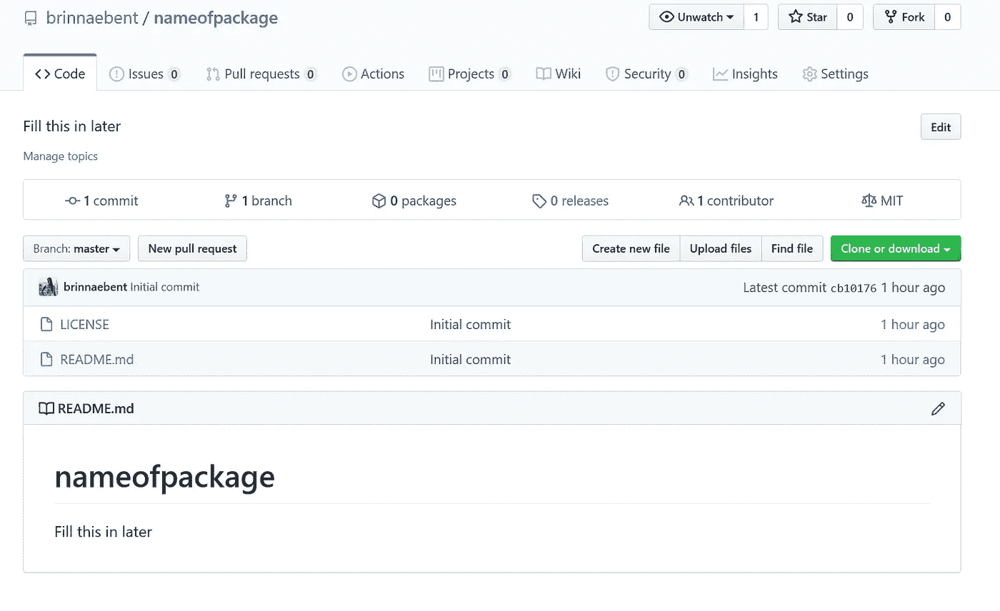
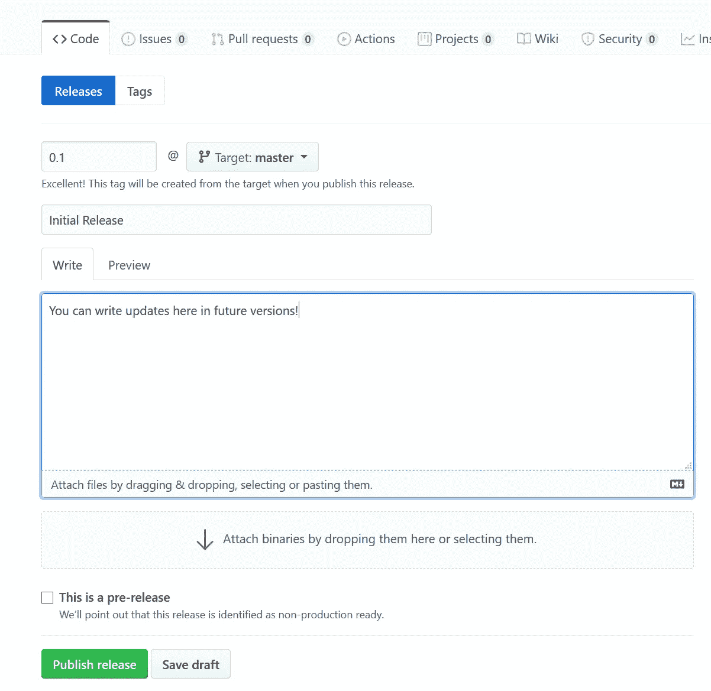
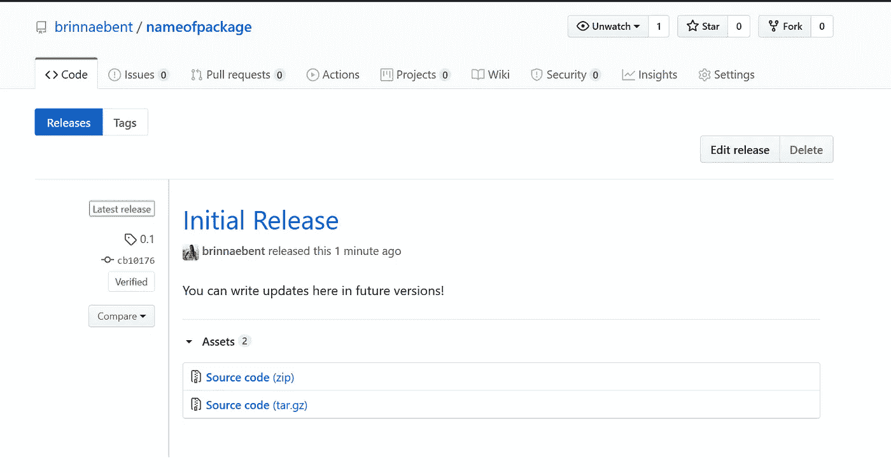

# 在 Python 包索引(PyPi)上发布包的初学者指南

> 原文：<https://medium.com/analytics-vidhya/a-beginners-guide-to-publishing-packages-on-the-python-package-index-pypi-a0157e13c174?source=collection_archive---------11----------------------->

在这里，我们将学习发布一个基本 python 包的步骤。

当我第一次决定发布 Python 包时，我很难为初学者找到资源。所以，这就是在 PyPi 中发布 Python 包并让您的工作公开的基础。



# 为什么要开发 Python 包？

通过开发和发布 python 包，您将使其他人能够使用(引用！)你的作品。包可以帮助促进与做类似工作的其他人的合作，并让你的工作得到宣传！即使在内部，使用 Python 包也有助于标准化您的工作流。你还在等什么？在 PyPi 上获取代码，并开始协作和标准化您的工作流。

# 基本假设

这是我希望你在教程开始之前做的事情:

1.如果您还没有安装 pip ，请安装它。

2.[如果你还没有 PyPi 账号](https://pypi.org/account/register/)(我建议使用非大学的专业邮箱)

3.有一些基于函数的(应该已经格式化为函数的)代码，您希望将其发布为 PyPi 包

4.有 GitHub，对 git 有基本的了解

# 决定许可证

首先，为你的软件包决定一个许可。这里有一个很有帮助的[资源](https://choosealicense.com/)，可以帮你决定最好的许可证！

# 命名您的包

选择一个独特的名称，这个名称要容易记忆，并且与软件包的功能相关。请记住，Python 包应该有简短的、全部小写的名称，并且不鼓励使用下划线。你可以在 pypi.org 上搜索，看看你的名字是否独一无二。您应该始终检查并确保您想要的 python 包名称不会覆盖任何内容(例如，“list”在 Python 中已经有了意义——您不会想要将您的包命名为“list”)。

点击这里查看要避免使用的名字。

# 记录您的代码

这是一个重要的部分，你可能会花大部分时间在这里！考虑其他人可能想要使用你的代码的所有方式，并确保你的函数要么 a)可通用(首选),要么 b)有很好的文档记录，这样其他人可以很容易地使用你的代码。

在每个函数的开头使用以下注释来记录每个函数:

# 贮藏室ˌ仓库

现在您已经检查并很好地记录了您的代码，让我们将您的包放在 GitHub 存储库中。输入软件包的确切名称作为存储库名称。确保将存储库设置为公共，使用自述文件初始化存储库，并添加选定的许可证。



现在，您的存储库应该如下所示:



是时候打开你的终端(Mac)或者 git Bash (Windows)或者任何你与 git 相关的东西了。将目录更改为您希望包所在的目录。我建议创建一个名为“Packages”的目录，将所有的包放在一个地方:

# 格式化您的存储库

是时候格式化您的存储库了。有很多方法可以做到这一点。对于本初学者教程，我将向您展示最简单的方法，但是如果您想了解更多或者需要不同格式的更复杂的代码体系结构，我在本教程的末尾提供了参考资料。

目前，您的 repo 中有一个 README.md 和一个许可证文件。您将在名为“yourpackagename”的存储库中添加一个目录(文件夹)。

现在，您的主目录应该包含:

*   许可证
*   README.md
*   包名(文件夹)

## __init__。巴拉圭

导航到您刚刚创建的目录。在这里，您将添加一个名为 __init__.py 的 python 文件。您最喜欢的编辑器中的 py 文件。在顶部添加依赖项、文档和函数，如下所示:

## setup.py

导航回您的主目录，README.md 就在那里。在这里，您将添加一个名为 setup.py 的 python 文件。我建议复制/粘贴以下代码并填写您的信息:

## setup.cfg

在主目录中，创建一个名为 setup.cfg 的文件。

## README.md

自述文件是 Python 包中最重要的部分之一，因为它告诉人们如何安装和使用它。拥有一个可重用的 Python 包需要一个好的自述文件。我推荐使用[迪林杰](https://dillinger.io/)来创建 READMEs。如果你使用[迪林杰](https://dillinger.io/)，你可以下载你制作的自述文件并替换当前目录中的文件。

现在，您的主目录应该包含:

*   许可证
*   README.md
*   setup.py
*   setup.cfg
*   包名(文件夹)
*   (在 Packagename 文件夹内):__init__。巴拉圭

通过 git 添加并提交这些文件。

# 设置版本控制

这一步会让你以后更容易进行编辑，所以不要跳过它！

把你的库推回 GitHub (origin master)。

现在，导航到您的 GitHub 存储库。在“发布”选项卡下，您将“创建一个新的发布”。版本应该与 setup.py 文件中的版本相同(如果您一直在学习，最初应该是 0.1)。



为了获得源代码，右键单击 tar.gz 链接，然后单击“复制链接位置”(其他浏览器可能会说“复制链接地址”)。使用此链接地址更新“下载 url”字段中的 **setup.py** 文件。



# 将您的包上传到 PyPi

等等。测试您的包。再测试一次。

好了，现在我们准备好上传到 Python 包索引了！

打开终端(Mac、Linux)或 Windows Powershell (Windows)。

首先，您将安装麻绳。你只需要在第一次这样做。一旦安装，twine 将使更新我们的包和上传到 PyPi 变得非常容易。

如果你去 pypi.org，你现在应该能够在“你的项目”中看到你的包，并且你应该能够搜索它！通过自己安装来测试您的软件包，以确保它能够正常工作:

```
pip install packagename
```

# 更新您的包

你瞧，即使在严格测试之后，你还是在你的代码中发现了一个 bug。或者您可能有一个新特性要部署到您的包中。无论哪种方式，在 PyPi 中更新您的包都不会令人头痛。请遵循以下步骤:

1.在本地存储库中进行更改。

2.更新 setup.py 文件中的版本号

3.推送至 GitHub，如上所述发布一个新版本，并使用新版本的 tar.gz 文件更新 setup.py download_url 字段

4.重复步骤将包上传到 PyPi

# 添加测试

在您的存储库中添加一个 test_ directory 是一个很好的实践，包括:

*   test_code.py(测试你的包的所有功能的测试代码)
*   test_results (markdown、jupyter notebook 或包含 test_code.py 结果的文本文件，以便测试您的代码的人可以确保它正常工作)
*   test_file.csv(如果您的包使用数据运行，这个文件是一小段去标识的数据，以确保您的包运行)

# 把你的包裹传出去

让人们知道他们可以通过 pip 安装您的软件包:

```
pip install packagename
```

写一篇关于你的新包裹的博客，在 LinkedIn 和 Twitter 上发布包裹，或者发布到你的个人网站上！

如果你想扩大你的软件包的覆盖范围，我建议看看《开放源代码软件杂志》(JOSS)和《开放研究软件杂志》(JORS)。

现在，您已经准备好开始更具挑战性的 python 包开发了！如果您想更深入地开发 Python 包和模块，请查阅下面的参考资料。

# 参考

https://pypi.org/

【https://realpython.com/pypi-publish-python-package/ 

[https://packaging.python.org/tutorials/packaging-projects/](https://packaging.python.org/tutorials/packaging-projects/)

[https://www . educative . io/edpresso/publishing-packages-on-pypi](https://www.educative.io/edpresso/publishing-packages-on-pypi)

[https://medium . com/@ Joel . bar mettler/how-to-upload-your-python-package-to-pypi-65 ed C5 Fe 9 c 56](/@joel.barmettler/how-to-upload-your-python-package-to-pypi-65edc5fe9c56)