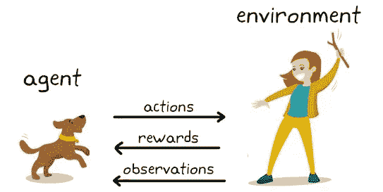

# 强化学习-基础

> 原文：<https://medium.com/analytics-vidhya/a-beginners-guide-to-reinforcement-learning-88a330d8d94e?source=collection_archive---------24----------------------->

想知道上面的图像与强化学习有什么关系吗？嗯，这是强化学习的一个例子。这篇文章将为你提供关于强化学习的最基本的解释。

## **什么是强化学习？**

它是一种机器学习技术，允许机器自动确定特定上下文中的理想行为，以最大化其性能。**机器在时间 *t* 学习经验，为时间 *t+1 做出决策。***

***让我们从一个简单的例子开始* :** 我们如何训练我们的宠物狗在我们扔球的时候帮我们捡球？每次我们做扔球的动作，当狗拿到球时，我们用它最喜欢的零食奖励它。
多次进行投掷和奖励的任务会让狗学习经验，然后训练它每次都这样做以获得**奖励。** 这是强化学习。
在这里，狗在时间 ***t*** 学习经验，在时间 ***t+1*** 迈出一步以获得奖励。

## 现实生活应用:

哪个老虎机会让我发财？

假设你去了一个赌场，有 5 个不同的老虎机可以玩。你有些钱，想从中获取最大利润。 **你会选择哪款机器？每台机器都有特定的赚钱机会，你想去买那台能让你发财的机器！！**

在这种情况下，你可以做两件事

1.  你可以用你的 25 美分硬币，每次都试试随机的吃角子老虎机，直到你用完所有的钱。这个过程也会为你赚到一些钱，但会很乏味，因为你也会失去很多时间。我们需要一种在 ***探索和*** 开发之间保持平衡的方式。

> 探索:我们想多次探索/使用所有的机器，这样我们就知道哪一台是最好的。

同时…

> 剥削:我们想在最赚钱的机器上多次使用我们的钱。

2.我们可以使用强化学习来学习每次使用老虎机时接下来选择哪台机器。使用这种技术，我们可以在勘探和开采之间保持平衡，并通过找到最佳机器来赚取最大利润。

## 强化学习的其他用例:

1.  从多个广告中选择最佳广告以增加利润。
2.  交通控制
3.  机器人学
4.  任何需要多次反复试验才能获得最佳选择的应用程序

我如何实现它？

为了应用强化学习，存在不同的算法，如:

1.  置信上限
2.  汤普森取样法等

在下一篇文章中，我们将使用 python 实现这些算法，并找出为什么强化学习超级棒！！

# 最终注释

这是我的第一篇文章，我希望你能学到一些东西！如果你们对这篇文章有什么想补充的，请随时留言，不要犹豫！任何形式的反馈都会受到真诚的感谢。不要害怕分享这个！谢谢！

查看本系列的下一篇文章:[置信上限](/@randadpratik456/reinforcement-learning-with-python-e458895d8abc)