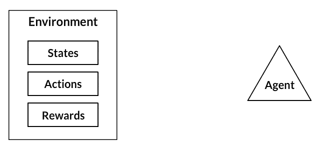
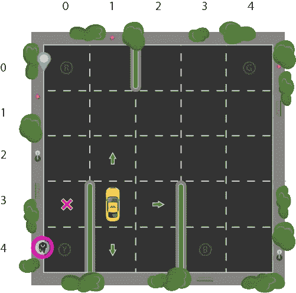
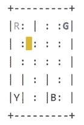
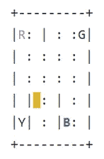
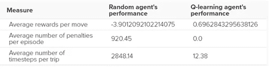

# 强化学习初学者指南及其从零开始的基本实现

> 原文：<https://medium.com/analytics-vidhya/a-beginners-guide-to-reinforcement-learning-and-its-basic-implementation-from-scratch-2c0b5444cc49?source=collection_archive---------1----------------------->

*现实世界类比强化学习的基础，以及从头开始使用 Python 训练自动驾驶出租车在正确的目的地接送乘客的教程。*

你们大多数人可能都听说过人工智能自己学习玩电脑游戏，一个非常受欢迎的例子是***【deep mind】***，其中在 2016 年击败韩国围棋世界冠军 ***AlphaGo*** 时轰动了新闻并震惊了世界。

> 那么这个重大突破背后的秘密是什么呢？沉住气！几分钟后你就会明白了。


强化学习的一个类比

让我们考虑一下教一只狗新的狗技巧的类比。在这个场景中，我们模拟了一种情况，狗试图以不同的方式做出反应。如果狗的反应是我们想要的，我们会奖励它狗粮。否则，我们会以这样或那样的方式传达出它的反应不是我们想要的。

现在，每一次狗暴露在同样的情况下，狗会以更大的热情执行类似的动作，期待更多的食物。这基本上是从积极的经历中学习该做什么。同样，当面对负面经历时，它会倾向于学习什么不该做。

> 这正是强化学习在更广泛意义上的工作方式！

*   狗是暴露在 ***环境*** 中的 ***特工*** 。*环境*可能是想到了你的房子，有了你。
*   遇到的情况类似于 ***状态*** 。一个*状态*的例子可能是你的狗站着，你在你的起居室里用某种特定的语气使用一个特定的词。
*   我们的*代理*通过执行 ***动作*** 做出反应，从一种状态转换到另一种状态。比如你的狗从*站着到跑着去抓棍子*。
*   过渡结束后，它可能会收到 ***奖励*** 或 ***惩罚*** 作为回报。你请客作为*奖励*或者干脆说*不*作为*惩罚*。
*   ***策略*** 是在给定一个*状态*的情况下，选择一个*动作*的策略，期望得到更好的结果。

> 现在，将所有这些放在一起…

一个 ***强化学习(RL)*** 任务是关于训练一个 ***智能体*** 与其 ***环境*** 交互。代理通过执行 ***动作*** 在环境的不同场景之间转换，称为 ***状态*** 。作为回报，行动产生 ***奖励*** ，可以是正数、负数或零。代理的唯一目的是在一集*中最大化累积 ***奖励*** 的概念，这是在初始状态和结束状态之间发生的所有事情，其中我们决定与我们想要完成的任务一致的奖励。*

*因此，我们 ***通过提供正奖励来强化*** 主体执行某些行为，通过提供负奖励来远离他人。这就是一个代理如何学习制定一个策略或 ***政策*** 。*

**

*强化学习过程的图解*

**强化学习是三种基本 ***机器学习*** 范式之一，与 ***有监督*** 和 ***无监督学习并列。*** 它的论及 ***开采*** 或 ***勘探。*****

> **一些需要注意的重要事项…**

1.  *****贪婪并不总是奏效***
    有些事情很容易为了即时的满足而去做，有些事情可以提供长期的回报。我们的目标是不要贪婪地只寻求快速的直接回报，而是在整个训练中优化以获得最大回报。**
2.  *****序列在强化学习中至关重要***
    奖励代理不仅仅取决于当前状态，而是整个历史状态。与监督和非监督学习不同，时间在这里很重要。**

**在某种程度上， ***强化学习*** 是利用经验做出最优决策的科学。分解一下，这个过程包括以下简单的步骤:**

1.  ***对环境的观察***
2.  ***使用某种策略决定如何行动***
3.  ***随机应变***
4.  ***接受奖励或处罚***
5.  ***从经验中学习并完善我们的战略***
6.  ***迭代直到找到最优策略***

> **回到 **AlphaGo** …**

***AlphaGo* 是一个 RL 代理的经典例子，代理已经学会了如何玩围棋来最大化它的回报。在本教程中，让我们通过实际开发一个代理来学习自动玩游戏来理解强化学习。**

> **强化学习不仅仅局限于游戏！**
> 
> **它用于管理股票投资组合和财务，用于制造人形机器人，用于制造和库存管理，用于开发通用人工智能代理等…**

# **从头开始设计无人驾驶出租车**

**我们来设计一个 S ***自动驾驶智能出租车*** 的模拟。主要目标是在一个简化的环境中演示如何使用 RL 技术来开发一种有效且安全的方法来解决这个问题。**

**智能出租车的工作是在一个地方搭载乘客，在另一个地方放下他们。我们希望智能出租车注意的事情:**

*   ***在正确的位置让乘客下车。***
*   ***尽可能缩短下车时间，以节省乘客的时间。***
*   ***注意乘客的安全和交通规则。***

**在对这个问题的 RL 解决方案建模时，这里需要考虑不同的方面:*奖励、状态和动作。***

## **1.奖励**

**由于 ***智能体*** *(假想驾驶员)*是奖励激励型的，并且将通过在环境中的试错经验来学习如何控制驾驶室，我们需要相应地决定 ***奖励*** 和/或 ***惩罚*** 及其幅度。这里有几点需要考虑:**

*   ***代理应该因为成功卸货而获得高额的正奖励，因为这种行为是非常可取的。***
*   **如果旅行社试图让乘客在错误的地点下车，应该受到处罚。**
*   **在每个时间步之后，代理应该因为没有到达目的地而得到一点负面的奖励。**
*   ***“稍微”否定，因为我们更希望我们的代理晚一点到达，而不是错误地试图尽快到达目的地。***

## **2.状态矢量空间**

**在 RL 中，代理遇到一个 ***状态*** ，然后根据它所处的状态采取 ***动作*** 。**

*****状态空间*** 是我们的出租车可能存在的所有可能情况的集合。状态应该包含代理做出正确动作所需的有用信息。**

**假设我们有一个智能出租车的培训区，我们在那里教它将停车场中的人运送到四个不同的位置(R，G，Y，B):**

****

**停车场中智能出租车的示意图**

***我们假设智能出租车是这个停车场唯一的车辆。我们可以把停车场分成一个 5x5 的格子，这样就有 25 个可能的出租车位置。这 25 个位置是我们状态空间的一部分。我们出租车的当前位置状态是(3，1)。***

**有 4 个位置可以让乘客上下车:***(row，col)坐标中的 R、G、Y、B*** 或`[(0,0), (0,4), (4,0), (4,3)]`。我们的乘客在位置 ***Y*** ，他们希望去位置 ***R*** 。**

**如果我们有 1 个额外的乘客在出租车内的状态，我们可以采用乘客位置和目的地位置的所有组合来得出我们的出租车环境的状态总数；共有 4 个目的地和 5 个 *(4+1)* 客运点。**

**因此，我们的滑行环境有*5×5×4 = 500*个可能的状态。*(出租车位置— 5×5，乘客位置— 5，目的地位置— 4)***

## **3.行为空间**

*****动作空间*** 是我们的 agent 在给定状态下可以采取的所有动作的集合。代理遇到 *500 个状态*中的一个并采取行动。在我们的例子中，行动可以是向一个方向移动或决定*搭载/放下一名乘客。***

**换句话说，我们有*六种可能的行动*:**

1.  **`south`**
2.  **`north`**
3.  **`east`**
4.  **`west`**
5.  **`pickup`**
6.  **`dropoff`**

**在上图中，由于墙壁的原因，出租车在某些状态下无法执行某些操作。在环境的代码中，我们将为每一次撞墙提供一个 *-1 的惩罚*，这将使出租车考虑绕过墙。**

# **用 Python 实现**

***幸运的是，* [*OpenAI 健身房*](https://gym.openai.com/) *已经为我们搭建好了这个确切的环境。***

**[*OpenAI Gym*](https://gym.openai.com/) 提供了不同的游戏环境，我们可以插入我们的代码并测试一个代理。该库负责 API 提供我们的代理需要的所有信息，比如可能的动作、分数和当前状态。我们只需要关注代理的算法部分。**

**我们将使用名为`Taxi-V2`的健身房环境，上面解释的所有细节都来自这里。**

## **健身房的界面**

***我们需要先安装* `gym` *。执行下面的代码应该可以工作:***

```
**!pip install cmake 'gym[atari]' scipy**
```

***安装完成后，我们可以加载游戏环境并渲染它的外观:***

```
**import gym  
env = gym.make("Taxi-v2").env  
env.render()**
```

**核心健身房界面是`env`，也就是 ***统一环境界面*** 。**

****

**下面是我们将在代码中遇到的`env`方法。**

**`env.reset` *:重置环境，返回随机初始状态。***

**`env.step(action)` *:在环境中移动一个时间步长。返回***

*   *****观察*** *:对环境的观察***
*   *****奖励*** *:你的行为是否有益***
*   *****完成*** *:表示我们是否成功接送了一名乘客，也称为一集***
*   *****信息*** *:用于调试目的的性能和延迟等附加信息***
*   **`env.render` *:渲染环境的一帧(有助于可视化环境)***

**以下是我们重组后的问题陈述*(摘自* [*健身房文档*](https://gym.openai.com/docs/) *)* :**

> **有 4 个地点(用不同的字母标记)，我们的工作是在一个地点接乘客，在另一个地点让他下车。我们获得+20 分的成功下降，每一个时间步失去 1 分。非法上下车行为还会被扣 10 分。**

***让我们深入了解环境-***

```
**env.reset() # reset environment to a new, random state 
env.render()  
print("Action Space {}".format(env.action_space)) 
print("State Space {}".format(env.observation_space))**
```

****

```
**Action Space Discrete(6)
State Space Discrete(500)**
```

*   *****实心方块*** 代表出租车，也就是 ***黄色*** *不带乘客****绿色*** 带*乘客*。**
*   *****管道(' |')*** 代表出租车无法穿越的墙壁。**
*   *****R、G、Y、B*** 是可能的*取货/目的地*位置。 ***蓝色字母*** 代表当前乘客*上车地点*,****紫色字母*** 为*目的地*。***

**我们有一个*大小为 6* 的 ***动作空间*** 和一个*大小为 500* 的 ***状态空间*** 。RL 学习从*可能的动作 0–5*中选择一个动作号，其中:**

*   **`0-south`**
*   **`1-north`**
*   **`2-east`**
*   **`3-west`**
*   **`4-pickup`**
*   **`5-dropoff`**

**RL 将学习 ***状态*** 到*最优* ***动作*** 的映射，以通过 ***探索*** 在该状态下执行，即代理探索环境并基于环境中定义的奖励采取行动。**

**每个状态的最优动作是具有 ***最高累积长期奖励*** *的动作。***

> **回到我们的插图…**

**让我们以我们的插图为例，对其状态进行编码，并将其交给环境在`gym`中进行渲染。回想一下，我们的出租车在*第 3 行第 1 列*，我们的乘客在*位置 2* ，目的地是*位置 0* 。使用`Taxi-V2`状态编码方法，我们可以做到以下几点:**

```
**state = env.encode(3, 1, 2, 0) 
#(taxi row, taxi column, passenger index, destination index)
print("State:", state)env.s = state
env.render()**
```

****

```
**State: 328**
```

**我们使用插图的坐标来生成一个数字，该数字对应于在 *0 和 499* 之间的一个状态，对于我们的插图的状态来说，这个数字就是 ***328*** 。**

**然后，我们可以使用该编码数字通过`env.env.s`手动设置环境状态。你可以摆弄这些数字，你会看到出租车、乘客和目的地在移动。**

## **奖励表**

**在创建出租车环境的时候，有一个已经创建好的初始奖励表，叫做`P`。我们可以把它想象成一个有*个状态*作为*行*和*个动作*作为*列*的矩阵，即 ***个状态×动作*** 矩阵。**

**因为每个州都在这个矩阵中，所以我们可以看到分配给我们示例的州的默认奖励值:**

```
**env.P[328]**
```

***输出:***

```
**{0: [(1.0, 428, -1, False)],
 1: [(1.0, 228, -1, False)],
 2: [(1.0, 348, -1, False)],
 3: [(1.0, 328, -1, False)],
 4: [(1.0, 328, -10, False)],
 5: [(1.0, 328, -10, False)]}**
```

**这本字典的结构是`{action: [(probability, nextstate, reward, done)]}`。**

**需要注意一些事情:**

*   ***0–5*对应于出租车在当前状态下可以执行的动作*(南、北、东、西、上客、下车)*。**
*   **在这个 env 中，`probability`始终是 *1.0* 。**
*   **`nextstate`是如果我们在字典的这个索引处采取行动，我们将处于的状态。**
*   **所有的移动动作都有一个 *-1 奖励*并且*取放动作*在该特定状态下有 *-10 奖励*。如果我们处于这样一种状态，出租车上有一名乘客，并且在正确的目的地之上，我们将在下车动作(5)处看到 20 的*奖励***
*   **`done`用于告诉我们何时在正确的位置成功放下乘客。每一个*的成功落幕*就是一个 ***插曲的结束。*****

**请注意，如果我们的代理选择在此状态下探索行动二(2 ),它将会向东撞墙。源代码已经使实际移动出租车越过一堵墙成为不可能，所以如果出租车选择了那个动作，它将只是继续累积 *-1 惩罚*，这影响了 ***长期奖励*** *。***

## **进入强化学习**

**我们将使用一个简单的 RL 算法，称为 *Q-learning* ，它将为我们的代理提供一些内存。**

> **关于 Q-Learning 的更多信息，请参考我的博客**
> 
> **[自动驾驶驾驶室问题 Q-Learning 介绍](/@tp6145/introduction-to-q-learning-for-the-self-driving-cab-problem-ee1dbf959b99)**

# **在 Python 中实现 Q 学习**

## **培训代理**

***首先，我们将把 Q 表初始化成一个 500×6500×6 的零矩阵:***

```
**import numpy as np
q_table = np.zeros([env.observation_space.n, env.action_space.n])**
```

**我们现在可以创建训练算法，该算法将随着代理在数千次事件中探索环境而更新该 Q 表。**

**在`while not done`的第一部分，我们决定是*选择一个随机动作*还是*利用已经计算好的 Q 值*。这可以简单地通过使用`epsilon`值并将其与`random.uniform(0, 1)`函数进行比较来完成，后者返回 0 到 1 之间的任意数字。**

**我们在环境中执行选择的动作，从执行动作中获得`next_state`和`reward`。之后，我们计算对应于`next_state`的动作的最大 Q 值，这样，我们可以很容易地将我们的 Q 值更新为`new_q_value`:**

***输出:***

```
**Episode: 100000
Training finished.Wall time: 30.6 s**
```

**现在 Q 表已经建立了 100，000 集，让我们看看在我们的图示状态下 Q 值是什么:**

```
**q_table[328]**
```

***输出:***

```
**array([ -2.30108105,  -1.97092096,  -2.30357004,  -2.20591839,
       -10.3607344 ,  -8.5583017 ])**
```

**最大 Q 值是*“北”(-1.971)* ，所以看起来 Q-learning 已经有效地学习了在我们的示例状态下要采取的最佳行动！**

## **评估代理**

> **是时候评估我们代理人的表现了…**

***输出:***

```
**Results after 100 episodes:
Average timesteps per episode: 12.3
Average penalties per episode: 0.0**
```

**我们可以看到，该代理的绩效显著提高，并且没有受到处罚，这意味着它对 100 名不同的乘客执行了正确的上下车操作。**

## **比较我们的 Q 学习代理和无强化学习**

**让我们看看我们的 *Q-learning 解决方案*与仅仅随机移动的代理*相比有多好。***

> **对于没有强化学习的实施**参考我的博客——****
> 
> **[不用强化学习解决自动驾驶驾驶室问题](/@tp6145/solving-the-self-driving-cab-problem-without-reinforcement-learning-5b07ac3c53ba)**

**使用 Q-learning，代理最初在探索过程中会犯错误，但是一旦它探索得足够多，它就可以明智地采取行动，做出明智的举动，使回报最大化。**

**我们根据以下标准评估我们的代理，**

*   ****(越低越好)****
*   ****(越低越好)****
*   ****(越高越好)****

****

**我们两个代理的比较(有和没有 RL)**

> **看来我们的 Q-Learning 代理已经搞定了！**

## **调整超参数**

*****α、γ和ε***的值大多是基于直觉和*试凑*，但是有更好的方法来得出好的值。**

**理想情况下，这三者应该随着时间的推移而减少，因为随着代理继续学习，它实际上建立了更有弹性的先验。因此，研究和试验超参数是极其重要的。**

# **结论和未来**

**好吧！我们从借助真实世界的类比来理解强化学习开始。然后我们一头扎进强化学习的基础，用 python 中的 *OpenAI 的 Gym* 为我们设计了一个*自动驾驶出租车*作为*强化学习问题*，为我们提供了一个相关的环境，我们可以在那里开发我们的代理并对其进行评估。**

**然后我们观察到我们的代理在不使用任何算法玩游戏的情况下有多糟糕，所以我们继续从头开始实现 *Q-Learning 算法*。在 *Q-Learning* 之后，代理人的表现显著提高。**

> **q 学习是最简单的强化学习算法之一。然而，Q-Learning 的问题是，一旦环境中的状态数量非常多，就很难用 Q-table 来实现它们，因为它的大小会变得非常非常大。**
> 
> **最先进的技术使用深度神经网络代替 Q 表(深度强化学习)。神经网络将状态信息和动作输入到输入层，并随着时间的推移学习输出正确的动作。**

**如果你想继续这个项目，让它变得更好，这里有一些你可以添加的东西—**

*   ***将这段代码转换成可以使用多种环境的功能模块***
*   ***使用剧集衰减来调整 alpha、gamma 和/或 epsilon***
*   ***实施网格搜索以发现最佳超参数***

> **“事实证明，强化学习是一种机器学习，它对数据的渴望甚至大于监督学习。强化学习算法真的很难获得足够的数据。”**
> 
> **—吴恩达**

***进一步参考我的其他博客:***

> **[无需强化学习解决自动驾驶驾驶室问题](/@tp6145/solving-the-self-driving-cab-problem-without-reinforcement-learning-5b07ac3c53ba)**
> 
> **[自动驾驶驾驶室问题 Q-Learning 介绍](/@tp6145/introduction-to-q-learning-for-the-self-driving-cab-problem-ee1dbf959b99)**