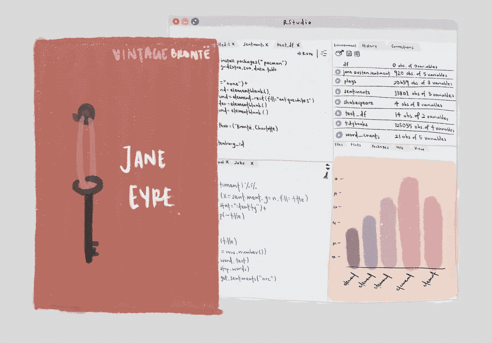

# 情感分析入门指南:测量简爱

> 原文：<https://medium.com/analytics-vidhya/a-beginners-guide-to-sentiment-analysis-measuring-jane-eyre-10987fa0654b?source=collection_archive---------12----------------------->

故事从我学习莎士比亚开始。只是因为，作为一个学文学的学生，我觉得研究莎士比亚的语言可能会很有趣。我的假设是，莎士比亚悲剧中死亡人数越多，传统的“负面”词汇就越多。在这一点上，我还没有听说过情绪分析，并开始与 Excel…