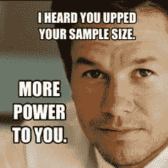

# 数据科学统计学入门指南

> 原文：<https://medium.com/analytics-vidhya/a-beginners-guide-to-statistics-for-data-science-55ce66f00aa2?source=collection_archive---------14----------------------->

我能找到的唯一合理的图像。ikr

在当今世界，我们清楚地看到技术在塑造我们如何相互交流、如何吃以及吃什么方面的影响(不这么认为？去 Instagram 上自己看看 amigo)，我们穿什么，还有更重要的事情，比如在信用卡欺诈发生之前发现它，抓住网络恐怖分子，拯救泰坦尼克号上的人(如果你是一个数据人，你不明白这个笑话，你还不如关闭这篇文章，当然我只是在开玩笑！)除此之外，结果我们有越来越多的人成群结队地进入这个非常广阔的领域，谢天谢地，每个人都有足够的空间。

这篇文章是写给数据人的，我说数据人是因为它需要 BI 专业人员、ML 工程师、数据科学家、数据工程师，以及所有那些在数据世界中的人。

这篇文章将指导你一些你可能在别处听说过或在别处看到过的基本统计学术语。不要害怕！光在这里(我想)。

在接下来的几分钟里，我将尽力解释一些概念，如样本、总体、参数和一大堆其他的东西，它们将出现在后续的文章中

这是一个系列，包含 3 篇文章，解释数据科学领域的各种基本概念和术语。

在本系列的第一篇文章中，我们将介绍一些基本术语和概念，这些术语和概念有时会让没有掌握这些概念的数据科学家感到困惑。

如果你在统计学方面已经很好了，那么这篇文章可能不适合你，但是你可以坚持到最后，看看你是否会学到一些东西。

那我们开始吧！

因此，通常你会期待类似“在我们进入这些术语之前，让我们探索一下统计学的各种含义或定义”，好吧，我们在这里不这样做。但是，我真的想从一个不同的角度来看待这个问题，这就是这个角度。

想象一下这个家伙，你正在做一个项目，将欺诈交易与合法交易进行分类，你的数据量超过 20，000 次观察。

你做了必要的 EDA，特征工程，交叉验证和前处理，你已经学了几个月，你已经开始这个数据科学的东西，然后你终于训练你的模型并测试它，工作正常吗？F1 的分数和测试数据的混乱矩阵是火！模特 ti wa online！(为我的非约鲁巴语朋友翻译，模型现已上线)

还记得你试图建立一个系统来区分合法交易和欺诈交易吗？很好。在构建系统之后，你期望系统能够正确地对它甚至没有训练过的交易进行分类，对吗？总体**人口**，来自 20，000 个观察值的**样本**。你现在明白我的意思了吧？如果你不跟我在一起，是吗？

在您的情况下，人口是您的模型没有训练过的数据点，代表您的模型应该能够分类的金融交易的一般社区，也就是说，(这个想法应该是明确模糊的，以模糊的方式明确)

群体是代表所有成员或感兴趣的类别的个人或群体。你对这个案子的兴趣是金融交易。还不清楚？还是依然模模糊糊的清晰？再举一个例子？好吧。

你想知道你的房产的平均电费支出(我对此很挑剔，因为这在我居住的两个城市都是一个大问题，在这一点上，只有上帝能拯救我们。

一种方法是将数据收集到某种类型的列表中(不，我不是指 python 列表！叹气，程序员)从每一个房子，每一个使用或连接到向你的地产供电的电网的公寓，现在因为这个列表(仍然不是你正在想的列表，抓住一个人！)包含了你感兴趣的群体的每一个成员，它可以被认为是一个种群。

如果你成功的生成了平均支付金额，你已经成功的生成了一个**参数！**因为参数是从总体中生成的值。参数是应用于总体的值。

我们所讨论的是一种你可以着手做的叫做数据收集的事情，顺便说一下，这不是我们在这里的目的。

另一种方法是随机选择房地产中的某些房屋和公寓，然后获得他们支付的电费，这就是统计学家所说的**样本。**

样本，基本上是指从总体中抽取的样本，总体的子集。在金融交易分类的初始示例中使用的数据是来自金融界的大量金融交易的样本，我们是金融界的一大部分。

如果您也成功地生成了样本的平均支付金额，那么您就成功地获得了一个**统计数据！我们这里不这么做，是吗？有时候我们会。**

统计数据是从样本数据中得出的值，(是的，它们是实际值)。

你要记住这一点。一个群体不需要很大才能算作一个群体。我的庄园可能不超过 20 栋房子，不是很大吧？不，但就类别而言，它是一个群体吗？是的，它是。

样本不一定能很好地代表从中选择样本的人群。举个例子，(我厌倦了每次都打电)我在 NEPA 的情况(好得多)，如果构成我的样本的房屋是，例如，印刷机、面包店、快餐店和游戏屋，这显然不是一个好的样本代表，因为所有列出的房屋都比有灯泡、电视和洗衣机等的普通房屋使用更多的光。因此，这不是一个好的样本，生成的平均支付金额不会准确反映遗产中的平均支付金额。

有许多方法可以生成样本，我将列出它们并尽可能地解释

1.随机抽样:随机并不意味着偶然。这只是意味着总体中的每个观察值都有同等的机会被选入样本。随机抽样的主要优点是样本和从中选择样本的总体之间的任何差异都不是系统性的。以印刷机、面包店等为例。该样本是系统性的，因为我们选择了更可能消耗功率的元素。人口和样本的差异是由于偶然而不是系统的偏见

2.代表性抽样:这种方法只是为了通过预先选择的样本准确地代表总体。举个例子，在我的庄园里，我们总共有 20 栋房子，50%是住宅，30%是工业用房，剩下的 20%是办公用房，样本也必须反映这个数字。这意味着 50%的样本必须是住宅，30%必须是工业，20%必须是办公空间。随机抽样试图对总体进行建模，但代表性抽样恰恰做到了这一点。这种抽样过程可能既费钱又费时，但它增加了将样本结果推广到总体的机会

3.便利抽样:基于便利性选择观察值。以我在 NEPA 的情况为例，我可能只会考虑离我家 20 米远的房子，为什么？因为我不能来自杀(你以为我已经不开玩笑了？)但这是一个基于邻近性的便利样本的例子，或者说我选择去没有狗的房子，为什么？我太老了，不能被狗追来追去，我不想因为错误的原因在 twitter 上跟风。这是一个基于访问便利性的便利抽样示例。我知道你在想，便利抽样不是一个好的抽样方法，我也这么想，但是如果样本在可能影响解决方案的方面与总体没有不同，那么它是一个可接受的抽样方法。

我还有一件事要说，伙计们，你们开始厌烦了吗？我们很快就会结束，和我在一起。

稍微打破常规，我将直接切入变量是什么以及如何使用它们。

变量是任何可以被编码(以系统的方式安排和收集)并且有不止一个值的东西。一个例子可能是性别(显然我们现在已经超过 51 岁了)、收入、考试分数等等。这些代表变量。

相反，任何只有一个值的值都被视为常数。

变量的类型包括

1.(或连续的)定量和

2.**定性**(或直言)。

数量变量是以数字或数值表示某种数量的方式进行评分的变量。例如，身高是一个定量(或连续)变量，因为该变量的得分越高，表明身高越大。

相比之下，定性变量是那些分配值并不表示或多或少某种质量的变量。举个例子，如果我调查开发人员的饮食习惯，会发现有些人吃得就像生命受到威胁一样(美食家)，有些人吃得像每个正常人一样(人类)，有些人吃得不多(保守派)，最后还有一些人对食物有意见()，意思是他们不喜欢吃，他们宁愿整天编码。(不要猜我的类别，你会惊讶的)。我们有四个类别，然后可以用数字进行分组，如下所示:

1 —美食家

2 —人类

3 —保守派

4 –

你可以看到，这些数字不一定代表某种形式的增加或减少，它代表了归因于变量的各种类别。

伙计们，我真的希望你们能够理解我试图解释的概念和我的笑话(非常重要的东西，伙计们！)

以防你错过了:

1.人口:

2.样本:

3.参数:

4.统计数据:

5.抽样方法:随机、有代表性、方便

6.变量和变量类型:

你希望我再写一次。leeemmaaoo，你不知道…关于它。

请随意对文章发表评论、问题、建议、批评和想法。

正如我所说，这是一个系列，将有 2 篇文章讨论各种其他主题，也就是说，后续文章将于 2019 年 12 月 6 日星期五发布。

感谢阅读

