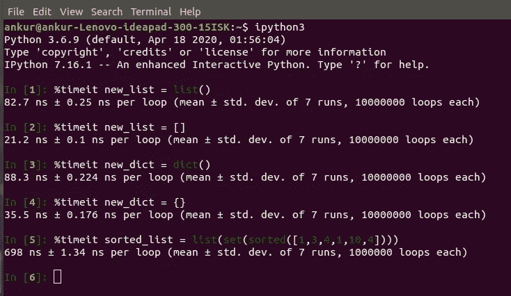
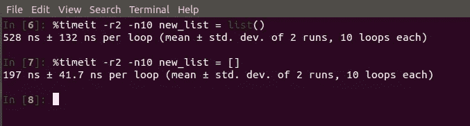
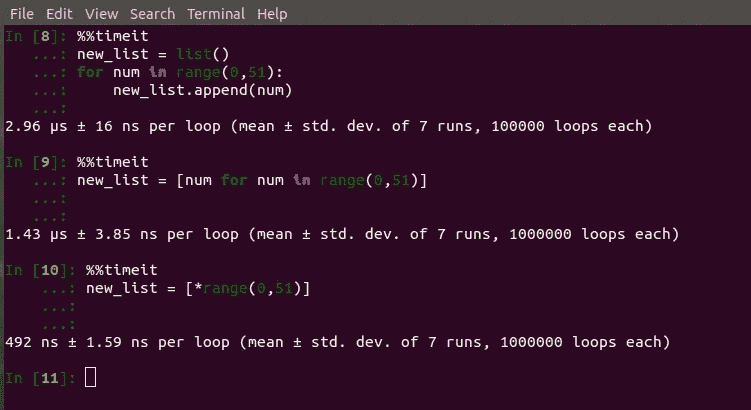

# Python 时间剖析初学者指南。

> 原文：<https://medium.com/analytics-vidhya/a-beginners-guide-to-time-profiling-in-python-c2422c35faa7?source=collection_archive---------12----------------------->

> 编写 python 代码给了我们强大的力量，通过简单的编程来展示我们的想法，但是就像有人正确地说的那样“强大的力量带来巨大的责任”。因为 python 是一种高级的基于参数的语言，所以总是需要检查时间复杂度和代码剖析。这个博客系列将主要关注使用`*ipython magic methods*`来做同样的事情。

**第一部分)。使用** `**%timeit**` **进行仿形。**

当我们用 python 编写一个简单的代码块时，当我们需要从众多可供选择的代码中选择一个时，我们通常会停滞片刻。例如，我们需要声明一个变量并将其赋给一个空列表，然后我们可以将其定义为`variable = list()`或`variable = []`。在开始对代码进行时间分析之前，让我们试着再理解一个例子。

现在，让我们假设我们需要创建一个包含数字 0-50 的列表。为此，我们可以使用类似于:

```
new_list = list()
for num in range(0,51):
    new_list.append(num)******************or********************new_list = [num for num in range(0,51)]******************or********************new_list = [*range(0,51)]
```

现在的问题是:**就所需时间而言，哪种代码是最高效的？**

有一些`ipython magic`方法可以很方便地用来解决这类问题。不知道`ipython`的，可以参考这个[链接](https://www.codecademy.com/articles/how-to-use-ipython)。我们可以用 IPython magic 命令`[%timeit](https://ipython.readthedocs.io/en/stable/interactive/magics.html).`计算运行时间

先来看几个使用`%timeit`的例子，然后我们就明白这个神奇的方法了。



当代码块运行 7 次 10000000 次循环时，输出显示“平均值和标准偏差”。正如你所看到的，当我们使用`[]`创建一个空列表时，它实际上比使用`list()`创建要花费更少的时间，但是你应该在使用`[]`或`list()`之前理解列表的可变性。您可以通过分别设置标志(-r )/( -n)来指定运行/循环的次数。



对于多行代码的时间分析，我们可以使用`%%timeit`。让我们用这个来检查下面代码所用的时间。



很明显，列表理解比编写简单的`for`循环要好得多。然而，对于上述问题，使用星号(`*`)解包`range object`要比使用列表理解好得多。

雅虎！！！我们今天在时间剖析的背景中学到了一些新东西。让我们在本系列的下一部分见面，并学习更多 python 中时间剖析的神奇方法。直到那时再见，继续学习。

请在这里找到 [**第二部**](/@ranjanankur334/part-2-a-beginners-guide-to-time-profiling-in-python-c56f71401b31?source=friends_link&sk=a8880ff6e215b19a2ccd8731114d2c24) 。