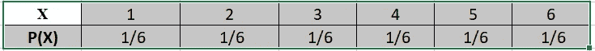
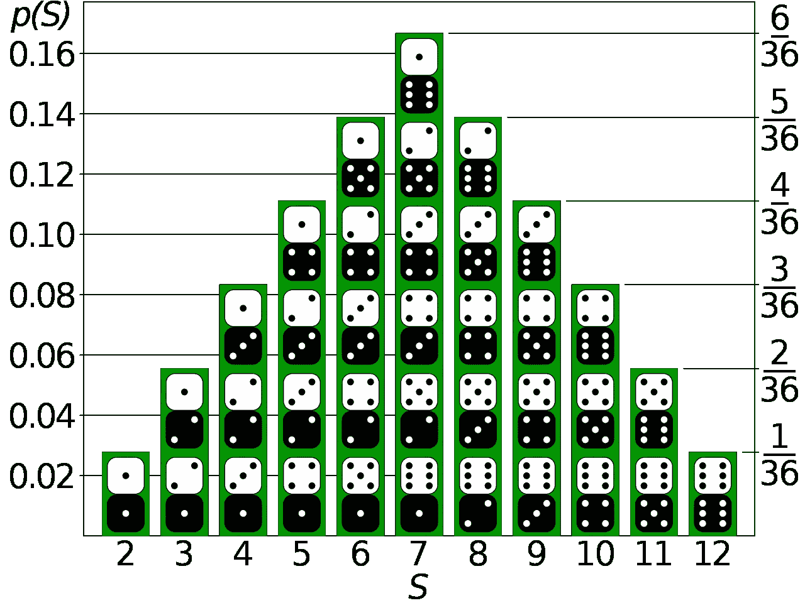
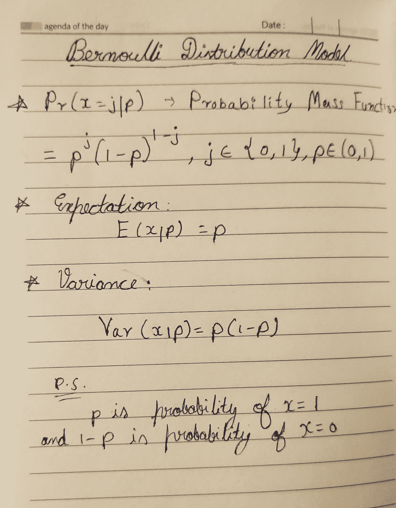
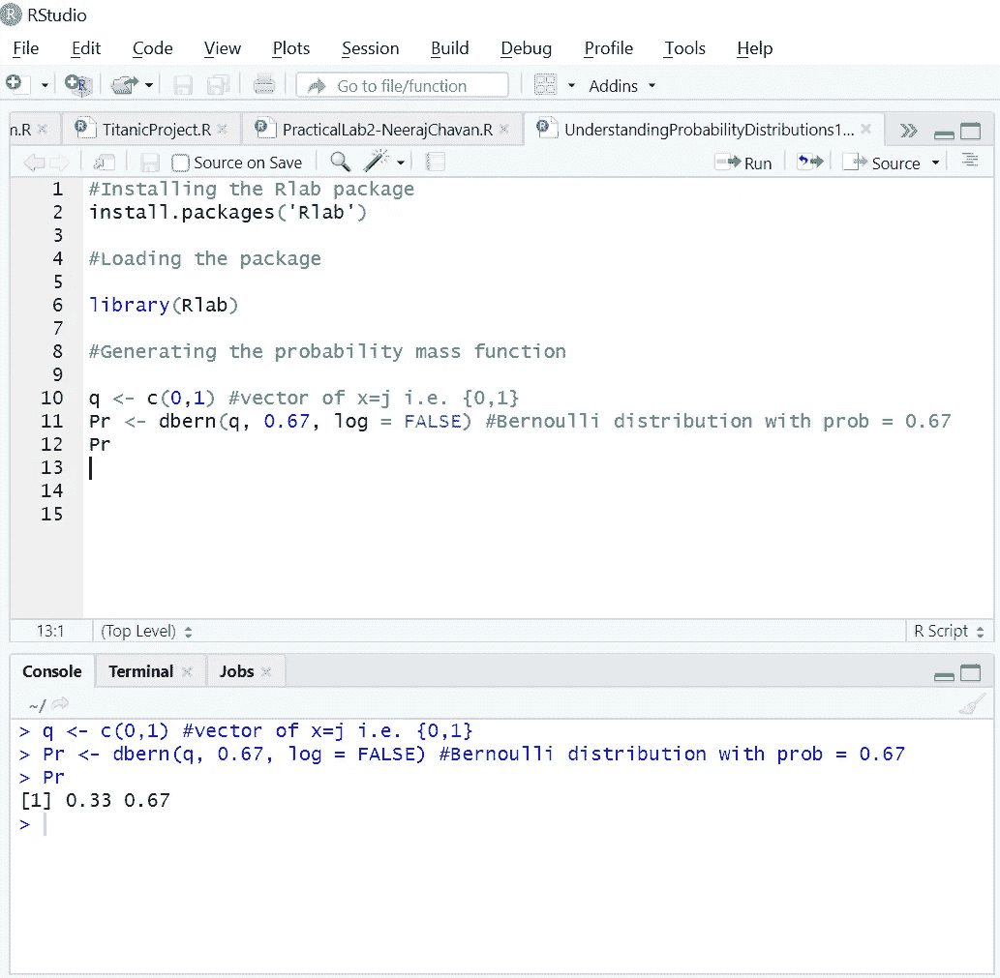
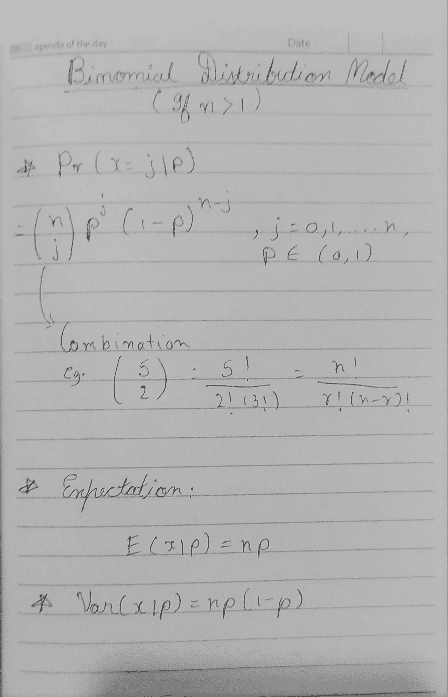
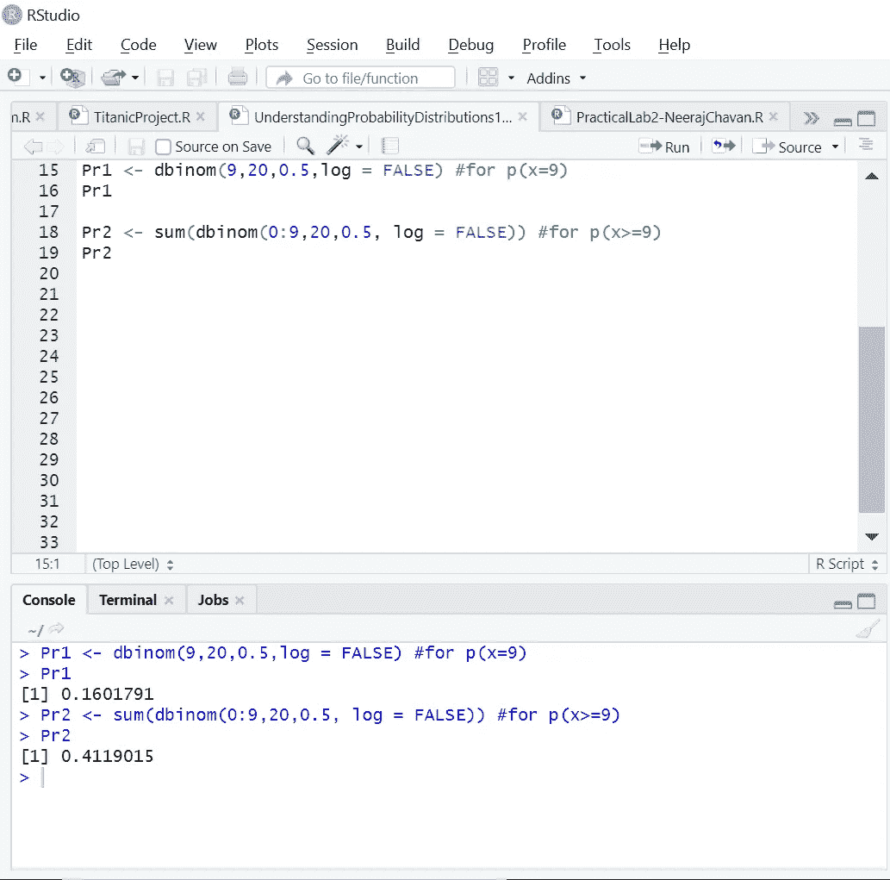

# 理解离散概率分布的初学者指南

> 原文：<https://medium.com/analytics-vidhya/a-beginners-guide-to-understanding-discrete-probability-distributions-part-i-7206fc6adcad?source=collection_archive---------15----------------------->

## 第一部分:期望，方差，二元和伯努利分布

布雷特·乔丹在 [Unsplash](https://unsplash.com?utm_source=medium&utm_medium=referral) 上的照片

> *“可能最好认识到概率概念在某种意义上是主观的，它总是基于不确定的知识，并且随着我们获得更多的信息，它的定量评估会发生变化。”*
> 
> *~理查德 p 费曼*

概率的概念似乎总是神秘地吸引着我。量化这个随机宇宙的不确定性的想法本身就是大胆的！无论如何，我最近开始探索概率，它抓住了我的好奇心。

所以，今天，我要讨论离散概率分布。那么，概率分布这个术语到底是什么意思呢？

要回答这个，我举个例子；

因为我最近刚从孟买搬到都柏林，所以让我举一个我经历过的例子。我从印度快递了一些东西。只是一些我放不进托运行李的衣服，还有几包 Maggi 方便面。所以，我联系了一家国际快递服务公司，他们把东西送到全球各地。然而，我关心的是我的东西是否会原封不动地送到我这里，在运输过程中没有任何损坏，尤其是面条包装。没有人喜欢他们的面条被压成肉酱。现在，我再次打电话给快递员，让他知道我的担忧。

快递员告诉我没什么可担心的，50 个包裹中只有 5 个会在运输过程中受损。

那么，这意味着什么呢？我应该继续交易，并通过这项服务订购我的东西吗？或者我应该寻找其他的快递服务来保证我的 Maggi 包更安全？

这就是概率的来源。

想象一下，我订购了大约 20 盒 Maggi，每盒有 50 包。箱子被送到我这里，我开始检查它们。假设，我打开第一个盒子，随机抽取 1 包。那么，我选包是损坏的包的可能性有多大？

快递员告诉我，可能最多有 5 个包裹在运输过程中损坏。因此，如果我从盒子里随机拿起一个包，有 5/50，即 1/10 的机会，它是一个损坏的包。

通俗地说，就是说你捡的包，有十分之一的几率是损坏的包。这是概率。

所以你在盒子里捡到一个损坏的 Maggi 包的概率是 0.1 或者 1/10。

也就是说，您有 10%的几率收到损坏的包裹。

# 概率分布:

继续，我希望上面的例子给你一个关于概率的公平的想法。因为这个主题是关于离散概率分布的，所以让我们深入研究一下。

概率分布有两种类型:

1.  分离的
2.  连续的

现在，在这篇文章中，我将只探索离散概率分布。(几款热门车型。)

在谈论概率分布模型之前，让我试着向你解释一下什么是概率分布。

根据[维基百科](https://en.wikipedia.org/wiki/Probability_distribution)，

***在概率论和统计学中，概率分布是一个数学函数，它提供了实验中不同可能结果出现的概率。用更专业的术语来说，概率分布是用事件的概率来描述随机现象。***

这是维基描述概率分布的方式。非常清晰和简短，对不对？

我会试着用经典的骰子例子来解释-

假设你掷骰子。现在，考虑下面的表格-

在上表中，X 表示骰子上的数字，P(X)表示如果掷出一次，该数字出现在骰子上的概率。

X 可以是任何离散的随机变量，P(X)是它的相关概率。

所以基本上，当谈到概率分布时，只有两件事很重要:随机变量可以取的值以及每个值出现的相关概率。

用更专业的术语来定义，如果 X 是任意离散随机变量，并且 X 的每个值都有一个关联的概率 p(x)，那么如果满足以下条件，p(x)就称为概率分布:

1.  ***对于 x*** 的所有值，p(x)应该大于 0
2.  ***所有概率之和将等于 1(或 100%)。即∑p(x)=1***

p(x)被称为**概率函数**或**概率质量函数**。

现在考虑一下之前掷骰子的例子。从表中可以看出，对于 x 的所有值，p(x) ≥ 0，所有 p(x)之和等于 1。

简而言之，这就是概率分布。

在讨论一些离散概率分布模型之前，还有最后一件事。

# ***期望值或期望值:***

概率函数为 p(x)的离散随机变量 x 的期望值由下式给出

# E(X) = ∑ xp(x)

因此，期望值基本上是离散随机变量的值和该值的相关概率的乘积。

或者用一种更简单的方式来阐述，它是你在多次试验中得到的平均值。

再次使用上面的骰子实验，假设你掷出两个骰子。现在考虑下图:

**图片来源:**[**【https://en.wikipedia.org/wiki/Probability_distribution】**](https://en.wikipedia.org/wiki/Probability_distribution)

从上图可以明显看出，你最有可能得到的值是 7。

所以，如果有人问你这个实验的“预期”结果是什么，答案是 7。

就像所有 p(x)的总和应该是 1 或 100%，分布曲线下的面积必须是 1。

继续，我需要阐明最后一个概念；方差。

# ***方差:***

也用 Var(x)表示，它是标准差平方的平均值。

## var(X)= E[(X-μ)]=∑(X-μ)p(X)

标准差通常描述平均值的分布，是方差的平方根。

低标准偏差表示这些值都接近平均值，高标准偏差表示这些值偏离平均值。

好吧。现在，我们已经涵盖了所有必需的方面，让我们继续讨论一些离散概率分布模型！

# 1.伯努利模型

该模型用于二进制分类，并用于结果为 0 或 1 的随机实验中。即“是”或“否”，或“成功”或“失败”；只有两种可能的结果。

举个例子，如果你掷硬币，要么是正面，要么是反面。

其概率质量函数、期望值和方差由以下公式给出

伯努利分布模型

伯努利模型的要点是，每次试验都必须有相同的概率，而且每次试验都必须相互独立。这些试验不应该依赖于其他试验的结果。就像扔硬币一样。或者掷骰子。

如果试验事件是相关的，那么伯努利模型将不起作用，因为在试验过程中概率会发生变化。

伯努利模型只针对 **n=1** ，其中 n 为试验次数。

对于 n >1，我们有二项式模型。这在某种程度上与伯努利模型有关。

**示例:**

假设我们抛硬币 6 次，得到以下结果:

http http

即(011011)

如何计算上述数据集的概率质量函数？

现在，数学上我们可以解出 p(x=1)，也就是 4/6 = 0.67，我们就得到概率。

从公式中，我们可以确定 P.M.F .(概率质量函数)P(X=j)为(2/3)^j * (1/3)^(1-j)其中 j 为{0，1}

现在，同样地，我们可以把期望值计算成-

E = p = 2/3 = 0.67

和方差-

var(x | p)= p(1-p)= 2/3(1–2/3)= 2/9 = 0.22

***在 R:*** 中实现

r 中有一个伯努利分布函数，然而，它在 [Rlab](https://www.rdocumentation.org/packages/Rlab/versions/2.15.1/topics/Bernoulli) 包中。因此，您需要首先安装该软件包。

我们可以使用[伯努利分布函数](https://www.rdocumentation.org/packages/Rlab/versions/2.15.1/topics/Bernoulli)在 R 中进行上述计算

请参考以下快照-

R 中的伯努利分布函数

现在让我们看看什么是二项分布模型。

# 2.二项式模型

我前面说过，二项式模型和伯努利模型密切相关。

二项式分布模型会告诉你在一系列独立的试验或事件中获得“成功”的可能性。

假设我们掷 50 次硬币。现在我们连续重复同样的事件 50 次。即 n=50。概率为 0.5 和 0.5。

在前面提到的扔硬币实验中。，如果获得人头是“成功”,那么我们可以期待 25 次成功，因为 25 是分布的平均值。

二项式基本上是多个独立的伯努利事件。

在二项式分布模型中，概率质量函数、期望值和方差由以下公式给出

二项式分布模型

二项式模型与伯努利模型非常相似。可以说伯努利模型只是一个简单的 n=1 的二项式模型，其中 n 是试验次数。

**举例:**

假设我们掷硬币 20 次。我们正好得到 9 个头的概率是多少？

现在，我们这里有 n=20

P(x=j=9)因为我们需要 9 个头。

概率 p 将是 0.5。

通过使用数学公式，我们可以将其计算为-

p(x = j = 9)= 20 C9 * p⁹*(1-p)= 167960*0.5⁹*0.5 = 0.160

类似地，我们可以把期望值计算为-

E = n*p = 20*0.5 = 10

最后方差是-

Var(x|p) = 20*0.5(0.5) = 5

现在，我们可以将 P(x≥9)计算为 1- P(x≤8)，其中 P(x≤8)可以计算为 P(0)+P(1)+…+P(8)

***实现在 R:***

关于 R 的最好的事情是有一个用于所有事情的包。

总之，R 中有一个内置的[二项式分布](https://www.rdocumentation.org/packages/stats/versions/3.3/topics/Binomial)函数，叫做‘DBI nom’

我们可以如下解决 R 中的上述问题-

R 中的二项分布函数

好了，今天就到这里吧！在这个系列中，我将讨论更多的发行模型。可能在即将发布的博客文章中。

此外，请让我知道你是否发现这篇文章足智多谋，并请与你的朋友/同行/同事分享。

如果没有，我随时欢迎建设性的反馈，告诉我如何进一步改进。

欢迎在 [**LinkedIn**](https://www.linkedin.com/in/neeraj-chavan/) 上联系我，或者在[**Twitter**](https://twitter.com/EmilSincliar)**上联系我(我大多是 RT 笑话，和 doggo gifs)**

**https://www.skepticalthoughts.net/<——这是我的个人博客，以防你厌倦了数学和概率，需要一些新鲜的东西来阅读。我主要写短篇小说、讽刺作品，有时也写诗。一定要去看看。**

**下次见，再见！**

**— — — — — — — — — — — —**

**[**理解离散概率分布的初学者指南——第二部分**](/@EmilSincliar/a-beginners-guide-to-understanding-discrete-probability-distributions-part-ii-5c1dc5fa2cf2)**