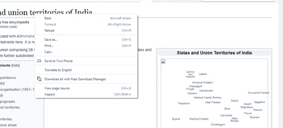
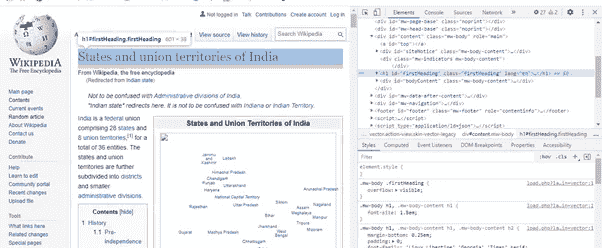

# 使用美丽的汤网报废的初学者指南

> 原文：<https://medium.com/analytics-vidhya/a-beginners-guide-to-web-scrapping-using-beautiful-soup-9f91a400c324?source=collection_archive---------4----------------------->


在这个博客中，我们将学习使用请求和美丽的汤来清理网页。还可以学习如何从电子商务网站获取数据。

# **什么是 Web 报废？**

Web 抓取是以自动方式收集结构化 web 数据的过程。
一般来说，网络抓取本质上是提取大量公开可用的网络数据，以做出更明智的决策。

如果你曾经从一个网站上复制粘贴过信息，那么你已经完成了和任何网页抓取器一样的功能，但是是手动的。与单调乏味、令人麻木的手动提取数据的过程不同，web 抓取使用智能自动化从互联网看似无穷无尽的前沿检索数百、数百万甚至数十亿个数据点。

# **Python 中使用的库**

*   **请求库:**[请求](http://docs.python-requests.org/en/master/)库是在 Python 中发出请求的标准库。之后，向网站发出请求，网页的全部内容以可以分析的文本形式提供。
*   **美汤:** [美汤](http://www.crummy.com/software/BeautifulSoup/)是一个从 HTML 和 XML 文件中抽取数据的 Python 库。它与一个解析器一起工作，用于导航、搜索和修改解析树。

# **抓取数据的基本结构:**

以下代码是从维基百科抓取数据的概述。

```
url = "[https://en.wikipedia.org/wiki/States_and_union_territories_of_India](https://en.wikipedia.org/wiki/States_and_union_territories_of_India)"headers = {}  #To get header; google search 'what is my user agent'search_response=requests.get(url,headers = headers)if search_response.status_code == 200:
    soup=BeautifulSoup(search_response.content,'html.parser')
```

下面详细解释了每个步骤:

1.  **Get 请求:**Get 方法表示您正在尝试从特定网站获取或检索数据。

```
search_response=requests.get(url,headers = headers)
```

参数:

url —您要从中抓取数据的网站。

headers: Header 帮助为请求设置一个客户用户代理。谷歌'什么是我的用户代理'，并得到你的标题。

**2。检查状态代码:**状态代码给出了请求的状态信息。200 OK 状态意味着您的请求成功，而 404 NOT FOUND 状态意味着您要寻找的资源没有找到。

```
if search_response.status_code == 200:
```

始终检查状态代码是否为 200。

**3。** **使用 beautiful soup 提取数据:** Beautiful Soup 帮助从响应接收的内容中解析数据。

```
soup=BeautifulSoup(search_response.content,'html.parser')
```

# **使用美汤提取数据:**

Beautiful Soup 解析从 request 收到的内容。

1.  首先，您必须将响应中的 HTML 文本转换成可以遍历和搜索的嵌套结构。

```
soup=BeautifulSoup(product_response.content,’html.parser’)
```

product_response.content 获取页面内容。我们使用 html 解析器。

2.现在使用其他各种漂亮的汤来获取数据。要想知道从哪里开始，你可以先了解 HTML 的结构。为此:

*   访问要从中提取数据的网站。
*   拾取要提取的对象。左键单击并选择“检查”。



*   右手边，该部分的 HTML 结构将显示在右上角。



3.您现在可以使用相关标签来提取数据。在这种情况下是页面的标题。

```
soup.find('h1',{'id':'firstHeading'}).get_text()
```

# **从亚马逊抓取评论:**

目的是提取网站中列出的各种 earpods 的评论。

1.  亚马逊上列出的每个产品都有一个独一无二的 ASIN 编号，有助于识别产品。因此，首先要做的是获取各种产品的 ASIN 编号。

*   刮搜索页面为一个新的号码。
*   一个搜索网址通常看起来像“www . Amazon . in/s？k = earpods”，earpods 可以替换成你想搜索的任何产品。
*   要浏览搜索页面，请添加' &page=2 '或您想点击的任何其他页面。最后，网址应该看起来像这样，'www.amazon.in/s？k=earpods&page=2 '。
*   现在你可以刮一个号码。

```
url = '[https://www.amazon.in/s?k=earpods&page=2'](https://www.amazon.in/s?k=earpods&page=2')search_response=requests.get(url,headers = headers)if search_response.status_code == 200:
    soup=BeautifulSoup(search_response.content,'html.parser')
    print(soup.find('div',{'data-component-type':'s-search-result'})['data-asin'])
```

报废的一个 ASIN 是' B08G1P26MJ '。

2.访问每个产品页面，获得所有评论的链接。

*   现在我们有了一个新的号码，我们可以点击产品的网址。
*   一个产品的网址看起来像，'www.amazon.in/dp/B08G1P26MJ'。

```
url = '[https://www.amazon.in/dp/B08G1P26MJ'](https://www.amazon.in/dp/B08G1P26MJ')search_response=requests.get(url,headers = headers)if search_response.status_code == 200:
    soup=BeautifulSoup(search_response.content,'html.parser')
    review_link = "[https://www.amazon.in/](https://www.amazon.in/)"+soup.find('a',{'data-hook':'see-all-reviews-link-foot'})['href']
    print(review_link)
```

3.抓取产品详情和评论链接。

*   访问评论链接和刮评论，星级等。

```
search_response=requests.get(review_link,headers = headers)if search_response.status_code == 200:
    soup=BeautifulSoup(search_response.content,'html.parser')
    print('Star: ',soup.find('i',{'data-hook':'review-star-rating'}).get_text().strip()[0:3])
    print('Title: ',soup.find('a',{'data-hook':'review-title'}).get_text())
    print('Review: ',soup.find('span',{'data-hook':'review-body'}).get_text())
```

# **结论:**

在这篇博客中，我试图帮助你建立一种直觉，如何从任何网站搜集数据。如果你想看我用来从亚马逊提取评论的代码，请点击[这里](https://github.com/SanjaPanda/Amazon-Review-Analysis/blob/main/Data%20Extraction%20using%20Beautiful%20Soup.ipynb)查看。