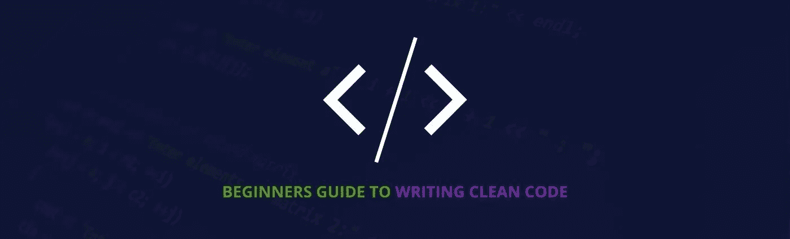

# 编写干净代码的初学者指南

> 原文：<https://medium.com/analytics-vidhya/a-beginners-guide-to-writing-clean-code-aa58ac915462?source=collection_archive---------15----------------------->



编写干净代码的指南(故事照片)

当我开始作为一名软件工程师的旅程时，我给自己的首要目标是让我的代码始终工作。作为一个初学者，我写的代码至少是计算机能理解的，而且大多数时候从来不关心是什么让它工作。这在我的开发中有一个缺点，因为在几个月之后，我发现很难理解和修改代码。

> 任何傻瓜都能写出计算机能理解的代码。优秀的程序员编写人类能够理解的代码。—马丁·福勒

当我加入一个技术团队时，我知道事情需要改变，在这个团队中，我们有很多人在同一个项目上工作。我开始意识到编写不仅计算机理解而且人类也能理解的**代码**的重要性。然后，我开始研究其他有经验的开发人员的代码，学习设计模式，研究如何编写干净的代码。

这篇文章基本上是为初学者或任何对成为更好的程序员感兴趣的人写的。我强烈推荐你阅读这篇文章，在你作为软件工程师的旅程中熟悉“编写干净代码的基础”。这篇文章中的一些想法来自罗伯特·c·马丁(又名“鲍勃叔叔”)写的[清洁代码](https://www.amazon.com/Clean-Code-Handbook-Software-Craftsmanship/dp/0132350882/ref=sr_1_1?crid=MV144GF35QDX&dchild=1&keywords=clean+code+by+robert+c.+martin&qid=1605007891&sprefix=Clean+code%2Caps%2C576&sr=8-1)。

# 简明变量名

命名变量应该足够清晰易懂，不需要写一行注释。使用“揭示意图”的名字应该是最重要的，尽管为变量取一个好名字可能需要时间，但它会节省更多的回报。一个简洁的变量名应该回答所有关于它的使用和在代码中的位置的大问题。它应该告诉你它为什么存在，它是做什么的，它是如何被使用的。


说明变量命名的好代码和坏代码

## 命名变量的最佳实践

1.  **使用可发音的名字—** 采用这种“如果你不能发音，你就不能讨论它”的方法，记住我们的目标是编写清晰的代码，可以将我们的意图传达给其他人。
2.  **使用可搜索的名称** —单字母名称和数字常量存在不容易在代码中找到的问题，尤其是当代码变大时。例如，使用变量 ***e*** 是一个糟糕的选择，程序员可能需要在其上执行搜索。

# 避免虚假信息

应该不惜一切代价避免虚假信息，因为它使代码难以理解，而且大多数时候会给出关于代码的错误信息。避免使用关键词、歧义词、不一致的拼写和不规范的名称。虚假信息的一个例子是使用小写的 **L** 和大写的 **O** 你会看到它们看起来几乎完全一样，都是常数 1 和 0。

```
int a = l; 
if(O == l)
   a = O1;
else 
  l = 01;
```

# 命名类别

当命名一个类和一个对象时，它应该是一个名词或名词短语，如*客户、维基页面、账户*和*地址解析器。在类的命名中，应该避免使用类似于*管理器*、*处理器*、*数据*或*信息*的词语。此外，类名不应该是动词。*

# 方法的命名

方法名应该是动词或动词短语，如 *getAccount、getCurrency 或 save。*根据 javabean 标准，访问器、赋值器和谓词应该以它们的值命名，并以 *get、set、*和 *is* 作为前缀。

```
customer.setName("mike");
```

# 书写功能

编写函数的第一条规则是它们应该很小，而且非常小。让功能变小，意味着它的意图可以很容易地传达给普通读者。

函数也应该只做一件事。只有在函数很小的情况下，函数做一件事才是可能的。虽然很难指出一个函数是否在做多件事，但是通过提取另一个不同名字的函数是可能的。如果你能得到一个，那么你就能创建一个函数。

例如，下面的函数获取用户详细信息，检查它们是否存在，以避免重复条目，如果不存在，则添加用户。

```
function registerUser($fullname, $email, $password){
    if(userExist($email)){
       return "User already exists";
    } else {
       addUser($fullname,$email, $password);
    }
}
```

上面的函数示例不到 10 行代码，但是执行 3 个不同的函数，并且这些函数被封装到 if else 条件语句中。

## 编写函数的最佳实践

1.  **避免过多的参数** —函数中的参数不应超过两个，只有在特殊情况下才使用三个或更多。过多的参数在测试时会变得困难，想象一下编写所有测试用例以确保所有参数的各种组合正常工作的难度。减少参数的方法之一是声明实例变量。
2.  **错误处理** —如前所述，函数应该总是做一件事。错误处理是一回事，因此应该编写一个函数来处理错误，而不是其他。

# 写作课

班级的第一条规则是规模应该小第二条规则是规模应该小。这不应该与函数混淆。对于函数，我们通过计算物理行来度量大小，对于类，我们通过计算责任来度量大小。

此外，类的名称应该描述它所履行的职责。事实上，命名可能是帮助确定班级规模的第一种方式。如果我们不能为一个类获得一个简洁的名字，那么它可能会很大。对于下面的示例，DailyReport 类负责每天发送帐户注册、交易和用户报告。

```
public class DailyReport extends Base_Controller {
    public function accountReport(){}
    public function transactionReport(){}
    public function usersReport(){}
}
```

**写作课的最佳实践**

1.  **采用单一责任原则**——它声明*一个类或模块应该有且只有一个改变的理由。这个原则给了我们责任的定义和班级规模的指导方针。*
2.  **cohesion**—类应该有少量的实例变量，并且类中的方法可以操作一个或多个这些变量。一个类中的每一个变量都被每一个方法使用，这个类就是最大内聚的。

# 评论

正确使用注释是为了弥补我们无法用代码表达自己的缺陷。理想情况下，根本不需要注释。如果你的代码需要注释，这意味着你做错了。

> 不要评论糟糕的代码——重写它。布莱恩·w·克尼根

现代编程语言有英语单词，如果写得好，通过这些单词代码可以不言自明。因此，当你发现自己处于需要写评论的位置时，仔细考虑一下，看看是否有什么方法可以扭转局面，用代码来表达自己。

此处不考虑法律意见，即版权和许可声明，因为它们是必需的。

# 避免代码重复

代码重复被认为是编程中万恶之源。重复代码仅仅意味着在需要修改的时候在多个地方修改东西，而且通常容易出错。

# 避免将代码留在注释中

将代码放在注释中，会让你的代码难以阅读和理解。如果您不使用该代码，只需将其删除即可。在这些代码非常重要的情况下，你可以使用版本控制，比如 Git 和 Subversion。

# 结论

编写干净的代码不是一朝一夕就能获得的，但当你在编写代码时有意识地采用这些原则来努力时，它是可以实现的。

感谢你阅读这篇文章，我相信它是有帮助的。

敬请关注更多故事。

> 我是一个全栈开发人员，我愿意接受任何远程位置。在 https://github.com/itsjuliuscoder[给我结账](https://github.com/itsjuliuscoder)