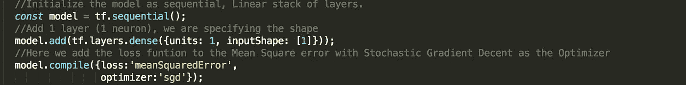

# TensorFlow JS 初学者入门

> 原文：<https://medium.com/analytics-vidhya/a-beginners-introduction-for-tensorflow-js-a574ce1063fa?source=collection_archive---------21----------------------->

## 学习使用 TensorFlow JS 构建和训练您的第一个神经网络

> **注意:本文假设您已经掌握了 Javascript 知识。*

在本文中，我将向您展示如何使用 Tensorflow JS 创建您的第一个神经网络。这将相当于我们在安的“*你好世界*”。

# 人工神经网络(ANN 或 NN)简介

神经网络是我们认为的机器学习的一部分。所以我们先从*说起“什么是机器学习？”*(关于机器学习或神经网络的理论，我不会讲太多细节，因为信息很多，可能会让人应接不暇)。

机器学习是人工智能的一个分支，它为系统或模型提供了从示例(数据)中学习和改进的能力，而无需编写显式规则。如果我们想到编程或传统开发，我们编码一些规则，然后执行这些规则，提供一个结果。机器学习或神经网络(NN)的工作方式不同于通常的编程方式，我们希望模型能够识别模式。我们给我们的模型我们正在寻找的例子，模型将找出规则，并根据它从我们的例子中学到的东西做出预测。您可能已经注意到，示例或数据对于算法或模型的学习过程非常重要。

# 现在让我们快速看一下神经网络。

当首次引入时，神经网络是模仿人脑(不严格地说)而建立的。它们用于识别一组标记数据(示例)中的模式。所以，像人脑一样，在神经网络中我们有称为“神经元”的单元。这些神经元通过加权值相互连接。在提供的示例中，计算结果保存在每个神经元上，突触通过反向传播进行调整。

一组神经元被称为*层*。我们有*输入层*:这是我们提供给神经网络的例子。然后是*隐藏层*:在这里执行所有的计算。最后，*输出层*是计算完成的地方。这一层必须是我们输入神经网络的数据大小。

# 理论够了:现在开始编码吧！

对于这个例子，我们将构建一个简单的神经网络来预测 **Y** 的值。这个例子的公式是 Y **= 2X -4** 。但是我们不会应用那个公式:*我们会让我们的神经网络计算出*。

我们的一组例子是:

对于 X :-4.0，-3.0，-2.0，-1.0，0.0，1.0，2.0，3.0，4.0

对于 Y: -12.0，-10.0，-8.0，-6.0，-4.0，-2.0，0.0，2.0，4.0

作为一个数组，它是这样读取的:当 x=-4 时，y=-12，依此类推。

要开始使用 TensorFlow JS，我们需要添加库

***<脚本 src = " https://cdn . jsdelivr . net/NPM/@ tensor flow/tfjs @ latest "></脚本>*** 到我们的 HTML 代码中。

现在，我们需要定义模型。该模型将是连续的。

代码 `model.add(tf.layers.dense({units: 1, inputShape: [1]}));`将告诉我们的网络使用 1 层。这是一个非常简单的神经网络，所以我们将只使用 1 个神经元。

然后，我们需要编译我们的模型，并分配一个损失函数和优化器。

*那么“损失”是什么意思呢？*NN 的学习方式是“试错法”。神经网络进行猜测，然后使用他所知道的数据(我们的例子),并测量猜测的好坏程度，并从中学习。由于系统已经知道答案，它可以衡量猜测的好坏。然后，它将这些数据交给负责计算下一个猜测的优化器。每次猜测都应该比前一次更好。

对于这个例子，我们将使用损失函数均方误差和 SGD(随机梯度下降)作为优化器。

如果你想了解更多关于 Tensorflow 中可用的[损失函数](https://www.tensorflow.org/api_docs/python/tf/keras/losses)和[优化器](https://www.tensorflow.org/api_docs/python/tf/keras/optimizers/Optimizer)，[你可以在官方文档中获得更多信息](https://js.tensorflow.org/api/latest/)。

我们想打印神经网络活动的摘要。

为此，我们只需要一行`model.summary();`

然后，我们传递网络将用来学习的数据。传递给模型的每个信息都应该是张量。张量*是向量和矩阵向潜在的更高维度的推广。在内部，TensorFlow 将张量表示为基本数据类型的 n 维数组。*

tensor2d 函数接收一个包含数据的数组，第二个数组([9，1])指示数组的长度和维度。我们将给它一个一维数组中的 9 个元素。

如果你习惯于在 Python 上编写 NN 代码，你可能不太关心训练所耗费的时间，但是因为我们在浏览器上使用 JS，所以让我们的交流异步是很重要的，这样页面就不会等待代码被执行，而是在代码被执行后让我们知道。

> 神经网络很重，我们不想让浏览器过载。

因此，让我们为培训创建一个异步函数。

我们将创建一个具有 500 个*历元*的神经网络，并在控制台上打印每个历元后的信息，后跟损失。因为纪元等于 500，这意味着它将进入“猜测循环”500 次。您可以编辑该金额。

像在 Python 中一样，我们可以指定一个进程在每次 Epoch 执行后运行。对于内联，我们添加了“回调”代码。功能 *onEpochEnd* 将帮助我们做到这一点。我们希望跟踪每个时期的训练，因此我们将把结果输出到控制台。

训练结束后，我们想做一个预测。假设我们想知道当 X=20 时 Y 是多少。

对于预测，我们将使用我们训练过的模型，然后警告结果`model.predict(tf.tensor2d([20], [1,1])` 。请记住，应该使用函数 tf.tensor2d 将数据作为张量传递，首先我们传递数据(我们要预测的数字)和维度(一维数组中的 1 个数据)。

这是最终的代码。我把代码做得尽可能简单，这样它就容易理解了。

你可以在这里查看代码:[https://codepen.io/labaiwact/pen/dyPOJxO](https://codepen.io/labaiwact/pen/dyPOJxO)

# 现在让我们看看结果:

由于我们将结果和摘要打印到控制台中，如果您使用 Chrome，右键单击->Inspect，然后在“Info”消息中转至“console”。

您会注意到，在加载页面时，它将从训练和输出摘要开始，然后是 loss 和 epochs 结果。

让我们看看时代和损失。请注意，随着时代接近 500，损失会减少。

现在，当训练结束时，它会提醒我们 Y=20 的预测结果。结果将作为数据类型张量输出。我们的结果是 36.00015。由于 NN 处理概率，它将输入带小数的估计值。稍后我们将需要舍入或处理这些结果。但是你可以看到 36=(20*2 )- 4。

> 我们的神经网络成功预测了正确的结果！

希望这对你有用。如果你有任何问题，请在评论中告诉我。

*原载于[https://www . piecex . com/articles/A-初学者-入门-for-TensorFlow-JS-284](https://www.piecex.com/articles/A-Beginners-Introduction-for-TensorFlow-JS-284)

> 顺便说一下，如果你目前是任何编程语言的开发人员，我想向你推荐网站[*www.piecex.com*](https://piecex.page.link/mdm)*，这是一个人工智能驱动的源代码市场，你可以在那里出售你的项目/脚本。如果你想增加收入，看看吧！*