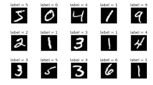
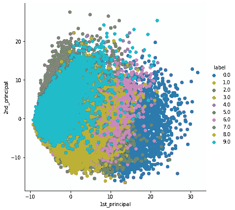
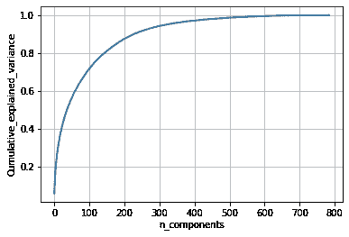

# 通过使用 Python 在 MNIST 数据集上实现主成分分析，更好地理解主成分分析。

> 原文：<https://medium.com/analytics-vidhya/a-better-understanding-of-principal-component-analysis-by-implementing-it-on-mnist-dataset-using-ebbfaefe017b?source=collection_archive---------11----------------------->

这是我第一篇关于媒介的文章。在这里，我将简要介绍什么是主成分分析，我们为什么需要它，以及如何在 MNIST 数据集上使用 Python 来进行主成分分析。

**主成分分析**

主成分分析(PCA)是一种统计技术，用于通过选择捕捉关于数据集的大部分信息的最重要的特征来降低数据的维度(减少数据集中的特征数量)。

PCA 通过找到数据的主要成分(数据中变化最大的方向)并将其投影到更小维度的子空间上，同时保留大部分信息。通过将我们的数据投影到一个更小的空间，我们降低了特征空间的维度。导致最高方差的特征是第一主成分。造成第二高方差的特征被认为是第二主成分，依此类推。

简而言之，PCA 是一种从数据集中的大量可用特征中提取重要特征(以成分的形式)的方法。

**MNIST 数据集**

MNIST 是一个计算机视觉数据集，它包含手写数字的图像，每个图像高 28 像素，宽 28 像素，总共 784 像素。



现在，我们将使用 sklearn 对该数据集执行 PCA 可视化。

```
**from** **sklearn** **import** decomposition
pca=decomposition.PCA()*# configuring the parameteres*
*# the number of components = 2*

pca.n_components = 2
pca_data = pca.fit_transform(standardized_data)*# pca_reduced will contain the 2-d projects of simple data*
print("shape of pca_reduced.shape = ", pca_data.shape)shape of pca_reduced.shape =  (42000, 2)*# attaching the label for each 2-d data point* 
pca_data = np.vstack((pca_data.T, l)).T

*# creating a new data fram which help us in ploting the result data*
pca_df = pd.DataFrame(data=pca_data, columns=("1st_principal", "2nd_principal", "label"))
sn.FacetGrid(pca_df, hue="label", size=6).map(plt.scatter, '1st_principal', '2nd_principal').add_legend()
plt.show()
```



主成分分析是将高维特征(比如本例中 MNIST 数据集中的 784 个特征)降维而不丢失原始数据方差的方法之一。

**到达 PCA 的步骤:**
让我们把数据集作为矩阵 A

步骤 1:预处理 A，即标准化数据集。
第二步:求 A 的协方差，假设协方差矩阵为 S
第三步:求协方差矩阵的特征值和特征向量 S
第四步:求特征向量和协方差矩阵的点积 S

特征值-给出特征的方差百分比。
特征向量——给出特征的方向。

```
*# PCA for diemnsionality reduction (not visualization)* pca.n_components = 784
pca_data = pca.fit_transform(standardized_data)

percentage_var_explained = pca.explained_variance_ / np.sum(pca.explained_variance_);

cum_var_explained = np.cumsum(percentage_var_explained)
*# Plot the PCA spectrum*
plt.figure(1, figsize=(6, 4))

plt.clf()
plt.plot(cum_var_explained, linewidth=2)
plt.axis('tight')
plt.grid()
plt.xlabel('n_components')
plt.ylabel('Cumulative_explained_variance')
plt.show()

*# If we take 200-dimensions, approx. 90% of variance is expalined.*
```



这里我们画出了分量方差的累积和。这里 200 个成分解释了几乎 90%的差异。所以我们可以根据要求的方差来降维。

参考:[https://colah.github.io/posts/2014-10-Visualizing-MNIST/](https://colah.github.io/posts/2014-10-Visualizing-MNIST/)