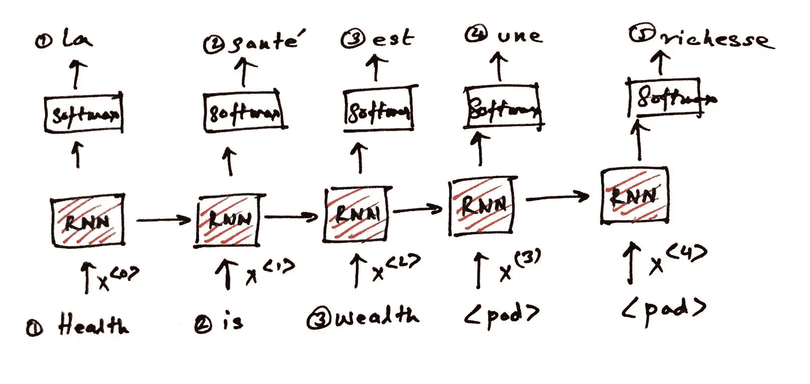
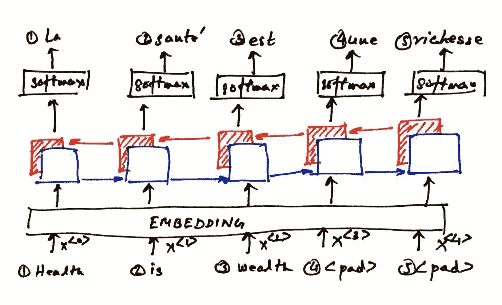
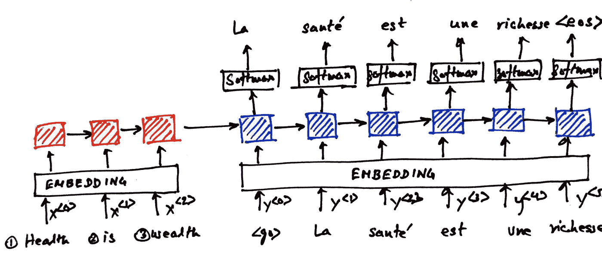

# 一束用于实现机器翻译的序列到序列体系结构

> 原文：<https://medium.com/analytics-vidhya/a-bouquet-of-sequence-to-sequence-architectures-for-implementing-machine-translation-5d13b286df5?source=collection_archive---------16----------------------->


在本文中，我们将讨论实现机器翻译的各种可能的序列到序列架构。尽管我们将尝试解决的主要问题是机器翻译，但是相同的架构，稍加修改，也适用于其他机器学习用例，例如但不限于:

文本摘要—生成输入文本摘要的模型

问题回答—为输入问题提供答案的模型

对话——生成序列中下一个对话/话语的模型

文档分类—将输入文档分类为体育、政治、金融等的模型

因此，掌握为机器翻译设计序列到序列架构的艺术将额外武装您，使您能够毫不费力地处理上述任何用例。

**简介**

顾名思义，机器翻译是一种机器学习模型，可以帮助我们将文本从一种语言转换为另一种语言。在这篇文章中，我们将学习把英语句子翻译成法语。我将这篇文章评为相当高级，因此我希望你有递归神经网络的基础知识，包括长短期记忆和门控递归单元——因为我们将使用这些作为构建序列到序列架构的构建模块。此外，对自然语言处理的基本概念，即单词嵌入，标记化，词汇，语料库等。将帮助您自信地浏览这篇文章。事不宜迟，现在让我们深入有趣的序列到序列架构世界。

本文将讨论以下序列到序列架构。

经典的多对多架构

具有嵌入和双向层的多对多架构

编码器-解码器架构

我将用自己写的架构图和代码片段来补充文本，以确保我能公正地解释这些概念。

**经典多对多架构**

经典的多对多架构是最简单的 seq2seq 架构，也是最容易理解的。它的输出和输入数量相同。然而，具有与输入相同数量的输出是一种限制，因为语言翻译很少具有与输入句子相同数量的句子，因此，与其他体系结构相比，充满这种限制的经典体系结构不能很好地执行机器翻译。通过添加不同种类的循环单元(即 RNN、LSTM 或 GRU)或者通过增加隐藏层的深度或者通过改变 RNN 层中的维度数量。

下面的涂鸦代表了一个简单的经典 seq2seq 架构

*Doodle:经典的多对多架构*



*代码片段:经典的多对多架构*

```
import tensorflow as tffrom tensorflow.python.keras.models import Sequentialfrom tensorflow.keras.models import Modelfrom tensorflow.keras.layers import Input, Dense, SimpleRNN, GRU, TimeDistributeddef simple_model(input_shape, output_sequence_length, english_vocab_size, french_vocab_size):learning_rate = 0.01model = Sequential([SimpleRNN(256, input_shape=input_shape[1:], return_sequences=True),TimeDistributed(Dense(french_vocab_size, activation='softmax'))])model.compile(loss=tf.keras.losses.sparse_categorical_crossentropy,optimizer=tf.keras.optimizers.Adam(learning_rate),metrics=['accuracy'])return modeltmp_x = pad(preproc_english_sentences, max_french_sequence_length)tmp_x = tmp_x.reshape((-1, preproc_french_sentences.shape[-2], 1))simple_rnn_model = simple_model(tmp_x.shape, max_french_sequence_length, english_vocab_size, french_vocab_size)simple_rnn_model.fit(tmp_x, preproc_french_sentences, batch_size=1024, epochs=10, validation_split=0.2)
```

**嵌入&双向层**的多对多架构

通过包含嵌入层和双向 RNN，可以进一步支持经典的多对多架构。嵌入层帮助将输入句子标记转换成多维嵌入。嵌入可以被认为是一种矢量化的单词表示，其中具有相似语义的单词在向量空间中彼此更接近。已知具有嵌入层的模型产生更好的自然语言处理模型。

双向层是简单 RNN 的扩展，其中细胞状态在两个方向流动(向前和向后),如附带的涂鸦所示。双向层基于这样的概念，即除了当前输入单词之外，序列中的过去和未来单词都对当前翻译(或任何其他自然语言处理任务)有影响。

嵌入层和双向 RNN 这两种增强功能预计将对模型的输出产生积极影响。

下面的涂鸦代表了一个简单的经典 seq2seq 架构，具有嵌入和双向 RNN 层。

*涂鸦:嵌入双向层的多对多架构&*



*代码片段:嵌入&双向层的多对多架构*

```
import tensorflow as tffrom tensorflow.python.keras.models import Sequentialfrom tensorflow.keras.models import Modelfrom tensorflow.keras.layers import Input, Dense, SimpleRNN, GRU, TimeDistributed, Embedding, Bidirectionalembedding_dim = 256def embed_model(input_shape, output_sequence_length, english_vocab_size, french_vocab_size):learning_rate = 0.005model = Sequential([Embedding(english_vocab_size+1, embedding_dim, input_length=input_shape[1], input_shape=input_shape[1:]),Bidirectional(GRU(256, return_sequences=True)),TimeDistributed(Dense(french_vocab_size, activation='softmax'))])model.compile(loss=tf.keras.losses.sparse_categorical_crossentropy,optimizer=tf.keras.optimizers.Adam(learning_rate),metrics=['accuracy'])return modeltmp_x = pad(preproc_english_sentences, max_french_sequence_length)embed_rnn_model = embed_model(tmp_x.shape, max_french_sequence_length, english_vocab_size, french_vocab_size)embed_rnn_model.summary()embed_rnn_model.fit(tmp_x, preproc_french_sentences, batch_size=1024, epochs=10, validation_split=0.2)
```

**编码器解码器架构**

编码器解码器架构解决了传统多对多架构的局限性。编码器/解码器结构能够生成长度不同于输入英语句子的法语句子。这样就克服了输入&输出句子长度相同的限制。经典架构的另一个限制是它一次翻译一个单词，这有时会导致不精确的翻译。一种更自然的翻译方法是大爆炸翻译法，即。一次读完整个句子，然后一起翻译。编码器/解码器架构使用后一种方法——它首先将输入句子编码成一个编码向量，然后用它来生成输出句子。警告——编码器解码器架构仅对较短的句子有效，因为将较长句子的所有信息保留在编码器向量中可能不可行；一些信息即将丢失。这个问题是通过使用注意机制来解决的，我计划在以后的文章中讨论这个问题。

下面的涂鸦代表了一个编码器解码器架构。

*涂鸦:编码器解码器架构*



*代码片段:编码器解码器架构*

```
import tensorflow as tffrom tensorflow.python.keras.models import Sequentialfrom tensorflow.keras.models import Modelfrom tensorflow.keras.layers import Input, Dense, SimpleRNN, GRU, TimeDistributed, Embeddingembedding_dim = 256def encdec1_model(encoder_input_shape, decoder_input_shape, output_sequence_length, english_vocab_size, french_vocab_size):learning_rate = 0.005encoder_inputs = Input(shape=encoder_input_shape[1:])en_x = Embedding(english_vocab_size+1, embedding_dim)(encoder_inputs)_, state_h, state_c = LSTM(french_vocab_size, return_state=True)(en_x)encoder_states = [state_h, state_c]decoder_inputs = Input(shape=decoder_input_shape[1:])dec_x = Embedding(french_vocab_size+1, embedding_dim)(decoder_inputs)decoder_outputs = LSTM(french_vocab_size, return_sequences=True)(dec_x, initial_state=encoder_states)decoder_outputs = TimeDistributed(Dense(french_vocab_size, activation='softmax'))(decoder_outputs)model = Model([encoder_inputs, decoder_inputs], decoder_outputs)model.compile(loss=tf.keras.losses.sparse_categorical_crossentropy,optimizer=tf.keras.optimizers.Adam(learning_rate),metrics=['accuracy'])return modeltmp_x = pad(preproc_english_sentences, max_english_sequence_length)tmp_y = pad(preproc_french_sentences, max_french_sequence_length)tmp_y = tmp_y.reshape((-1, preproc_french_sentences.shape[-2]))encdec1_rnn_model = encdec1_model(tmp_x.shape, tmp_y.shape, max_french_sequence_length, english_vocab_size, french_vocab_size)encdec1_rnn_model.summary()encdec1_rnn_model.fit([tmp_x, tmp_y], preproc_french_sentences, batch_size=1024, epochs=10, validation_split=0.2)
```

正如你从 doodle 中注意到的，解码器部分(右边的 RNN)类似于简单的 RNN 架构——编码器部分(左边的 RNN)是我们以前没有见过的额外部分。解码器部分不是使用英语句子作为输入，而是取法语句子作为输入，而编码器部分取英语句子作为输入。编码器解码器架构的主要原则是当前预测不仅依赖于输入的英语句子，还依赖于迄今预测的法语句子。但是有一个问题，在推理过程中，我们没有可用的法语翻译。因此，在推理过程中，我们不是输入实际的法语句子，而是将前一个解码器单元的输出馈送给每个解码器单元。另一方面，第一解码器单元将被馈送<bos>或<go>(指示句子开始的标签)，它还将被馈送来自最后一个编码器的单元状态(如果我们使用 LSTM 作为 RNN 单元，则包括长期和短期存储状态)。输出序列/单词将继续生成，直到算法预测到<eos>或达到最大法语句子长度。最大法语句子长度是可配置的，但通常我们将其设置为培训期间使用的法语句子的最大长度。</eos></go></bos>

你一定注意到了，我们在训练中使用了备用交叉熵作为损失函数。还有其他优化技术，如波束搜索，已知性能更好，但实施起来不太简单。关于波束搜索的讨论超出了本文的范围。

**评估指标**

尽管我没有提供任何评估指标，但机器翻译中非常流行的一种技术是 Bleu Score，它基于我们能够在实际的人类和模型预测的翻译中找到多少相似的单字、双字、三字等。

用于评估各种架构结果的 Bleu 分数可以使用 NLTK 库生成，如下面的代码片段所示:

```
from nltk.translate.bleu_score import sentence_bleuimport statistics as statsbleu_score_list = []bleu_score_list = [sentence_bleu([modified_french_sentences[100000+x]], logits_to_text(final_pred[x][0], french_tokenizer)) for x in range(100)]print(stats.mean(bleu_score_list))
```

**后记**

请注意，我故意没有在本文中解释输入文本的预处理，因为它本身就是一个庞大的主题。但是，请记住，您几乎总是需要实现所有的文本预处理步骤，如标记句子，填充句子，将所有字母转换为小写，删除标点符号，词条，词干等。在开始机器翻译之前。你可能想要抓住任何自然语言处理的初学者指南来掌握这些概念。

在不久的将来，我将努力在 github 上上传附带的策划代码，以便您可以在您的计算机上下载它，并尝试各种 seq2seq 架构。

我真心希望你喜欢这篇文章——如果你能在下面留下评价/反馈，我将不胜感激。如果您遇到了任何其他有趣的 seq2seq 体系结构，并且没有在本文中涉及，请告诉我；我非常乐意将它们收录到未来的出版物中。

学分:

1.  阿努杰·库马尔([https://www.linkedin.com/in/anujchauhan/](https://www.linkedin.com/in/anujchauhan/))合著
2.  Aurelien Geron —使用 Scikit-Learn 和 TensorFlow 进行机器实践学习
3.  v . Kishore Ayyadevara——神经网络与 Keras 食谱
4.  Udacity —自然语言处理纳米学位，深度学习纳米学位
5.  Coursera —实践与深度学习专业化中的 TensorFlow
6.  杰森·布朗尼—[https://machine learning mastery . com/calculate-bleu-score-for-text-python/](https://machinelearningmastery.com/calculate-bleu-score-for-text-python/)