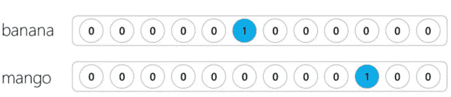
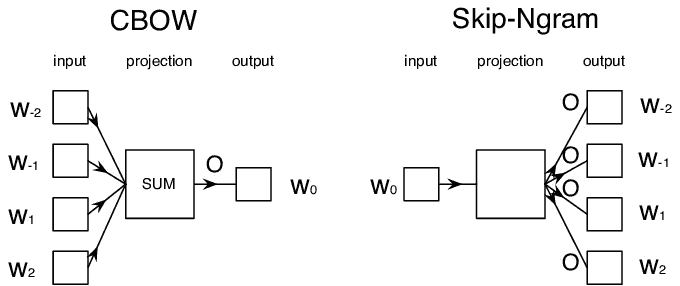
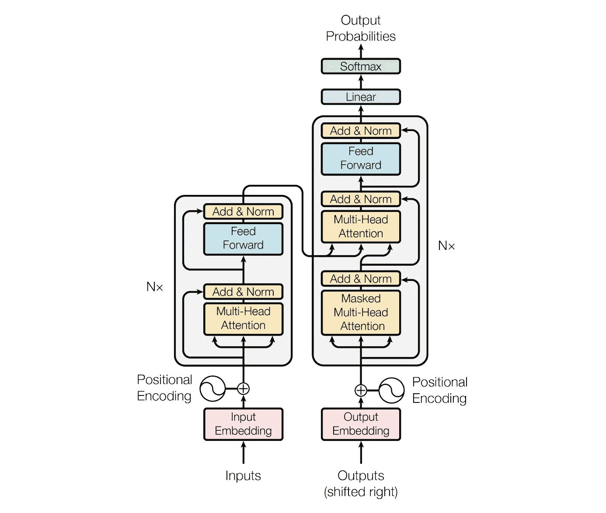
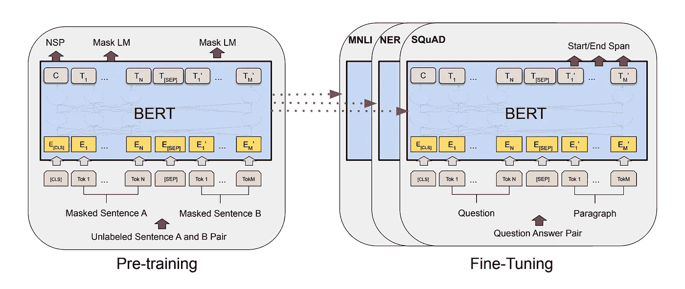

# 自然语言处理中句子表征的简史

> 原文：<https://medium.com/analytics-vidhya/a-brief-history-of-sentence-representation-in-nlp-a50492481d93?source=collection_archive---------9----------------------->

插图来自 dribbble，版权归格莱布 Kuznetsov✈所有，[链接](https://dribbble.com/shots/4787574-Organic-Artificial-Intelligence-design?utm_source=Clipboard_Shot&utm_campaign=glebich&utm_content=Organic%20Artificial%20Intelligence%20design&utm_medium=Social_Share)。

这篇[博文](https://hubertwang.me/machinelearning/a-brief-history-of-sentence-representation)是总结自然语言处理领域句子表示的简史。

**句子嵌入/句子表示**:这些是句子在 n 维向量空间中的表示，以便语义相似或语义相关的句子根据训练方法变得更接近。

# 1.句子表征的用法

工业中的句子表达之道；

1.  相同的嵌入可以跨域使用；
2.  微调预训练嵌入以用于产品。

具体来说，您可以决定:

1.  直接使用嵌入，训练分类器，不关心嵌入；
2.  或者重新训练嵌入模型和分类器。例如伯特

BERT 无处不在:BERT 已经广泛应用于各种工业应用中。BERT 作为一个突破可能是单词/句子表示的巅峰，因此 Neurips 2019 上发表的几乎所有论文都是基于 BERT，而不是提出新的方法。

# 2.句子表征的历史

# 2.1 传统的句子表示法

**One-hot Bag of Words (BoW)** :每个单词都链接到一个向量索引，并根据它是否出现在给定的句子中而标记为 0 或 1[1]。例如:

`banana mango`编码为`000001000100`；

`mango banana`编码为`000001000100`。

*   亲:简单快捷；
*   弊:没有语序；没有语义信息；重要词和非重要词没有区别。

**词频-逆文档频率(TF-IDF)** :是一种表示一个词在语料库中有多重要的方法。它根据给定单词出现的上下文为其提供权重。[2]中关于 TF-IDF 的更多内容。下面的图片来自[2]。

*   亲:简单快捷；考虑单词的重要性；
*   弊:没有语序信息；没有语义信息。

# 2.2 神经嵌入

语言模型。语言模型描述了文本在语言中存在的概率。例如，句子“我喜欢吃香蕉”比“我喜欢吃回旋”更有可能。我们通过对 n 个单词的窗口进行切片并预测文本中的下一个单词是什么来训练语言模型。

**word 2 vec/doc 2 vec**:word 2 vec[3]—包含 2 个模型，其中第一个模型(连续单词包，CBoW)使用前面的单词预测下一个单词，另一个模型(Skip-Gram)使用 1 个单词预测所有周围的单词。Doc2Vec [4] —创建文档的数字表示，而不管其长度。基于 Word2Vec 模型，他们在 CBoW 的输入中添加了另一个名为段落 ID 的向量。新的向量作为记忆，记住当前上下文或段落主题中缺少的内容[5]。推荐阅读[5]了解更多信息。

除了 Word2Vec，还有多种其他无监督的学习句子表示的方法。下面列出。

**Autoencoder** :是一个无监督的深度学习模型，试图将其输入复制到其输出。自动编码器的诀窍在于中间隐藏层的维度低于输入数据的维度。因此，神经网络必须以智能和紧凑的方式表示输入，以便成功地重建它[6]。

**RNN / LSTM** :角色级别的 LSTM(绝对是我最喜欢的 LSTM 文章，作者安德烈·卡帕西)【7】和双向 RNNs【8】。

跳过思维:同样的直觉，语言模型从前一个预测下一个。然而，它不是预测下一个单词或下一个字符，而是预测上一个和下一个句子。这给了模型更多的句子上下文，因此我们可以建立更好的句子表示。[6]在[9]中有更多关于 Skip-thinks 的内容。

**注意力和变压器**:注意力取两个句子，把它们变成一个矩阵，其中一个句子的单词形成列，另一个句子的单词形成行，然后它进行匹配，识别相关的上下文。这在机器翻译中非常有用。自我注意:把同一个句子列和行，我们可以学习句子的一部分如何与另一部分相关。一个很好的用例是帮助理解“它”指的是什么，即把代词和先行词联系起来[10]。

虽然注意力最初是与其他算法(如 RNNs 或 CNN)一起使用的，但已经发现它本身表现得非常好。结合前馈层，注意力单元可以简单地堆叠起来，形成编码器。此外，与 LSTM 相比，注意力的“聚光灯”有助于聚焦于实际有用的数据。

注意力是你所需要的(Vaswani 等人，2017) [11]绝对是提议 Transformer 允许我们在没有递归单元的情况下进行 Seq2Seq 的影响者。它基于 **K** ey、**V**value、 **Q** uery 和编码器/解码器堆栈。这在[12]中有详细解释。

**BERT** :从名字中可以看出它的想法——**B**I directional**E**n coder**R**代表来自**T**transformers，这表明关键的技术创新是应用变压器的双向训练。预训练的 BERT 模型可以通过一个额外的输出层进行微调，从而为各种任务创建最先进的模型[13]。更多关于 BERT 的解释可以在这里找到[14]。也用于可视化伯特[15]。

[1] [亚伦(Ari)博恩施泰因，超越文字嵌入第 2 部分，中等](https://towardsdatascience.com/beyond-word-embeddings-part-2-word-vectors-nlp-modeling-from-bow-to-bert-4ebd4711d0ec)

[2] [克里斯·尼科尔森，词汇入门指南& TF-IDF，Skymind](https://skymind.ai/wiki/bagofwords-tf-idf)

[3] [T .米科洛夫等人向量空间中单词表示的有效估计](https://arxiv.org/abs/1301.3781)

[4] [Quoc 诉 Le 和 T. Mikolov，句子和文件的分布式表示](https://arxiv.org/abs/1405.4053)

[5] [Gidi Shperber，对 Doc2Vec 的温和介绍，WISIO](/wisio/a-gentle-introduction-to-doc2vec-db3e8c0cce5e)

[6] [Yonatan Hadar，深度学习的无监督句子表示，YellowRoad](https://blog.myyellowroad.com/unsupervised-sentence-representation-with-deep-learning-104b90079a93)

[7] [Andej Karpathy，递归神经网络的不合理有效性](http://karpathy.github.io/2015/05/21/rnn-effectiveness/)

[8] [双向递归神经网络，维基百科](https://en.wikipedia.org/wiki/Bidirectional_recurrent_neural_networks)

[9] [Sanyam Agarwal，我对 Skip-Thoughts 的想法](/@sanyamagarwal/my-thoughts-on-skip-thoughts-a3e773605efa)

[10] [克里斯·尼科尔森，注意力机制和记忆网络初学者指南，Skymind](https://skymind.ai/wiki/attention-mechanism-memory-network)

[11] [瓦斯瓦尼等著《注意力就是你所需要的一切》，NIPS 2017](http://papers.nips.cc/paper/7181-attention-is-all-you-need.pdf)

[12] [大春(Bgg)苏，Seq2seq 注意自我注意:第二部](/@bgg/seq2seq-pay-attention-to-self-attention-part-2-cf81bf32c73d)

[13]j .德夫林等人、BERT:语言理解深度双向转换器的预训练

[14] [拉尼·霍雷夫，伯特——自然语言处理语言模型的现状，里纳伊](https://www.lyrn.ai/2018/11/07/explained-bert-state-of-the-art-language-model-for-nlp/)

【15】[杰西·维格(Jesse Vig)，在变形金刚模型中可视化注意力的工具(伯特、GPT-2、艾伯特、XLNet、罗伯塔、CTRL 等。)](https://github.com/jessevig/bertviz)

喜欢这篇文章？在我的博客上阅读更多:[https://hubertwang.me/](https://hubertwang.me/)