# 深度学习简介

> 原文：<https://medium.com/analytics-vidhya/a-brief-introduction-to-deep-learning-21cc20fa890e?source=collection_archive---------15----------------------->

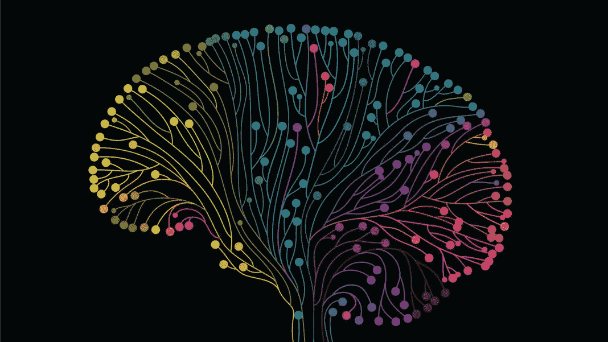

深度学习是机器学习的一个强大分支，它启动了人脑的工作。深度学习是自动驾驶汽车背后的科学，对图像、文本或音频进行分类。它在 Alexa、Google Home 等设备中发挥着关键作用。

如今，从电子商务到医疗保健，深度学习几乎在每个行业都有应用，并且继续创造新纪录。深度学习模型可以实现准确性，有时人脑也无法实现。这是因为深度学习模型是在非常大的数据集上训练的，并且包含许多层的人工神经网络。

在本文中，我们将尝试涵盖一些与人工神经网络(ANN)相关的主题。

***“人工神经网络(ANN)是一种计算模型，它复制了由大脑组成的生物神经系统的行为，以解决一个特定的问题。这个系统由大量相互连接的神经元组成，帮助处理信息和解决问题。”***

**涵盖话题:**

1.  神经元
2.  激活功能
3.  神经网络是如何工作的
4.  神经网络如何学习
5.  梯度下降
6.  随机梯度下降
7.  用随机梯度下降法训练神经网络

# **神经元**

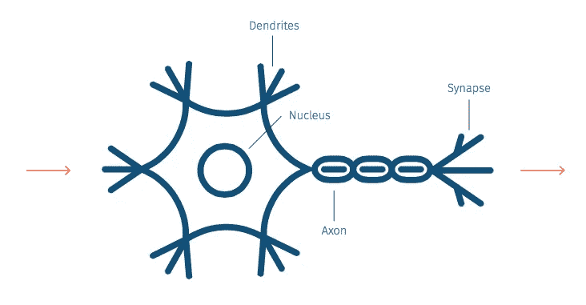

神经元是神经细胞，是神经系统的基本构件。它们类似于人体内的其他细胞，但主要区别在于它们负责在全身传递信息。

**细胞体或称胞体:**与其他细胞不同，胞体包含细胞核、线粒体和其他细胞成分。它执行负责神经元生命的活动。

**树突:**树突是神经元的线状投射。它们像树一样分支，接收来自其他神经元的信号(信息)。

**轴突:**它是一种长管状结构，将从树突接收到的信息从细胞体带走。

**突触:**这些是轴突末端的复杂结构。这些结构与其他神经元的树突相连。

从树突接收的信息由 soma 处理并产生输出。这种输出通过轴突传递到突触，并从那里传递到其他神经元的树突。

下图代表一个单层人工神经网络。也叫感知器。

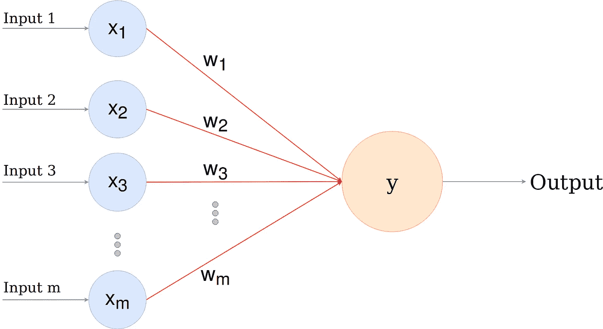

在上图中，x1，x2，x3…xm 代表输入变量。输入变量必须相互独立，并且应该标准化。

w1、w2、w3…wm 是分配给 synapse 的权重。这些权重乘以各自的输入值。在此步骤之后，计算输入值的加权和。

数学上，x1.w1+x2.w2+x3.w3…+xm.wm = ∑ xi.wi

现在激活函数被应用于加权和，𝜙(∑ xi.wi)

# 激活功能

激活函数对于人工神经网络学习和理解非常复杂的东西非常重要。它们给我们的神经网络增加了非线性特性。

激活函数背后的主要动机是将节点的输入信号转换成输出信号。这个输出现在可以用作下一层的输入。

**没有激活功能会怎样？**

没有激活函数的神经网络将简单地是具有一次多项式线性函数的线性回归模型。线性函数易于求解，但不太复杂，从复杂数据中学习的能力也较弱。我们希望我们的神经网络不仅仅学习和计算一个线性函数，而是比这更复杂的东西。

同样，如果没有激活功能，我们的神经网络将无法学习和模拟其他复杂类型的数据，如图像、视频、音频、语音等

**为什么我们需要非线性？**

非线性函数是那些次数大于一的函数，当我们画非线性函数时，它们有一个曲率。现在我们需要一个神经网络模型来学习和表示几乎任何东西。

神经网络被认为是**“通用函数逼近器”。这意味着他们可以学习和计算任何函数。**

**常用激活功能:**

1.  阈值激活函数
2.  Sigmoid 函数
3.  双曲正切函数
4.  整流器功能

**1。阈值激活函数(二进制阶跃函数):**
二进制阶跃函数是基于阈值的激活函数。如果输入值高于或低于某个阈值，神经元就会被激活，并向下一层发送完全相同的信号。

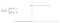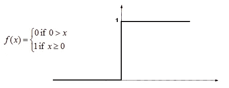

二元阶跃函数

**2。Sigmoid 激活函数(逻辑函数):**
Sigmoid 函数是一种数学函数，其特征为“S”形曲线或 Sigmoid 曲线，范围在 0 和 1 之间，因此用于需要预测概率作为输出的模型。

**3。双曲正切函数(tanh) :**
这个函数也像 logistic sigmoid 但性能更好。这个函数的范围是从(-1 到 1)。它也是 s 形的。双曲正切函数主要用于两个类别之间的分类。

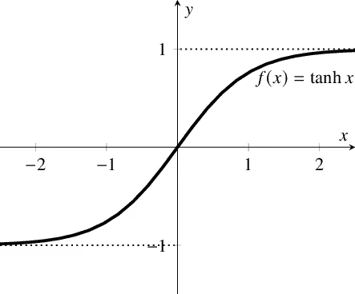

**3。整流器功能(Relu) :**

ReLu 是神经网络中最常用的激活函数，其范围从零到无穷大[0，∞]。就是 *R(z) = max(0，z)即如果 x < 0，R(z) = 0，如果 z > = 0，R(z)= z*因此，看到这个函数的数学形式，我们可以看到它是非常简单和有效的。

**Relu 的局限性:**

1.  但是它的局限性在于它只能在神经网络模型的隐藏层中使用。
2.  它可以导致权重更新，这将使它永远不会在任何数据点再次激活。简单地说，ReLu 会导致神经元死亡。

为了解决神经元死亡的问题，引入了 **Leaky ReLu 函数**。Leaky ReLu 引入了一个小斜率来保持更新有效。泄漏 ReLu 的范围从-∞到+∞。

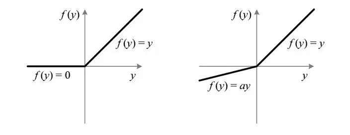

# 神经网络是如何工作的？

为了更好地理解这个主题，让我们以房地产价格为例，首先，我们将不同的因素组合在一行数据中:`Area, Bedrooms, Distance to city and Age.`

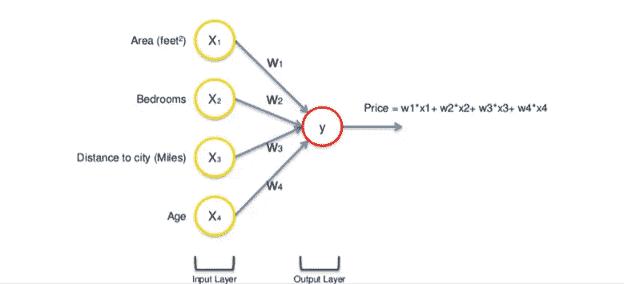

输入值通过加权突触，然后到达输出层。激活函数将应用于所有加权的输入值，并生成输出。

这是一个简单的神经网络，它的准确性可以通过在输入和输出层之间添加隐藏层来提高。

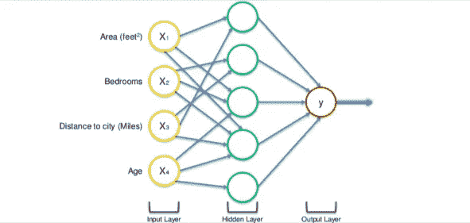

在上图中，我们在输入层和输出层之间添加了一个隐藏层。

输入变量通过突触与神经元相连。然而，并非所有的突触都是加权的。它们要么具有零值，要么具有非零值。

非零值，表明神经元是重要的

零值表示神经元不重要，将被丢弃。

让我们以`Area`和`Distance to City`为例，它们对于第一个神经元是非零的，这意味着它们是加权的，并且对第一个神经元是重要的。另外两个变量`Bedrooms`和`Age`没有加权，因此第一个神经元不考虑它们。

你可能想知道为什么第一个神经元只考虑四个变量中的两个。在这种情况下，在房地产市场上，离城市越远的大房子越便宜是很常见的。这是一个基本事实。因此，这个神经元可能正在做的是专门寻找大但离城市不远的房产。

这就是神经网络力量的来源。有许多这样的神经元，每一个都用这些变量的不同组合进行类似的计算。一旦满足了这个标准，神经元就应用激活函数并进行计算。

这样，神经元以一种非常灵活的方式工作和互动，允许它寻找特定的东西，因此可以对它接受训练的任何东西进行全面的搜索。

# 神经网络是如何学习的？

一旦建立了神经网络模型并生成了输出，我们就取实际值和预测值之间的差。计算称为成本函数的误差值。

**成本函数:实际值和输出值的平方差的一半。**

对于网络的每一层，分析成本函数并为下一个输入调整权重。我们的目标是最小化成本函数。成本函数越低，预测值就越接近实际值。通过这种方式，误差在每次运行中不断变小。

我们通过整个神经网络反馈结果数据。只要实际值和预测值之间存在差异，我们就需要调整这些权重。一旦我们稍微调整它们，再次运行神经网络，一个新的成本函数将会产生，希望比上一个更小。

我们需要重复这个过程，直到我们将成本函数降低到尽可能小。

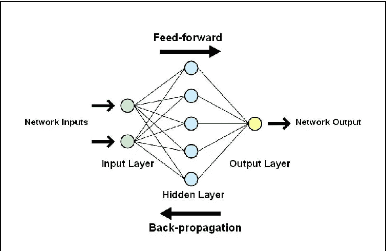

上述过程被称为**反向传播**，并通过网络连续应用，直到误差值保持最小。

# 梯度下降

梯度下降是一种优化技术，用于通过最小化成本函数来改进基于神经网络的模型。

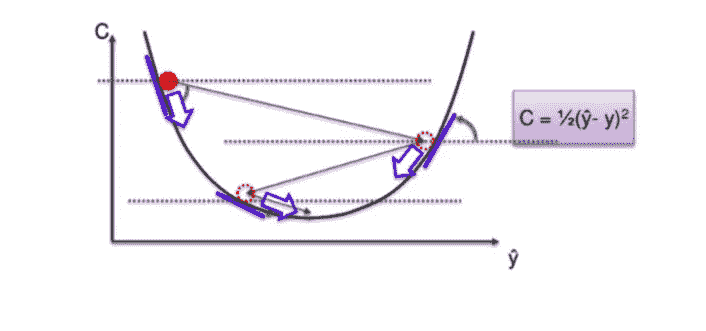

梯度下降是一种迭代算法，从函数上的随机点开始，逐步沿其斜率下降，直到到达该函数的最低点。这个过程发生在**反向传播**阶段，目标是连续地对梯度重新采样并调整权重，直到获得最小成本函数。

# 随机梯度下降

单词“*随机的*”意思是与随机概率相关联的系统或过程。因此，在随机梯度下降中，每次迭代随机选择一些样本，而不是整个数据集。

在 SGD 中，我们一次获取一行数据，通过神经网络运行它，然后调整权重。对于第二行，我们运行它，然后比较成本函数，然后再次调整权重。诸如此类…

SGD 帮助我们避免了局部极小值的问题。它比梯度下降法快得多，因为它是一次运行一行，而且不需要将全部数据加载到内存中进行计算。

SGD 通常需要更多的迭代次数才能达到最小值，因为它在下降过程中具有随机性。尽管与典型的梯度下降法相比，它需要更多的迭代次数来达到最小值，但它在计算上仍然比梯度下降法便宜得多。

# 用随机梯度下降法训练神经网络

Step-1 →随机初始化权重为接近 0 但不为 0 的小数字。

步骤 2 →在输入图层中输入数据集的第一个观察值，每个要素位于一个结点中。

Step-3 → **前向传播**:从左到右，神经元被激活，每个神经元激活的影响受到权重的限制。传播激活，直到获得预测值。

Step-4 →比较预测结果和实际结果，测量产生的误差(成本函数)。

步骤 5 → **反向传播**:从右到左，误差反向传播。根据权重对误差的影响程度来更新权重。学习率决定了我们更新权重的多少。

步骤 6 →重复步骤 1 至 5，并在每次观察后更新权重(强化学习)

第 7 步→当整个训练集通过人工神经网络，这就产生了一个新的纪元。重做更多的纪元。

本文到此为止。在下一篇文章中，我们将从头开始使用 python 创建一个人工神经网络。

感谢阅读！！