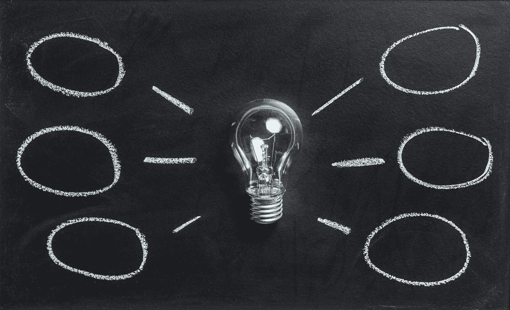
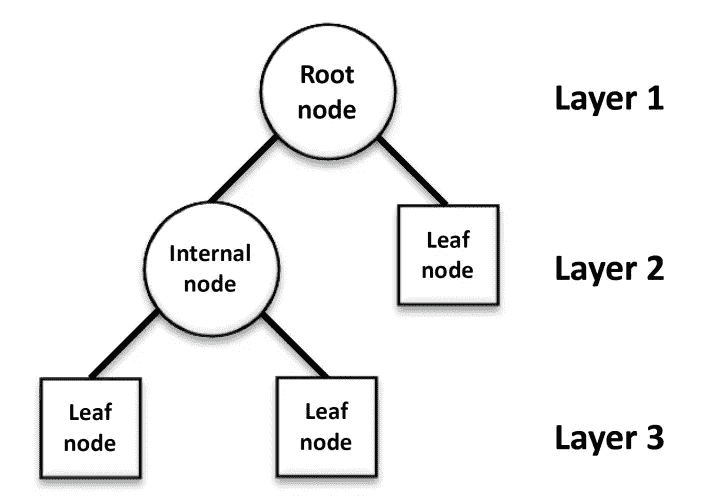
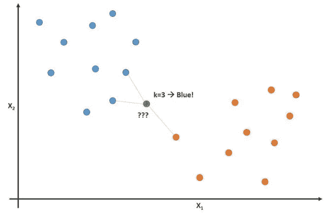

# 机器学习简介

> 原文：<https://medium.com/analytics-vidhya/a-brief-introduction-to-machine-learning-6c4357874c18?source=collection_archive---------27----------------------->

取自[像素](https://www.pexels.com/es-es/foto/aprendiendo-aprendizaje-aprendizaje-automatico-arte-355948/)

学习是每个人一生都要经历的过程。从我们出生的那一刻起，我们就开始了一个熟悉我们周围环境的过程，包括学习一种语言来与他人交流。

那么，什么是学习呢？。嗯，根据[剑桥词典](https://dictionary.cambridge.org/dictionary/english/learning)的说法，学习是获取知识的活动。

也就是说，我们人类是有理性的生命体，能够学习和做出决定。在我们存在的最初几年，我们开始从我们过去的经验中学习，例如，假设一个婴儿正在尝试一种新的食物，在他/她尝试之后，关于喜欢或不喜欢它的决定将会出现，随着我们继续成长，我们每天都开始做出新的决定。

现在，让我们把这个学习的概念推广到机器上。首先，机器是人类的发明，通过解决不同类型的问题来帮助我们改善生活。所以，每台机器都有它自己的目的，而且只有这个目的，它不会对另一个任务有用，而是对它被创造的那个任务有用。因此，作为人工设备的机器无法像我们人类一样执行思维过程，但当我们的能力走到尽头时，机器就会帮助我们。

因此，当谈到分析数据时，由于信息量太大，人类的思维会陷入死胡同。所以，计算机是一些帮助我们在这个过程中储存信息并为我们分析信息的机器。

所以，再向前一步分析信息，那就是机器学习定义出现的时候了。

## 机器学习

作为一种帮助我们改善生活的工具，人类创造了称为人工智能(AI)的东西，这一概念与机器开发的智能相关，“机器学习”概念是人工智能世界的一部分。

话说回来，机器学习是用来让计算机看起来有智能的。但是我们怎么做呢？正如我们一开始解释的学习过程。我们教机器从以前的数据中学习。先前的信息将帮助机器对这些数据有一些见解，以预测或根据它做出决定，这对于人类来说可能更难做到。

所以，机器学习是基于预测数据分析的。这个概念将帮助我们预测一个对象的行为。因为现在我们手中有大量的数据，我们可以使用机器学习来随着时间的推移改进流程。

## 预测数据分析

为了预测“未来”，机器学习使用了这种预测数据分析概念。但不要错误地认为预测未来就像人类的末日，这更像是预测你喜欢什么样的餐馆，或者你会得到什么样的推荐来购买一种产品。

因此，如果我们分析历史数据，我们可以利用它来分析现代或未来的数据。这就是统计数据登场的时候。有了统计学，人们就可以用之前的数据预测行为，但如果人能做到，我们为什么还需要机器学习？嗯，当涉及到详细分析一个详细的历史数据集，以预测一个特定类型的推荐给一个不同于其他人的人时，这就是 ML 派上用场的时候。有了最大似然算法，计算机可以在预测结果上更进一步，做得更快。

## 模型

ML 上的模型是什么？和 ML 有什么关系？

模型是对现实的简单描述，有助于我们研究现实。所以，就像医生根据历史医学数据预测一个人是否会患糖尿病一样。当我们没有对现实的完整描述时，ML 也可以获取这些信息，并根据这些陈述，预测被分析的人是否会患糖尿病。因为有很多可能性 ML 分析所有可能的可能性，得到我们最有可能发生的。

有了之前关于 ML 的信息，现在我们将解释机器是如何被编程来解决不同类型的模型的。

## 机器学习方法

ML 有两个主要的算法要研究，我们用它们来分类信息:

1.  监督学习
2.  无监督学习

**监督算法:**在监督学习中，我们有一些初始数据，这些数据将为程序提供一些标签信息，这些信息将在决策过程中帮助它。这就像教一个孩子一些初始指令，根据一个老年人的经验来指导他们的道路。

**无监督学习:**在无监督学习上，我们也有一些初始数据但没有标记，所以这种算法的神奇之处在于，程序会根据相似性对这些数据进行分组。如果我们回到我们的孩子类比，这就像把他带到野外，等他自己想出如何学习。

## 决策树学习

根据*丽莎·塔利亚费里的说法，“*决策树被用来直观地表示决策，并显示或告知决策制定。在处理机器学习和数据挖掘时，决策树被用作预测模型。”

因此，树是一种存储数据的方式，以便以后使用它来直观地显示决策是如何做出的。这是决策树的可视化表示:

摘自 [ResearchGate](https://www.researchgate.net/figure/Basic-structure-of-a-decision-tree-All-decision-trees-are-built-through-recursion_fig3_295860754)

所以叶节点是我们谈论的特征，是我们期望的最终响应。这个过程包括分割你的数据，直到你得到最终结果。

## 方法

我们之前说过，ML 与统计学有关，但应用于机器，所以我们可以带着计算统计学的概念来。话虽如此，我们需要解释两个主要概念:

*   相互关系
*   回归

根据剑桥词典， [***相关性***](https://dictionary.cambridge.org/es/diccionario/ingles/correlation) 可以定义为两个或两个以上事实之间的联系或关系。*回归可以定义为回到以前的状态。*

*最流行的 ML 方法之一是 k-最近邻算法。*

## *k-最近邻算法*

*k-nearest neighborhood 算法通常用于帮助我们根据模型在图表中的位置(取决于数据的属性)对数据进行分类。为了看得更清楚，让我们举个例子:*

**

*取自 [KD](https://www.kdnuggets.com/2017/09/rapidminer-k-nearest-neighbors-laziest-machine-learning-technique.html)*

*让我们来分析这个图表，蓝色的点是让我们喜欢一种类型的歌曲的属性，橙色的点是让我们根据歌曲旋律的特征决定我们不喜欢一种类型的音乐的属性。*

*如果一首新歌出现了，并且它的属性让它出现在了 X2 斧头的顶端，我们肯定知道我们喜欢这首歌。类似地，如果歌曲的属性使它出现在图表的较低部分，我们知道我们不喜欢它。*

*但是如果歌曲的属性在图表的中间，这是一个更复杂的决定。这时候算法就派上用场了。通过分析周围的数据，新的不确定点(绿色)附近有两个蓝点，只有一个红点。现在，越来越清楚的是，我们可能会喜欢这首歌，我们把它标为喜欢的歌曲。*

## *结论*

*现在，我们有了一些机器学习的先前知识，以及它在分析数据以及如何分类数据时的“魔力”。但是，因为这是一个不断创新的技术领域，这里只是一些实际的方法。如果你想更多地了解这个美丽的概念，我建议你熟悉一些数学和统计学，让你的生活更容易，同时理解这个最基本的概念。*

## *参考*

*   *凯莱赫，法学博士，纳米，工商管理硕士和达西(2015 年)。*预测数据分析的机器学习基础:算法、工作实例和案例研究(麻省理工学院出版社)*(第 1 版。).麻省理工学院出版社。*
*   *Tagliaferri，L. (2019 年 9 月 18 日)。*机器学习入门*。数字海洋社区。[https://www . digital ocean . com/community/tutorials/an-introduction to-machine-learning](https://www.digitalocean.com/community/tutorials/an-introduction-to-machine-learning)*
*   *杜威，C. (2020 年 1 月 23 日)。*Python 中机器学习的搭便车指南*。中等。[https://medium . com/free-code-camp/the-hitching liers-guide-to-machine-learning-algorithms-in-python-bfad 66 ADB 378](/free-code-camp/the-hitchhikers-guide-to-machine-learning-algorithms-in-python-bfad66adb378)*