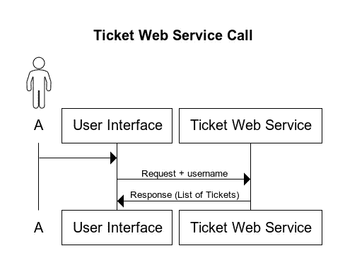
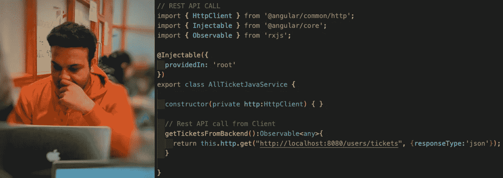

# RestFul API 和 Web 服务简介

> 原文：<https://medium.com/analytics-vidhya/a-brief-introduction-to-restful-api-and-web-services-c2b8494585f4?source=collection_archive---------13----------------------->

本文的目标是理解使用 restful API 的基本思想，并理解各种术语，如 web 服务、API、无状态和 Http 协议。如果你已经是一名 web 开发人员，并且使用过 Restful-API，那么对你来说，这可能是一个快速修订版。

# **API 和 Web 服务的基本区别**

API(应用编程接口)就是一个接受请求(输入)、应用业务逻辑并给出响应(输出)的程序。开发者把他们的 API 放在服务器上，允许其他程序与之通信。有时 API 和 Webservice 术语会相互重叠，尽管它们有一些不同。Web 服务是一种 API，一个 API 可以包含一个或多个 web 服务。API 可以脱机工作，也可以联机工作，另一方面，web 服务只能通过网络获得，这就是“Web”这个名称的原因。记住**所有的 web 服务都是 API，但不是所有的 API 都是 web 服务。**

# **票务管理 Web 服务**

以票务系统为例。假设您有一个系统，您可以在其中管理票证列表、更新票证、删除甚至添加新票证，并且您有 web 服务来执行这些操作。
用户 A 从 UI 向托管在服务器上的 web 服务发送请求，以获取分配给该用户的所有门票。票证 web 服务接收请求，并基于该用户查找所有打开的票证列表，然后返回响应。响应的数据格式取决于许多因素，但最常用的格式是 [JSON](https://www.w3schools.com/whatis/whatis_json.asp) 。

Web 服务调用

# **网络服务/API 通信**

问题是 UI 如何与 web 服务对话，以及服务如何发回响应。为了进行这种通信，web 服务使用了一种叫做 HTTP(超文本传输协议)的协议。

应用程序可以通过几种方法向 Web 服务发送数据请求并接收响应。这些方法是:

*   **休息**【表象状态转移】
*   **SOAP** [ *简单对象访问协议*
*   **XML-RPC** [ *远程过程调用*

SOAP 和 XML-RPC 将在单独的博客中讨论。

REST 是一种软件架构风格，它提供了几种允许客户端与 web 服务对话的方法。在开发 web 服务时，开发人员提到了每个 Rest 方法的特定 URL 模式，客户端必须确保请求以服务器期望的相同 URL 模式发送。最常见的休息方法有:

*   **Get:** 假设你想得到系统中用户的所有票，那么用请求 URL 调用 Get 方法，比如**/users/{ username }/tickets**为什么 username 在花括号里，因为它可以是任何用户，可以动态传递。您服务器上的 Web 服务已经用 Get 方法匹配了这个请求，并返回了票据列表。如果您需要特定票证的更多详细信息，用户必须使用票证 id**/用户/{用户名}/票证/{票证 Id}** 进行请求
*   **Put:** 假设您想要更新某个特定票证的任何详细信息，那么您可以更改详细信息，并使用 URL**/users/{ username }/tickets/{ ticket id }**进行 Put 调用。服务器在服务器上匹配这个请求，并更新数据库中该票证的数据。
*   **Post:** 如果您想要创建一个新的票据，那么提交包含票据和 web 服务的所有必需细节的请求，添加一个新的票据记录，然后将其存储在数据库中。
*   **删除:**如果您想删除一个特定的票据，那么发送一个带有票据 id 和包含详细信息的票据对象的删除请求。

***注意****:Rest***是无状态的，这意味着每当你需要某个特定用户的门票列表时，你每次都需要发送一个用户名，因为服务器不存储任何关于客户端调用的状态。**

# ***从哪里开始？***

*客户机不需要担心服务器上 web 服务的内部实现。Web 服务只需确保允许所有请求并发送正确的响应。在服务器端，Web 服务 API 可以使用 JAVA、C#或 python 开发。有几个公共 Rest API 可供您使用。通常，这些 API 提供了关于如何使用它们的 API 的文档。还有一些 API 只允许来自特定来源请求。实际上，你可以开发一个小程序，使用开源的 API。稍后，开发一个 Rest API，并向您的客户机公开它。你可以使用像[**Talend API Tester**](https://chrome.google.com/webstore/detail/talend-api-tester-free-ed/aejoelaoggembcahagimdiliamlcdmfm?hl=en)和 [**Postman**](https://www.postman.com/downloads/) **这样的工具来测试你的 Rest API。***

*你可以在这里 找到一些开源 API [**。可以参考 API 文档。**](https://public-apis.io/)*

*最好的学习方法是动手实践。干杯！*

**