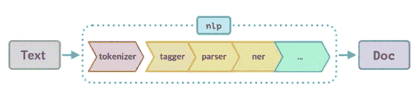

# 使用 python 的 spaCy 简介:生产级 NLP 库

> 原文：<https://medium.com/analytics-vidhya/a-brief-introduction-to-spacy-using-python-production-grade-nlp-library-9e3eeb574fa4?source=collection_archive---------25----------------------->

数据科学家、ML 工程师和研究科学家最感兴趣的领域之一是自然语言处理(NLP)。由于非结构化文本数据大量存在且不容易处理，很多时候数据工程师和初露头角的数据科学家都无法从中获得真知灼见。

在这篇博客中，我解释了一些基本但非常重要的 NLP 概念，以及如何在 python 中使用 Spacey 实现它们。选择 spaCy 的原因是它是跨行业使用最多的 NLP 库。

**什么是“spaCy”？**

spaCy 是由 Matt Honnibal 开发的生产级 NLP 软件包。它是用 Cython 写的，速度极快。它是完全免费和开源的。它支持 50 多种语言，2.0 版支持多语言处理。

**斯帕西到底有多能干？**

*   标记化
*   词汇化
*   词性标注
*   命名实体识别(NER)
*   句子识别
*   基于规则的匹配

**空间管道**

正如你在下图中看到的，输入文本必须经过多个组件，如标记器、标记器、解析器、ner 等。一旦流程完成，我们就可以开始工作了。

让我们来看看一些动作

spaCy 可以使用 jupyter 笔记本 API 中的 pip 命令安装。

一旦完成，第一步是将其初始化为一个对象。我已经加载了英语语言。此外，我可以检查默认情况下哪些管道是活动的。

您可以禁用任何未使用的管道，因为这样可以加快处理速度。可以通过 NLP . disable _ pipes(pipeline _ names)来实现。

**标记化**

这里我们使用了 text 方法，它返回 token 的字符串表示。请注意，spaCy 识别标点符号，并能够将这些标点符号从单词符号中分离出来。

我们还可以通过使用。is_stop 方法。

**词汇化**

它是把一个单词简化成它的词根形式的过程。一个词可以有不同的用法，但词根形式总是相同的。例如，cook、cooking、cooked 基本上都指同一即 cook。

一些用例是避免单词重复，删除重复单词等。

**位置标记**

词性是一个词在句子中的语法作用。总共有 8 个角色。有些是名词、代词、形容词、动词等。词性标注是将这些角色标注到句子中每个单词的过程。

这里 **tag_** 给出了细粒度位置，而 **pos_** 给出了粗粒度位置。

spacy.explain 给出了关于特定位置的描述。

**命名实体识别(NER)**

它是识别非结构化数据中的命名实体并将它们分类到一些预定义的类别中的过程，例如人、地点、时间、组织等。

我们将在与上面相同的段落中这样做。

这里 **text** 给出了实体的文本部分， **start_char** 表示实体的开始， **end_char** 表示实体的结束， **label_** 给出了实体的标签。 **spacy.explain** 给出关于实体标签的描述性细节。spaCy 模型已经为此进行了预训练。

**句子识别**

它是在输入文本中定位句子的开始和结束的过程。在自然语言处理任务中，将文档分割成句子是很常见的。这可以通过**来实现。发送**方法。

**基于规则的匹配**

基于规则的匹配是可以从非结构化数据中提取信息的应用之一。它类似于正则表达式。唯一的区别是它考虑了文本的语法属性。

例如，您可以使用基于规则的匹配来提取给定文本中的所有电话号码。

在我的下一篇文章中，我将介绍不同的解析技术和单词矢量化。