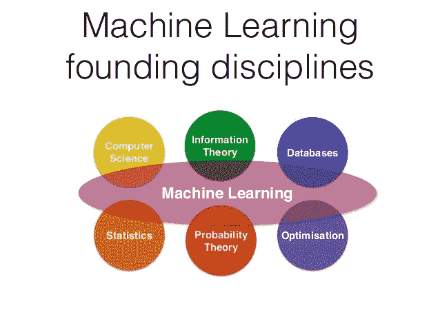
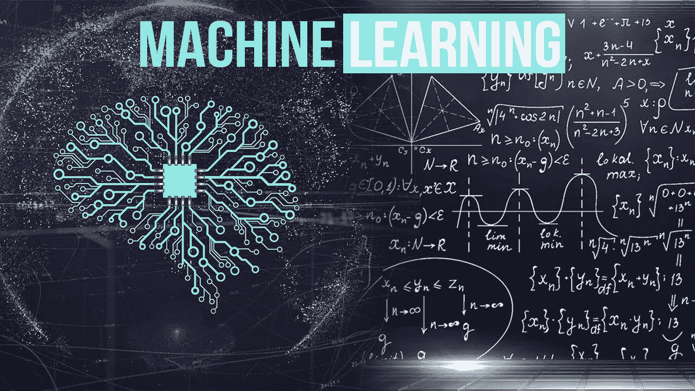

# “机器学习”一词简介

> 原文：<https://medium.com/analytics-vidhya/a-brief-introduction-to-the-term-machine-learning-40e0e995b722?source=collection_archive---------20----------------------->

来源:互联网

机器学习这个术语与人工智能有很深的关联。你们中的绝大多数人可能会有这样的直觉:他们实际上是同一个。但事实并非如此。人工智能一词指的是在机器上植入智能，让它模拟类似人类的行为。机器学习被认为是人工智能的子集。在机器学习中，我们基本上是在训练一台机器展示智能。正如该术语所暗示的，机器学习任务，而不是允许开发人员显式编程。由于整个过程是关于学习的，所以需要一些过去的数据来对任务进行建模。简而言之，这给了你一个关于机器学习的抽象概念。

来源:互联网

在我们继续之前，我想指出一些关于我们话题的基本直觉。我们经常会争论机器学习是否属于计算机科学的一个分支。你应该首先消除这种想法，因为机器学习是一个跨学科的话题。最重要的是，我会坚定地喊出数学是机器学习的灵魂。后者只是将其付诸现实的工具。为了理解机器学习领域内真正发生的事情，强大的数学理解是必不可少的。你也可以选择开发机器学习模型，即使没有任何与之相关的基础数学知识。但是相信我，你会错过这个领域的身份，而最终得出结论，这个领域只不过是一个普通的日常编码领域，而机器学习不是。

机器学习围绕使用相关的预定义数据对特定任务进行建模，并进一步使用该模型做出明智的决策。你们有没有想过如何对不同的动物进行分类？让我们举一个猫和狗的简单例子。你可以毫不费力地对它们进行清晰的识别和分类。这完全是因为你熟悉区分猫和狗的关键特征，无论是从你的真实生活经历还是从过去的一些经历中。答对了。这实际上是机器学习背后的基本思想。根据现有数据进行训练，开发模型并进行推理。

很明显，预定义的数据用于任务建模。如果你学到的东西与你的任务完全无关，那该怎么办？同样的场景也可以扩展到机器学习的层面。在我们的案例中，我们用来训练模型的数据的性质以及我们用来训练的数学模型起着关键的作用。仅仅收集数据是不够的，您应该始终确保它包含与您的任务最相关的信息。在直接进入建模部分之前，需要对可用数据的类型和性质进行公正而深入的研究。一旦数据处理部分完成，您就可以使用这些经过验证的数据来构建模型。数据处理部分统称为数据预处理。有了这些，我欢迎所有的初学者进入机器学习的世界。

> 在这篇博客中，我已经向你介绍了“机器学习”这个术语的基本概念，我希望这篇博客是有帮助的，并且会激发你对这个主题产生足够的兴趣。