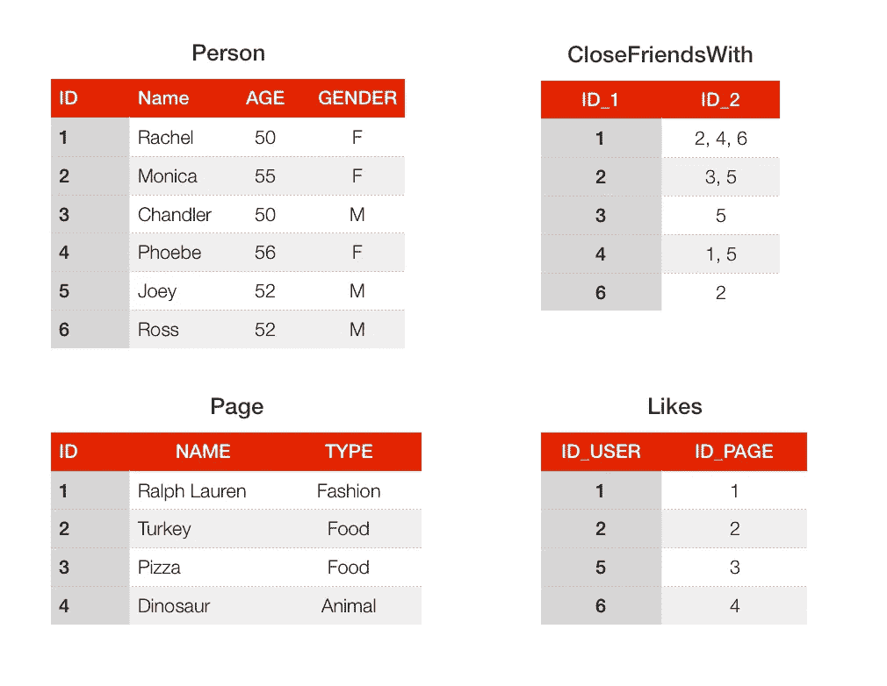
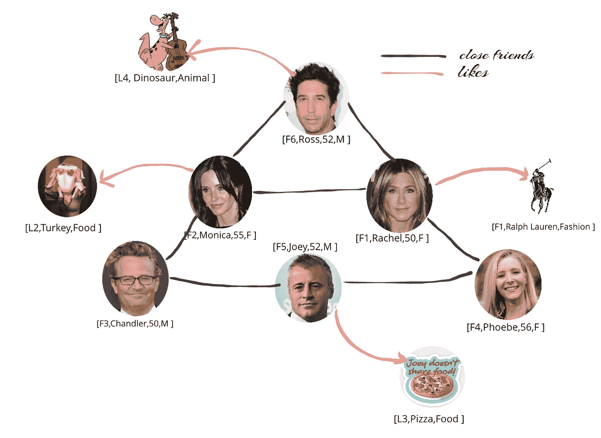

# 图形数据库简介

> 原文：<https://medium.com/analytics-vidhya/a-brief-look-at-graph-databases-d65b00f9c349?source=collection_archive---------9----------------------->

## 什么是图形数据库？我们在哪里看到它？我们什么时候使用它？

艾莉娜·格鲁布尼亚克在 [Unsplash](https://unsplash.com?utm_source=medium&utm_medium=referral) 上的照片

今天，公司根据他们的需求开发了大量的数据库。根据数据的类型、结构、数据模型、数据存储和预期用例，不同的系统可能更适合一个人的需求。通常，数据库分为两类，关系数据库和非关系数据库。在本帖中，我们将讨论一种非关系数据库，即图形数据库，它们的用例，以及我们应该何时使用它们。

## 关系数据库

在[关系数据库](https://www.wikiwand.com/en/Relational_database)中，数据被组织成*表格*。每个表由*行*和*列*组成，其中每一行都有一条记录，每一行都有相同的一组列，即字段。如果您主要处理来自一个表的数据，关系数据库工作得很好。但是，如果您从多个表中聚合数据，其性能将不够好。

考虑一个为著名的 90 年代电视连续剧 **FRIENDS *创建的社交网络数据库。*** 它的设计是存放两张桌子；主要人物和他们喜欢的东西的页面。除了字符之外，还有另外两个表来存储表之间的关系。字符是数据库的用户，他们的名字是；[詹妮弗·安妮斯顿](http://www.gstatic.com/tv/thumb/persons/30905/30905_v9_bb.jpg)饰演瑞秋·格林，[柯特妮·考克斯](https://upload.wikimedia.org/wikipedia/commons/8/83/Courteney_Cox_%2710_PaleyFest.jpg)饰演莫妮卡·盖勒，[丽莎·库卓](https://hips.hearstapps.com/hmg-prod.s3.amazonaws.com/images/lisa-kudrow-1556637934.jpg?crop=1.00xw:0.668xh;0,0.111xh&resize=480:*)饰演菲比·布菲，[马特·勒布朗](https://static.independent.co.uk/s3fs-public/thumbnails/image/2015/07/23/17/MattLeBlanc-Getty.jpg)饰演乔伊·崔比昂尼，[马修·派瑞](https://hips.hearstapps.com/hmg-prod.s3.amazonaws.com/images/matthew-perry-house-lead-1565126240.jpg?crop=0.458xw:0.917xh;0.0208xw,0.0224xh&resize=640:*)饰演钱德勒·宾，[大卫·史温默](http://www.gstatic.com/tv/thumb/persons/67980/67980_v9_ba.jpg)饰演罗斯·盖勒。除了用户，还有关于食物、时尚和动物的网页。为了报告所有亲密的朋友和在那个社交网络数据库上被突出显示的用户喜欢的页面，需要明确地描述那些关系。使用关系数据库，可以通过创建新的数据列或新的表来实现这一点。例如，根据我们的表格，我们定义了亲密朋友关系，罗斯是瑞秋的亲密朋友，钱德是乔伊的亲密朋友。为该数据库定义的另一个关系是 *likes，*它将用户映射到他们喜欢的页面。例如，瑞秋喜欢拉夫·劳伦品牌，乔伊喜欢披萨！

朋友的关系数据库

如果您使用的关系数量不多，关系数据库是很实用的。如果你有一个包含数百万个关系的大表，查询一个关系会花费很长时间，因为这些关系是用表中的*外键*来实现的，它们是通过连接这些表来查询的。

## 非关系数据库

在[非关系数据库](https://www.wikiwand.com/en/NoSQL)，也称为 *NoSQL* 数据库中，有一种存储机制和检索非表格数据的能力。NoSQL 技术有多种变体，但总的来说，它们比关系型技术更具可伸缩性和灵活性。NoSQL 使用为特定目的而优化的数据存储，它将数据存储在以下四个类别之一:

*   键值存储
*   文档存储
*   宽列存储
*   图形数据库

在这篇文章中，我们主要关注的是图形数据库。

## 图形数据库

图形数据库是使用图形结构进行语义查询来表示和存储数据的关系的集合。关于*图可以参考我之前的[帖](/@parlarselen/introduction-to-graphs-44c4356212c7)。L* 让我们看看关于*图形数据库*的一些概念:

*   一个*顶点*代表图中的一个实体，如人、电影、动物等。
*   一条*边*表示实体之间的关系，如 friendsWith、actedIn 等。
*   一条边可能有一个由显示关系方向的箭头指示的*方向*。
*   顶点可能与其他顶点连接，有几条边对应于*多对多关系*。
*   边或折点的属性可能类似于表中的字段，但它们更加灵活。
*   图形数据库中的每个顶点包括一个唯一标识符；表示为*键值对*的输入边、输出边和特征。
*   每个边缘还带有一个*唯一标识符*；结束地点节点、开始地点节点和属性集合。

图形数据库的关键优先级是数据之间的关系。查询关系很快，因为它们存储在数据库本身中。此外，使用图形数据库可以很容易地将关系可视化。下面是对应于上述朋友的列表社交网络数据库的图表。每个用户节点都有 ID、姓名、年龄和性别等特性，每个页面节点都有 ID、姓名和类型等特性。两个实体之间的关系也呈现并存储在图形数据库中，因此人们可以很容易地查询 Rachel 的亲密朋友和她最喜欢的东西！

朋友的图形数据库

## 用例

当数据高度关联时，图形数据库工作得最好，并且应该用它如何链接到其他数据来表示。在图数据库中，遍历关系非常快，因为节点之间的关系在数据库中是持久的。图形数据库对于社交网络、欺诈检测和推荐引擎等用例有很大的优势:

*   社交网络可以利用图形数据库。例如，可以容易地显示活动订阅源，或者可以根据他/她与他/她的其他朋友的接近度向用户推荐新朋友。
*   银行应用程序可以使用图形数据库中的关系来近乎实时地处理金融交易。除此之外，利用图形数据库的快速查询优势，任何欺诈都可以很容易地检测出来，例如多个具有相同 IP 地址但居住在不同地方的人。
*   任何管理实体间关系的应用程序都可以使用图形数据库。例如，采用资产管理系统、身份管理系统、访问管理系统和风险管理解决方案的应用程序。

## 流行的图形数据库

图形数据库在性能上有一些优势，因为它们使用基于 NoSQL 的存储机制，这使得这些数据库变得可伸缩和分布式。最受欢迎的图形数据库是 Neo4J、OrientDB 和 Amazon Neptune，还有许多其他数据库，如 [TigerGraph](https://www.tigergraph.com/) 、 [ArangoDB](https://www.arangodb.com/) 和 [AllegroGraph](https://franz.com/agraph/allegrograph/) 。

> **Neo4j**

Neo4j 是最知名的通用图形数据库。它支持大型图结构，例如在返回成千上万个关系的查询中。Neo4j 可以免费使用，也可以付费使用企业版。

> **OrientDB**

OrientDB 是一个开源的 NoSQL 数据库管理系统。它支持无模式、全模式和混合模式，具有基于用户和角色的强大安全配置系统，并支持查询。

> **亚马逊海王**

[亚马逊 Neptune](https://aws.amazon.com/neptune/) 是一个高性能的图形数据库引擎，能够存储大量的关系和非常短的查询时间。它支持属性图模型和 W3C 的资源描述框架(RDF)，以及一些查询语言，如 Apache TinkerPop Gremlin 和 SPARQL。

## 为什么/为什么不是图形数据库

> 在以下情况下，您可能更喜欢使用图形数据库而不是关系数据库:

*   你有一个高度关联的数据，
*   您的应用程序需要灵活的模式，
*   你想在你的应用程序上建立一个知识图表，
*   您希望构建的查询不是基于表，而是基于关系。

> 但是在以下情况下，您应该坚持使用关系数据库:

*   您有一个高度结构化的数据，表之间有一些关系，
*   你只需要存储数据而不需要查询，
*   你的数据结构是表格，
*   您使用键-值对执行查找，
*   你需要存储大的文本。

## 总而言之

图形数据库提供了一个很好的基础设施来链接不同的数据和实体的简单表达以及它们之间的关系。随着越来越多的组织开始投资图形数据库技术，2018 年被誉为“[图形之年](https://www.experoinc.com/post/2018-is-the-year-of-the-graph)”。我希望这篇文章能让你对图形数据库、图形数据库背后的思想、图形数据库的结构以及何时使用图形数据库有一些直觉。这是一个热门话题，我希望它能引起一些好奇心:)

## 参考

*   使用[草图创建图纸](https://sketch.io/)