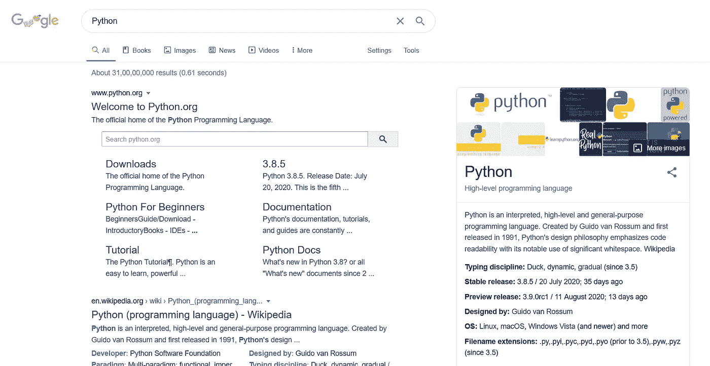
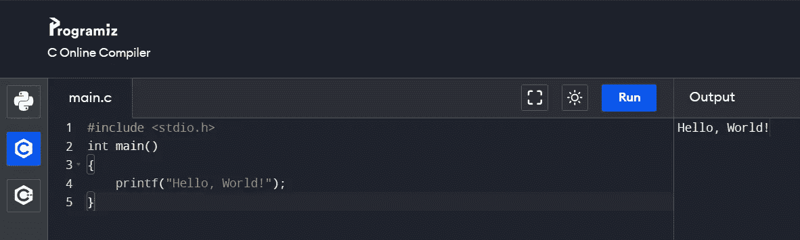
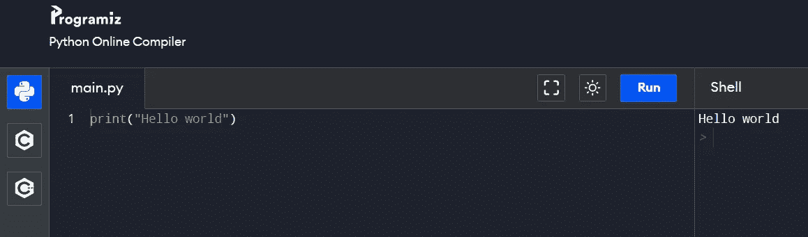
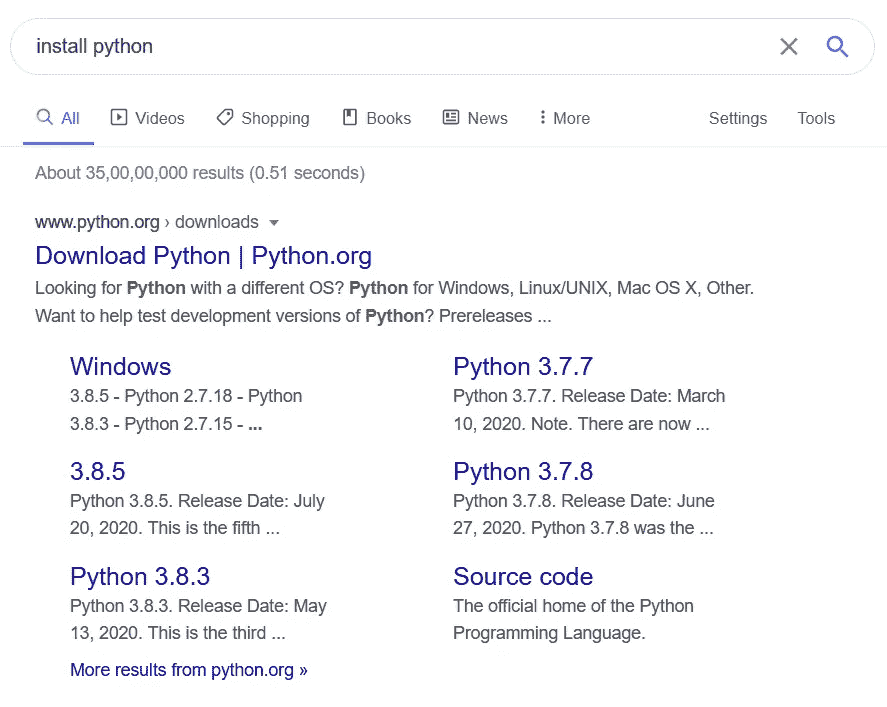
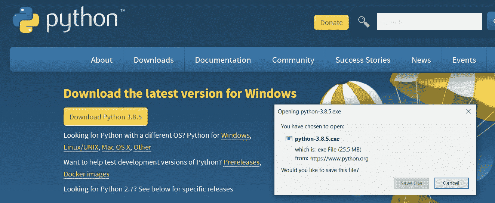
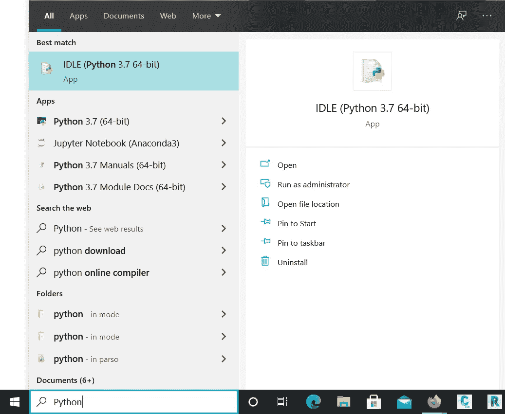
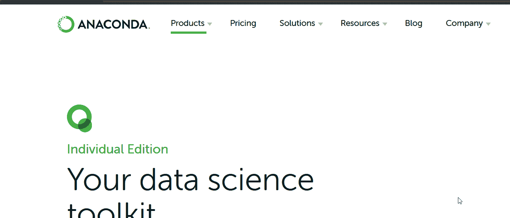
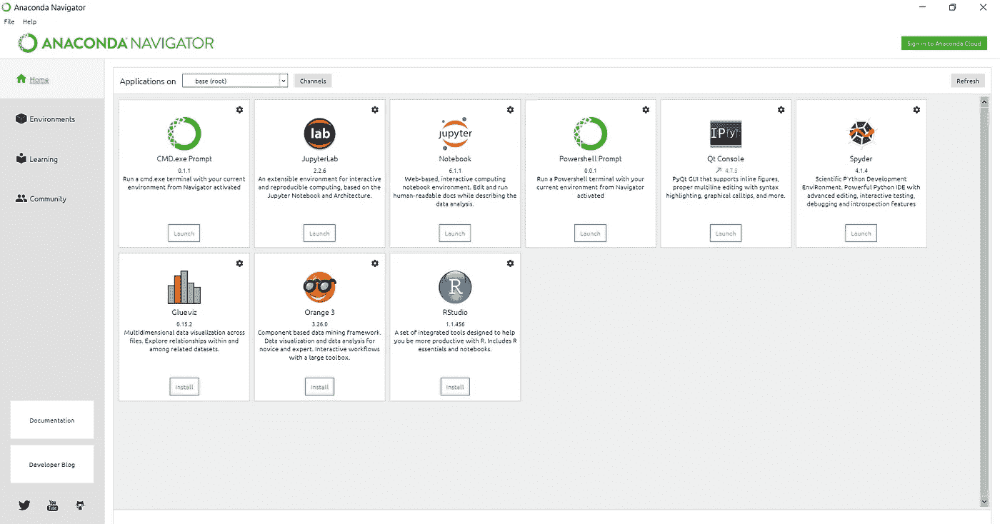

# 对“Python 和 Anaconda”的简要概述—对于初学者来说

> 原文：<https://medium.com/analytics-vidhya/a-brief-overview-python-and-anaconda-for-starters-4a38676d5778?source=collection_archive---------3----------------------->

# **Python 是什么？**

是的，你是对的！。蟒蛇是一种能够吞下鳄鱼的巨蛇。但是等等，让我们看看我们的朋友“谷歌”对“Python”有什么看法。你自己看吧

Python 是一种解释的、高级的和通用的…'，这是我们的谷歌人对 Python 的评价。这就是 Python 编程的流行。它是如此受欢迎，以至于它能够取代 Python 的原始含义。

**为什么要给编程语言取这样一个名字？**

图片提供:BBC

是的，左边的家伙是编程语言得到这样一个名字的原因之一。左边的人是英国超现实喜剧团的成员，“T4”*巨蟒剧团* 。在 20 世纪 80 年代末 ***Guido Van Rossum，***Python 的开发者在阅读 Monty Python 的《飞行马戏团》的脚本时，需要一个简短、独特且有点神秘的名字，所以他将他正在开发的语言命名为 ***Python***

**Python 的一般介绍:**

Python 是一种通用的高级编程语言，这意味着你可以用它来解决一般问题，而高级意味着编程语言几乎与口语/书面语相匹配。

Python 编程因其简单的语法和多功能性而易于初学者掌握。例如，其他编程需要分号或括号来完成命令，而 python 只使用新行来完成命令。

Python 严重依赖空白缩进来确定循环、函数和类的范围，而其他编程语言需要花括号来定义范围。找下面两个图，可以发现 C 程序的语法比 Python 多。

正如我们已经提到的 Python 是通用的，让我们看看它有多通用。Python 可以用于 web 开发。Flask、Pyramid、CherryPy 和 Django 是 Python 为 web 开发提供的一些框架。

Python 可以用于游戏开发、数据分析、人工智能和人工智能，也可以用于软件开发。简而言之，Python 可以被认为是编码的瑞士军刀。

还要注意，从 2020 年开始，Python 3 版本被广泛使用，因为对 Python 2 的支持已经正式停止。因此，如果你开始学习 Python，确保你学习的是 Python 3 版本，而不是 Python 的旧版本。

**如何安装 Python(在 Windows 中)？**

如果您计划安装 Anaconda，那么您可以跳过这一步，因为 Python 将在您安装 Anaconda 时安装。

要安装 python，只需在谷歌搜索中输入“安装 Python ”,第一个标签将来自 python.org，如下图所示。点击并前往 python.org

进入 python.org 后，点击**“下载 Python 3 . 8 . 5”**(版本和界面可能会在您安装 Python 时发生变化)

答。会提示. exe 文件，下载后点击**【保存文件】**执行

一旦在 windows 提供的搜索框中安装了类型“python”，如下图所示，就一定能看到 IDLE，这是 Python 在 Windows 中的默认集成开发环境。

**Python 中的库**

图书馆字面意思是藏书，对吗？。类似地，Python 库中也有大量代码可以在项目中使用。您可以通过使用关键字“import”来使用这些库。如果你想对什么是 python 中的库有一个简单的解释，通读链接[中的小故事什么是 Python 中的库？](https://www.transportpythonified.com/2020/08/what-are-libraries-in-python.html)。

最后总结一下，不考虑编程语言排名机构，你肯定会发现 Python 在 2020 年的十大语言中。既然我们现在已经看到了什么是 Python，那么让我们来看看什么是 anaconda(另一种以蛇为名的编程语言？).

# **什么是蟒蛇？**

嗯，我们可能都听说过术语“蟒蛇”,指的是一种能够吞下一个成年人的巨蛇。如果你是一个 90 年代的孩子，那么你可能在童年时就看过著名的电影《蟒蛇》,提醒你蟒蛇有多大。

再一次，让我们问问那个谷歌的家伙，他对蟒蛇了解多少。

从上图中你可以发现我们的电影被一种叫做“个人版——蟒蛇”的东西推倒了。这就是蟒蛇的受欢迎程度。那么 Anaconda 在编程环境中是什么呢？

> Anaconda 是 Python 和 R(另一种编程语言)的免费开源发行版。这意味着，当您安装 Anaconda 时，对于 Python 的数据科学和机器学习非常有用的包会预装在其中，因此 Anaconda 对于数据科学家和机器学习爱好者来说变得非常方便

**Anaconda 中的环境:**

Anaconda 还充当环境管理者。例如，如果您同时处理图像处理项目(项目 X)和数据分析项目(项目 Y)，您可以为它们分别创建单独的环境。

我们需要独立环境的原因是，假设项目 X 和项目 Y 都依赖于库 A(模块 A/包 A)。对于项目 X，库版本必须是 1.0.0，而对于项目 Y，库版本必须是 1.1.0。这可能会在项目工作中引起问题，为了避免这样的麻烦，我们创造了环境。

> 琐事:
> 
> 为了在 **python** 中安装库，我们使用 **pip install <库名>**
> 
> 为了在 **anaconda** 中安装库，我们使用 **conda install <库名>**

**如何安装 Anaconda:**

要在 Windows 上安装 Anaconda，请转到[www.anaconda.com/downloads](http://www.anaconda.com/downloads)。进入下载页面后，单击下载并保存。exe 文件并在以后执行它。

如需详细的安装指南，请访问[https://docs.anaconda.com/anaconda/install/windows/](https://docs.anaconda.com/anaconda/install/windows/)

**蟒蛇导航器:**

安装 Anaconda 后，您会得到一个名为 Anaconda Navigator 的 GUI(图形用户界面),如下所示

您可以使用这个 GUI 来创建环境，启动 IDE，如 Jupyter notebook、Jupyter lab 和 Spyder。蟒蛇有自己的执行命令的提示。

**结论:**

现在，您对编程世界中的 Python 和 Anaconda 有了一个简单的概念，安装它们，用代码弄脏您的手。

一旦安装了 Python 和 Anaconda，就要习惯这个界面，并开始探索其中有趣的特性。开始使用来自 anaconda 的 jupyter lab 或 jupyter notebook，从简单的 python 脚本开始。在 jupyter lab 和 notebook 中调试总是很容易，因为单元执行是可能的。

> *类比:如果 Python 是一个蛋糕，那么 Anaconda 就是出售添加口味的蛋糕的地方，你可以选择是否吃它们。Anaconda 还提供特殊的工具，如叉、刀、勺(Jupyter 笔记本、Jupyter 实验室、Spyder)等。品尝蛋糕。这还没完，Anaconda 允许你自己创造环境来享受蛋糕，你可以为不同场合创造不同的环境。你可以创造一个符合你和你女朋友/男朋友口味的环境，一个和家人一起分享蛋糕的环境等等..*

祝您的编码工作一切顺利。

> **免责声明**:本免责声明旨在告知读者，文中表达的观点、想法和意见仅属于作者，不一定属于作者的雇主、组织、委员会或其他团体或个人。如果文章中有任何错误，请务必通知作者

如果这篇文章在任何方面对你有用(即使它有助于你在公共汽车/火车/机场消磨时间😛)别忘了留两个拍手

***问候，***

***维格内什***

[人工授精](https://aipylinux.quora.com/)