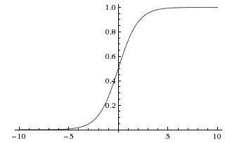
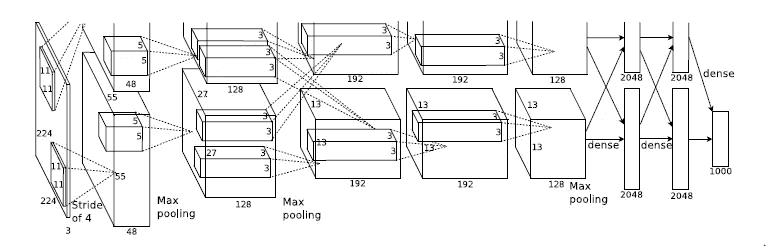
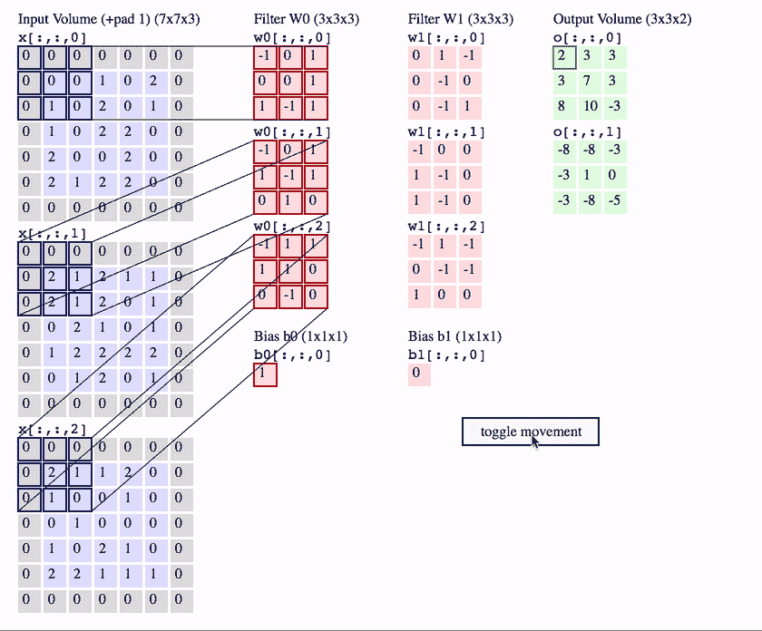
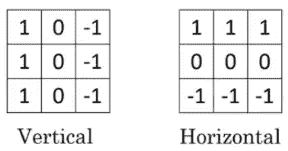

# 用 MNIST 数字识别器研究卷积神经网络

> 原文：<https://medium.com/analytics-vidhya/a-brief-study-of-convolutional-neural-network-cnn-using-mnist-digit-recognizer-e054cf8863bf?source=collection_archive---------12----------------------->

人工智能在过去十年里有了巨大的增长，看起来在不久的将来不会放缓。人工智能一直处于许多行业变革的前沿。科学家和工程师还有很多未开发的潜力。正如许多像我一样的工程师一样，对我们来说，具备参与这一新时代革命所需的知识是很重要的。

在这篇文章中，我解释了深度学习的一个最重要的概念:卷积神经网络。首先介绍了 CNN 的基础知识，然后完成了一个 MNIST 数字识别项目。我选择 MNIST 数据集，因为它被初学者广泛用来掌握神经网络，以开始他们的机器学习之旅。

# **简介**

卷积神经网络是深度神经网络的一部分，在图像识别和处理方面已经非常成功。它有多种应用，包括人脸识别、物体检测、交通标志识别和为机器人的计算机视觉提供动力。


这就是 CNN 对图像分类的工作方式([来源](https://github.com/cs231n/cs231n.github.io/blob/master/assets/classify.png)

几个经典的神经网络如下:

1.  **LeNet - 5**


来源:[基于梯度的学习应用于文档识别(研究论文)](http://yann.lecun.com/exdb/publis/pdf/lecun-98.pdf)

LeNet 是一个经典的多层神经网络，已经成功地用于识别手写数字和机器印刷字符。它使用**s 形**非线性函数。按照现代标准，这尤其是一个拥有 60，000 个参数的较小的神经网络。



SIGMOID 函数

**2。AlexNet**



来源:[深度卷积神经网络的 ImageNet 分类(研究论文)](https://papers.nips.cc/paper/2012/file/c399862d3b9d6b76c8436e924a68c45b-Paper.pdf)

AlexNet 是一个大型深度卷积神经网络，用于将 ImageNet LSVRC-2010 竞赛中的 120 万幅高分辨率图像分类为 1000 个不同的类别。它使用 **ReLU 非线性函数**。这个网络有 6000 万个参数和 650，000 个神经元，由五个卷积层组成，一些是最大池层，三个全连接层，最后是 1000 路 softmax。这些层被划分并在多个 GPU 上训练。一种叫做**脱落**的技术被用来防止过度拟合。


脱落技术

**3。VGG——16**


VGG-16 建筑([来源](https://neurohive.io/en/popular-networks/vgg16/)

VGG-16 是一个大型卷积神经网络，大约有 1.38 亿个参数。VGG16 中的 16 指的是它有 16 层有权重。VGG16 具有大量的超参数，这些参数集中于具有步幅为 1 的 3×3 滤波器的卷积层，并且总是使用步幅为 2 的 2×2 滤波器的相同填充和最大池层。整个架构都遵循卷积层和最大池层的这种安排。最后，它有 2 个完全连接的层，后面是 softmax(非线性函数)输出。


ReLU 非线性函数

# 卷积神经网络

## 卷积层(CONV)

这一层是 CNN 架构的基本构件。它获取输入图像，并对导致激活的图像使用过滤器。在滤波器和输入之间执行点积。

输入和滤波器之间的点积计算如下:



(参考:CS231n 注释。)

对于水平和垂直边缘检测，使用这些滤波器:



卷积有两个缺点

1.  图像尺寸缩小。
2.  角上的像素比中心的像素用得少。因此存在信息损失。

为了克服这些缺点，我们使用**填充**技术:这是一个添加零层到我们的输入图像的过程。


来源:geeksforgeeks

填充类型:

1.  **有效填充:**表示根本没有填充。输入图像保持不变。
2.  **相同填充:**在这种情况下，我们添加“p”个填充层，这样输出图像与输入图像具有相同的尺寸。

## 汇集层(池)


来源:[斯坦福 CS231 课程](https://github.com/cs231n/cs231n.github.io/blob/master/assets/cnn/pool.jpeg)

我们使用池层来减少图像的尺寸，这将有助于加快计算速度。通过对大小为 F×F、步幅为 S 的邻域应用某个函数，池独立地调整输入特征向量的每个通道的大小。这里，F 是滤波器大小，S 是步幅。

**联营类型:**

**最大池化**

从每个邻域中选取最大值。

**平均池**

计算每个邻域的平均值。


来源:斯坦福 CS217

## **全连接层(FC)**

我们使用完全连接的层来获取汇集/卷积层的输出，并使用它来将图像分类到标签中。在这一层中，汇集层的输出被展平成单个矢量输出，该矢量输出由表示图像属于特定标签的概率的值组成。

> FC 层和 CONV 层之间的唯一区别在于，CONV 层中的神经元仅连接到输入中的局部区域，并且 CONV 体积中的许多神经元共享参数，而 FC 层中的神经元与前一层中的所有激活完全连接。然而，两层中的神经元仍然计算点积，因此它们的功能形式是相同的。


完全连接的层

# MNIST 数字识别器

现在我们知道了卷积神经网络的基本原理，让我们开始这个项目。

数据集:-[https://www.kaggle.com/c/digit-recognizer/data](https://www.kaggle.com/c/digit-recognizer/data)

*注意——使用 Google Colab 作为它的 GPU 有助于神经网络的更快计算。*

**第一步**:导入需要的库

```
import numpy as npimport pandas as pdimport numpy as npimport tensorflow as tffrom tensorflow import keras
```

**第二步:**导入数据集并保存在 dataframe 中

有两种方法可以做到这一点:

1.  将文件从本地存储导入 Google Colab(较慢的方式)。

```
from google.colab import filesuploaded = files.upload()import iotrain = pd.read_csv(io.BytesIO(uploaded['train.csv']))test = pd.read_csv(io.BytesIO(uploaded['test.csv']))
```

2.将文件从 Google Drive 导入 Google Colab(更快的方法)。

```
from google.colab import drivedrive.mount('/content/drive/', force_remount=True)train = pd.read_csv('/content/drive/My Drive/Colab Notebooks/Colab Datasets/MNIST/train.csv')test = pd.read_csv('/content/drive/My Drive/Colab Notebooks/Colab Datasets/MNIST/test.csv')
```

这是训练数据集的样子:


训练数据集视图

**步骤 3** :分离数据和标签

```
train_data = train.loc[:,"pixel0":]train_label= train.loc[:, "label"]
```

**步骤 3** :将训练和测试数据转换为 numpy 数组

```
train_data = np.array(train_data)train_label = tf.keras.utils.to_categorical(train_label, num_classes=10, dtype='float32')test_data = test.loc[:, "pixel0":]test_data = np.array(test_data)
```

**第四步:**对数据进行整形和归一化。

**我们在这里写“1 ”,让 keras 知道它是一个灰度图像，它实际上不会改变值的数量。**

```
train_data = train_data.reshape(train_data.shape[0],28,28,1)test_data  = test_data.reshape(test_data.shape[0],28,28,1)#Normalize the values between 0 to 1train_data = train_data/255.0test_data  = test_data/255.0
```

**步骤 5:** 定义 CNN 层

```
model = tf.keras.models.Sequential([tf.keras.layers.Conv2D(32, (5,5), activation='relu',input_shape=(28,28,1), padding= 'same'),tf.keras.layers.Conv2D(32, (5,5), activation = 'relu', padding='same'),tf.keras.layers.MaxPooling2D(2,2),tf.keras.layers.Dropout(0.25),tf.keras.layers.Conv2D(64,(3,3),activation = 'relu',padding = 'same'),tf.keras.layers.Conv2D(64,(3,3),activation = 'relu',padding = 'same'),tf.keras.layers.MaxPooling2D(2,2),tf.keras.layers.Dropout(0.25),tf.keras.layers.Flatten(),tf.keras.layers.Dense(1024,activation = 'relu'),tf.keras.layers.Dropout(0.5),tf.keras.layers.Dense(10,activation = 'softmax')]) model.compile(optimizer = "adam", loss='categorical_crossentropy',metrics=['accuracy'])
```

**第六步:**拟合模型

```
history = model.fit(train_data,train_label,epochs = 25)
```

输出:

```
Epoch 1/25 1313/1313 [==============================] - 6s 5ms/step - loss: 0.1634 - accuracy: 0.9488 Epoch 2/25 1313/1313 [==============================] - 6s 5ms/step - loss: 0.0609 - accuracy: 0.9809 Epoch 3/25 1313/1313 [==============================] - 6s 5ms/step - loss: 0.0469 - accuracy: 0.9856 Epoch 4/25 1313/1313 [==============================] - 6s 5ms/step - loss: 0.0392 - accuracy: 0.9880 Epoch 5/25 1313/1313 [==============================] - 6s 5ms/step - loss: 0.0358 - accuracy: 0.9889 Epoch 6/25 1313/1313 [==============================] - 6s 5ms/step - loss: 0.0300 - accuracy: 0.9909 Epoch 7/25 1313/1313 [==============================] - 6s 5ms/step - loss: 0.0311 - accuracy: 0.9905 Epoch 8/25 1313/1313 [==============================] - 6s 5ms/step - loss: 0.0288 - accuracy: 0.9912 Epoch 9/25 1313/1313 [==============================] - 6s 5ms/step - loss: 0.0246 - accuracy: 0.9924 Epoch 10/25 1313/1313 [==============================] - 6s 5ms/step - loss: 0.0233 - accuracy: 0.9930 Epoch 11/25 1313/1313 [==============================] - 6s 5ms/step - loss: 0.0214 - accuracy: 0.9937 Epoch 12/25 1313/1313 [==============================] - 6s 5ms/step - loss: 0.0206 - accuracy: 0.9933 Epoch 13/25 1313/1313 [==============================] - 6s 5ms/step - loss: 0.0206 - accuracy: 0.9938 Epoch 14/25 1313/1313 [==============================] - 6s 5ms/step - loss: 0.0218 - accuracy: 0.9936 Epoch 15/25 1313/1313 [==============================] - 6s 5ms/step - loss: 0.0201 - accuracy: 0.9941 Epoch 16/25 1313/1313 [==============================] - 6s 5ms/step - loss: 0.0189 - accuracy: 0.9945 Epoch 17/25 1313/1313 [==============================] - 6s 5ms/step - loss: 0.0188 - accuracy: 0.9944 Epoch 18/25 1313/1313 [==============================] - 6s 5ms/step - loss: 0.0161 - accuracy: 0.9948 Epoch 19/25 1313/1313 [==============================] - 6s 5ms/step - loss: 0.0172 - accuracy: 0.9950 Epoch 20/25 1313/1313 [==============================] - 6s 5ms/step - loss: 0.0175 - accuracy: 0.9953 Epoch 21/25 1313/1313 [==============================] - 6s 5ms/step - loss: 0.0165 - accuracy: 0.9950 Epoch 22/25 1313/1313 [==============================] - 6s 5ms/step - loss: 0.0166 - accuracy: 0.9955 Epoch 23/25 1313/1313 [==============================] - 6s 5ms/step - loss: 0.0180 - accuracy: 0.9950 Epoch 24/25 1313/1313 [==============================] - 6s 5ms/step - loss: 0.0149 - accuracy: 0.9959 Epoch 25/25 1313/1313 [==============================] - 6s 5ms/step - loss: 0.0195 - accuracy: 0.9949
```

**第 7 步**:检查型号汇总使用:

```
model.summary()
```

输出:

```
Model: "sequential" _________________________________________________________________ Layer (type)                 Output Shape              Param #    ================================================================= conv2d (Conv2D)              (None, 28, 28, 32)        832        _________________________________________________________________ conv2d_1 (Conv2D)            (None, 28, 28, 32)        25632      _________________________________________________________________ max_pooling2d (MaxPooling2D) (None, 14, 14, 32)        0          _________________________________________________________________ dropout (Dropout)            (None, 14, 14, 32)        0          _________________________________________________________________ conv2d_2 (Conv2D)            (None, 14, 14, 64)        18496      _________________________________________________________________ conv2d_3 (Conv2D)            (None, 14, 14, 64)        36928      _________________________________________________________________ max_pooling2d_1 (MaxPooling2 (None, 7, 7, 64)          0          _________________________________________________________________ dropout_1 (Dropout)          (None, 7, 7, 64)          0          _________________________________________________________________ flatten (Flatten)            (None, 3136)              0          _________________________________________________________________ dense (Dense)                (None, 1024)              3212288    _________________________________________________________________ dropout_2 (Dropout)          (None, 1024)              0          _________________________________________________________________ dense_1 (Dense)              (None, 10)                10250      ================================================================= Total params: 3,304,426 Trainable params: 3,304,426 Non-trainable params: 0 _________________________________________________________________
```

**第八步**:进行预测并保存。

```
predictions = model.predict(test_data)prediction = []for i in predictions: prediction.append(np.argmax(i))#making a dataframe to save predictions and data valuessubmission =  pd.DataFrame({"ImageId": test.index+1,"Label": prediction})submission.to_csv('submission.csv', index=False)
```

这是我们提交的内容的样子:


**第 9 步:**使用模型预测单个示例的结果

```
import matplotlib.pyplot as pltimage = train_data[0].reshape(28,28)plt.imshow(image)
```


我们将试图识别的图像

识别图像的代码:

```
result = model.predict(np.array([train_data[0]]))predicted_value = np.argmax(result)print(predicted_value)
```

输出:

```
1
```

Github 链接:[https://github.com/Atharva1604/MNIST-Digit-Recognizer-CNN](https://github.com/Atharva1604/MNIST-Digit-Recognizer-CNN)

请和我分享你对 CNN 和深度学习的想法。

谢谢大家！！！