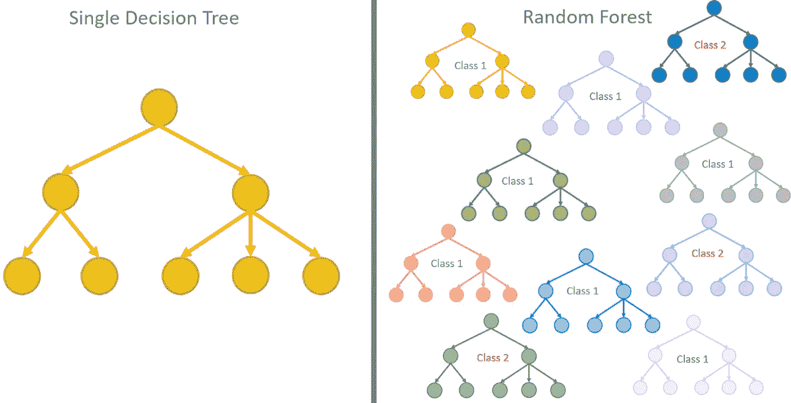

# 改变职业的算法让你成为更好的数据分析师

> 原文：<https://medium.com/analytics-vidhya/a-carrier-changing-algorithms-to-make-you-a-better-data-analyst-a75ff49c5157?source=collection_archive---------17----------------------->

Jorge Vasconez 在 [Unsplash](https://unsplash.com?utm_source=medium&utm_medium=referral) 上拍摄的照片

有了经验，你会发现少数算法可以解决你的大部分问题。本文将涵盖你工具箱中需要的 3 种最有用的 CML(经典机器学习)算法。

以下 3 个算法是 CML 问题的*转到*算法。该列表包括 3 种分类器算法:

**I-朴素贝叶斯(NB)**

NB 是一种基于贝叶斯定理的概率建模算法。贝叶斯定理简单地陈述如下:

> 事件的概率是基于可能与事件相关的条件的先验知识。

贝叶斯定理讨论条件概率。条件概率是假设条件 B 为真，事件 A 发生的可能性。

例如，考虑人的视力及其与人的年龄的关系。根据贝叶斯定理，与在不知道一个人年龄的情况下做出的评估相比，年龄可以帮助更准确地评估一个人戴眼镜的概率。在这个例子中，人的年龄是条件。

名称中的*天真*部分的原因是算法对属性的独立性做了一个非常*天真*的假设。

NB 算法的一些优点包括:

1- NB 适用于垃圾邮件检测，其中分类返回一个类别，如垃圾邮件或非垃圾邮件。

2- NB 可以接受分类和连续数据类型。

3- NB 可以通过在估计概率时忽略数据集中的缺失值来处理它们。

4- NB 对于有噪声的数据也是有效的，因为噪声通过使用概率来平均。

5- NB 是高度可伸缩的，它特别适合大型数据库。

6- NB 可以适应大多数类型的分类，是文档分类、垃圾邮件过滤和欺诈检测的优秀算法选择。

7- NB 适合增量更新。

8- NB 提供了有效的内存使用和快速的训练速度。该算法适合并行处理。

因为 NB 的缺点是，当数据属性具有某种程度的相关性时，该算法不能很好地工作。这违背了算法的*幼稚*假设。

**II-随机森林(分类)**

随机森林

要理解 RF，首先要理解决策树。最后一种是用于分类的监督学习方法。此外，它们使用训练数据集增长。

决策树可以对测试数据集中的实例进行分类，是一种分而治之的学习方法。

随机森林非常适合高维数据，因为我们处理的是数据子集。训练比**决策树**更快，因为我们只处理这个模型中的一个特征子集，所以我们可以轻松地处理数百个特征。

RF 算法有几个优点:

1- RF 易于可视化，因此您可以了解导致分类结果的因素。如果您必须向业务领域专家或用户解释您的算法是如何工作的，这将非常有用。

2-随机森林中的每棵树在随机特征上生长结构，最小化偏差。

3-与朴素贝叶斯算法不同，基于决策树的算法在属性具有某种相关性时工作良好。

4- RF 是最简单、最鲁棒、最容易理解的算法之一。

5-射频装袋功能非常有用。它提供了牢固的贴合性，通常不会过度贴合。

6- RF 是高度可扩展的，并提供合理的性能。

射频有一些缺点:

1-当决策树很复杂时，训练时间很长，因此速度很慢。

2-缺失值会给基于决策树的算法带来问题。

3-属性排序是很重要的，比如那些具有最多*信息增益*的属性最先出现。

RF 算法是对朴素贝叶斯算法的很好补充。射频变得流行的一个主要原因是因为它非常容易得到好的结果。

**III-K-最近邻算法(KNN)**

**K-最近邻算法(KNN)**

k-最近邻算法是一种产生良好结果的简单算法。KNN 对于分类和回归是有用的。

KNN 算法根据其邻近实例的分类对每个新实例进行分类。

KNN 的优势:

1- KNN 不对基础数据做任何假设。

2- KNN 是一个简单的分类器，可以很好地处理基本的识别问题。

3- KNN 易于想象和理解分类是如何确定的。

4-与朴素贝叶斯不同，KNN 对相关属性没有问题，如果数据集不大，它也能很好地处理有噪声的数据。

KNN 的缺点:

1-选择 K 可能会有问题，你可能需要花时间调整 K 值。

2-由于依赖基于距离的测量，KNN 受到维数灾难的影响。为了帮助解决这个问题，您可以尝试在建模之前减少尺寸或执行特征选择。

3- KNN 是基于实例的，处理整个数据集进行分类，这是资源密集型的。对于大型数据集，KNN 不是一个很好的算法选择。

4-将分类值转换为数值并不总能产生好的结果。

5-作为一个懒惰的分类器，KNN 不是实时分类的好算法选择。

总之，KNN 是一个简单、有用的分类器。在最初的分类尝试中考虑它，特别是如果上面列出的缺点对您的问题来说不是问题的话。

起源于:[Blog.selcote.com](http://blog.selcote.com/2020/02/05/a-carrier-changing-algorithms-to-make-you-a-better-data-analyst/)