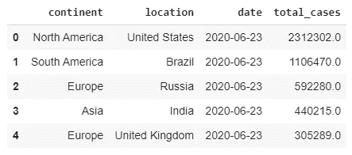
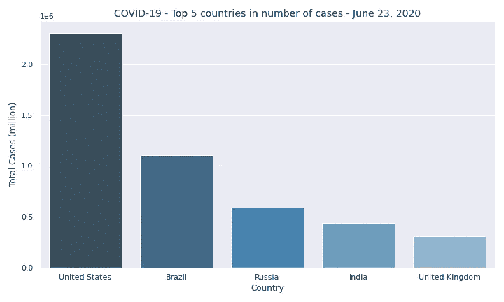
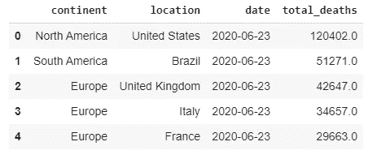
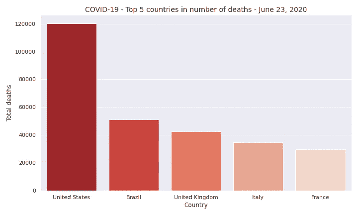
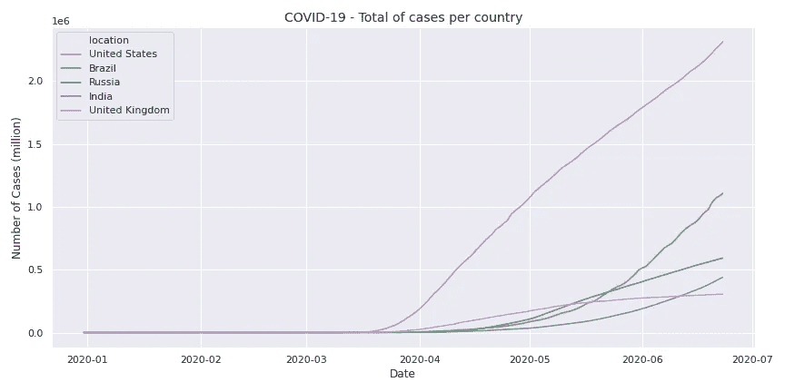
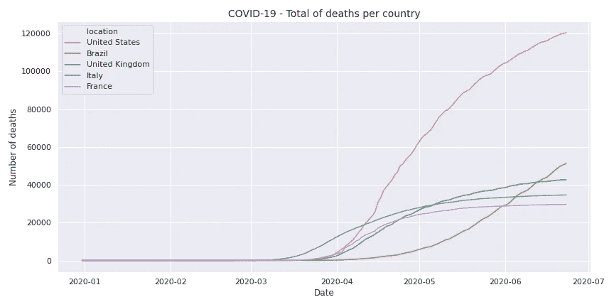
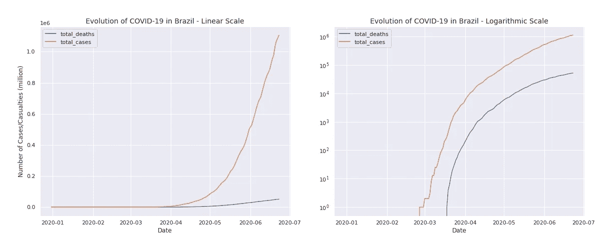
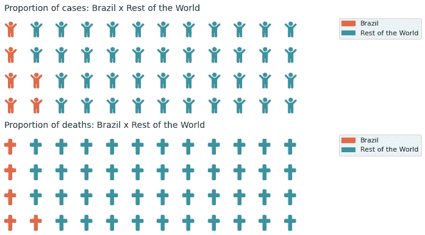

# 巴西新冠肺炎情况的案例研究—2020 年 6 月

> 原文：<https://medium.com/analytics-vidhya/a-case-study-of-brazils-covid-19-situation-june-2020-85f029d652e9?source=collection_archive---------20----------------------->

[疾控中心](https://unsplash.com/@cdc)在 [Unsplash](https://unsplash.com) 拍摄的照片

## 基于 Pandas、Matplotlib 和 Seaborn 基本概念的巴西新型冠状病毒的统计分析

新冠肺炎(冠状病毒疾病 2019)是一种由新型冠状病毒引起的传染病，与严重急性呼吸综合征(SARS)和某些类型的普通感冒属于同一病毒家族。

据[世界卫生组织](https://www.who.int/)称，常见症状包括发烧、疲劳、咳嗽和气短。虽然大多数情况下会出现轻微症状，但在更严重的情况下，感染会导致肺炎或呼吸困难，在更罕见的情况下，这种疾病可能是致命的。

照片由 [fusion_medical_animation](https://unsplash.com/@fusion_medical_animation) 在 [Unsplash](https://unsplash.com/) 上拍摄

虽然对导致新冠肺炎的病毒仍有许多未知，也没有疫苗或特定的抗病毒治疗方法可用，但避免错误信息和了解最新消息和保护措施的最佳方法之一是参考世界卫生组织网站。

为了提高对新冠肺炎的认识，重点是巴西，这项研究将使用用于数据分析和可视化的 Python 工具的概念，如 Pandas、NumPy、Matplotlib 和 Seaborn，检查截至 2020 年 6 月 23 日的疾病演变。

# 关于数据

收集关于新疾病的数据可能会有问题，因为不同来源的信息可能会有冲突。例如，在巴西，联邦和州政府、医院和媒体机构以及其他非官方手段正在披露数据。

为了使这项研究尽可能可靠，这里使用的数据集是由科学在线出版物 [Our World in Data](https://ourworldindata.org/coronavirus) 维护的新冠肺炎数据集合，该出版物的研究团队位于牛津大学，专注于大型全球问题。

完整的数据集可以从[这里](https://github.com/owid/covid-19-data/tree/master/public/data)下载。它每天更新，包括每个国家的确诊病例、死亡和检测数据，以及其他可能感兴趣的特征。

由于数据每天都在增长和变化，请记住这项研究考虑的是 2020 年 6 月 23 日的数据。

## 变量库

研究中使用的主要变量如下。[完整码本](https://github.com/owid/covid-19-data/blob/master/public/data/owid-covid-data-codebook.md)可用于数据集中每个变量的描述和来源。

*   `location` -地理位置
*   `date` -观察日期
*   `total_cases` -新冠肺炎确诊病例总数
*   `new_cases` -新冠肺炎新增确诊病例
*   `total_deaths` -新冠肺炎造成的总死亡人数
*   `new_deaths` -新的死亡归因于新冠肺炎
*   `population`-2020 年人口

# 探索性分析

在这个分析中，我们使用了以下库。

我们将使用 25，707 行 34 列的数据框。每行代表一个位置和日期。如上所述，很难准确跟踪关于这种新疾病的信息。许多条目丢失并不奇怪。一些特性，尤其是那些与新冠肺炎测试相关的特性，有大量的缺失值。由于本研究不关注测试，我们将不讨论这些特性。

## 全球概览

首先，我们研究了新冠肺炎病例最多的 5 个国家。

图一。新冠肺炎病例数量最多的 5 个国家

然后我们使用 matplotlib 和 seaborn 绘制了一个图表，并可视化了这些国家中的病例分布。

图表 1

2020 年 6 月 23 日全球新冠肺炎病例总数达到 900 万。至于受影响最严重的国家，美国有 230 万病例，其次是巴西，有 100 多万病例。

这 5 个国家的病例数占全球新冠肺炎病例总数的 52.48%。

对新冠肺炎造成的伤亡人数做同样的检查，我们得到以下结果。

图二。新冠肺炎死亡人数最多的 5 个国家

我们再次绘制了一个图表来可视化数据。

图表 2

截至 2020 年 6 月 23 日，新冠肺炎死亡总人数超过 47 万。伤亡人数最多的国家是美国，有 12 万人，其次是巴西，有 5 万人左右。

这 5 个国家的死亡人数占新冠肺炎在全球造成的死亡总数的 59.07%。

# 新冠肺炎全球进化

自 2019 年 12 月首次报告病例以来，新冠肺炎感染人数仍在增加。在 matplotlib 和 seaborn 的帮助下，我们可以观察到病例数量的变化，考虑到前 5 个受影响最严重的国家。

图表 3

请注意美国的感染人数是如何在三月中旬左右开始激增，并从那时起持续增长的。至于英国，病例数在 6 月份似乎已经稳定下来。

关于列表中的其他 3 个国家，病例数在 4 月份开始呈指数增长，到 5 月中旬，巴西的曲线脱离了其他国家，呈现出与美国几周前相似的趋势。

现在，我们来探讨死亡总数的演变。

图表 4

从上面的图表中，我们可以假设美国、英国、意大利和法国的伤亡曲线正在变平，而巴西仍然没有显示出明显的变平趋势。

一个可能的原因是，疫情比巴西早几周袭击了前几个国家，自然传染周期(加入了战斗策略)可能有助于死亡人数逐日减少。

# 巴西的现状

由[塞尔吉奥·索萨](https://unsplash.com/@serjosoza)在 [Unsplash](https://unsplash.com) 上拍摄的照片

正如我们在上一节中看到的，巴西在病例和伤亡人数上排名第二。而且它的感染和死亡曲线仍然没有呈现出明显的扁平化趋势。让我们仔细看看巴西的情况。

巴西的首例新冠肺炎病例于 2 月 26 日登记，首例伤亡于 3 月 18 日。从首例报告病例到首例报告死亡，历时 21 天。

为了比较确诊病例和死亡人数的变化，我们绘制了两个图表，分别是线性和对数标度。

图表 5

正如我们之前核实的那样，巴西的病例和伤亡人数正在上升。幸运的是，新冠肺炎的死亡率不像许多其他疾病那样高，这解释了病例数和死亡数之间的巨大差异。

最后，我们可以使用 Python 的另一个伟大的可视化特性`pywaffle`，来比较巴西和世界其他地方的病例数和死亡数。

图表 6

巴西的新冠肺炎病例和死亡人数分别占全球病例和死亡总数的 13%和 11%。

# 结论

我们对新冠肺炎在世界范围内的发展进行了统计分析，重点是巴西的情况。巴西与其他疫情严重的国家不同的一点是，在病例和死亡人数上升的同时，该国一些地区开始放松检疫措施。

美国在病例和伤亡人数上排名第一，是排名第二的巴西的两倍。然而，美国的死亡演变开始显示出减速的信号，而巴西的曲线仍然没有显示出明显的平坦趋势。事实上，如图 4 所示，在伤亡人数排名前 5 位的国家中，巴西的总死亡人数曲线是唯一一个呈增长趋势的国家。

总体而言，全球范围内新冠肺炎病例和死亡人数仍在上升，一些国家的遏制策略比其他国家更为成功。当然，各种各样的因素，如社会和经济环境，在各国处理当前疫情的方式中起着重要作用。

完整代码请参考[笔记本](https://github.com/rmpbastos/data_science/blob/master/Brazil's_COVID_19_situation_June2020.ipynb)。