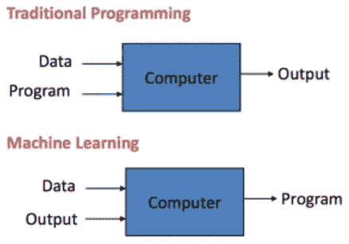
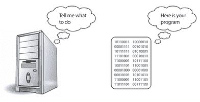
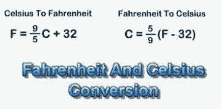
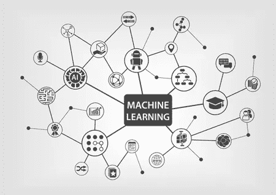
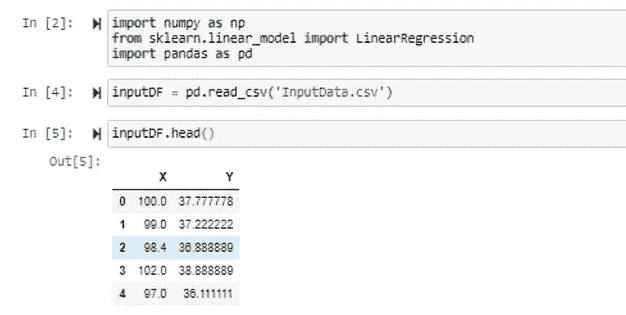
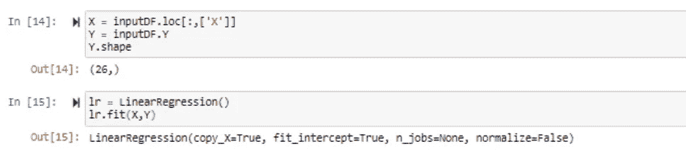

# 机器学习的经典介绍——用一个例子来讲述和实现

> 原文：<https://medium.com/analytics-vidhya/a-classic-introduction-to-machine-learning-with-an-example-to-relate-and-realize-f7995f3660c8?source=collection_archive---------17----------------------->

机器学习的经典介绍

机器学习已经成为主流，有许多教程、博客和视频解释它到底是什么。我想写这篇博客来解释什么是机器学习，以及它真正做什么，我在与初学者互动时经常引用一个简单的例子。

顾名思义，机器学习是一个领域/技术，它使机器能够从历史数据中学习，并将学习应用于未来数据以预测结果。许多基于人工智能的系统正在被构建，以执行 ML 解决方案推荐的决定性行动，从而保持领先地位。

这很好……它与传统的自动化系统有什么不同——在传统的自动化系统中，基于规则的场景定义系统行为。对于这个问题，我们大多数人都会在下面的快照中遇到:

机器学习和传统编程有何不同？

如上所述，基于传统编程的方法需要以下结构:

传统编程

→程序:定义确切行为的要求

系统和应用程序的 ior 将按照定义的需求编写。

→输入数据:输入到上面创建的程序中的数据。

→输出:输入数据后程序的处理输出。

举个例子，让我们考虑一下“华氏温度到摄氏温度的转换”这个经典问题。我们有一个科学的公式来管理它们之间的关系，为了自动进行这种转换，我们将编写程序，以“华氏”作为输入，并应用所需的公式来生成计算的“摄氏”。

它公平而简单——这是我们大多数人在高中课程中都会写的常见练习之一。

让我们看看，如何用基于机器学习的方法来解决同样的问题。

有了机器学习，我们不需要科学公式，基于 ML 的算法足够智能，可以根据提供的输入和输出数据推导出公式。因此，基于 ML 的解决方案需要以下结构:

→输入数据:作为解决方案输入的输入数据(即特征)。

→输出数据:输入后产生的输出结果(又名期望值)。

→推导程序:描述输入和输出数据之间关系的程序(又名模型文件)。

让我们以同样的问题为例，引用包含“华氏”和“摄氏”值的各种样本的 excel 表。对于这个讨论，让我们把“华氏温度”看作“X ”,把“摄氏温度”看作“Y ”, excel 表格包含大约 20 个这样的值。暂时，让我们假设我们不知道这些 X 和 Y 是什么以及支配它们的关系。

我们的目标是推导出它们之间的关系，并生成可用于将 X 值转换为 y 值的程序。

因此，让我们进入 ML 程序，使用一种“回归”算法来推导这种关系。我们不会深入回归问题的细节或算法细节。考虑一下，我们有一个特定的 ML 算法来解决这个问题。

现在，我们已经建立了我们的模型，让我们看看我们的模型如何帮助转换任务。

正如您所观察到的，model 有助于从给定的“X”(即华氏温度)值转换“Y”(即摄氏温度)值。

我们能够从给定的数据中推导出从“华氏”到“摄氏”的公式，而不需要进入各自领域的复杂细节。这是我们如何用给定的“输入”和“输出”值生成“程序”的经典例子——如前所述。

请注意，这是一个简单的问题，因为“华氏”和“摄氏”之间的关系是线性的。但是在现实世界中，大多数基于数据的决策需要从数据属性之间存在的非线性关系中得出。

机器学习是一个很好的概念来挖掘这些属性之间的内在关系，并帮助我们做出正确的决定。

你可以在这里找到本博客[使用的笔记本和数据文件。](https://github.com/VVasanth/MachineLearning/tree/master/ClassicIntroductionToMachineLearning)

请随时发表您的疑问/意见。