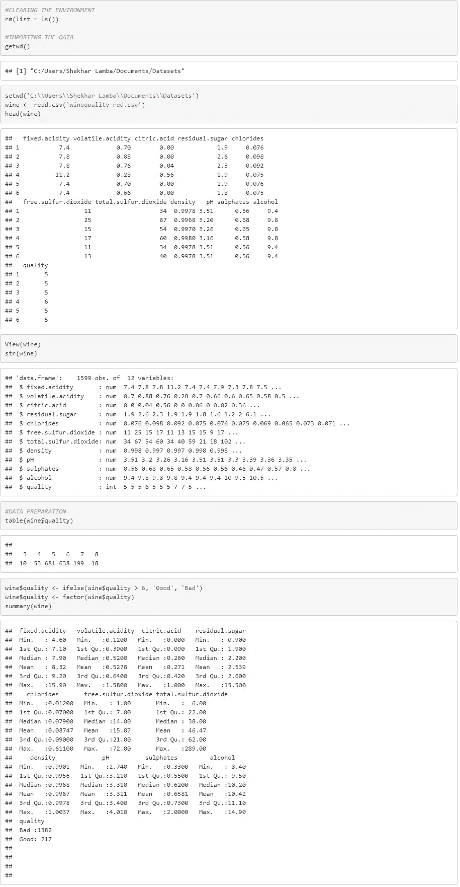
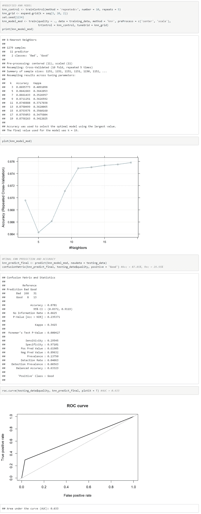
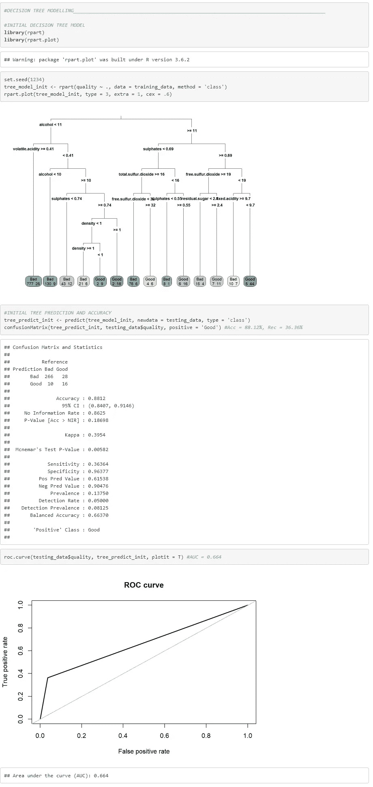
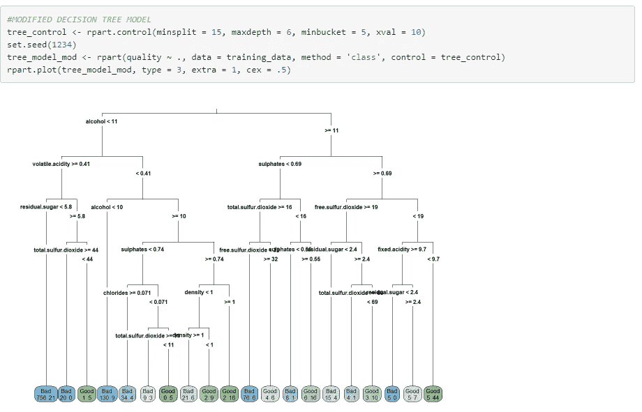

# 基于红酒质量数据的最大似然算法比较。

> 原文：<https://medium.com/analytics-vidhya/a-comparison-of-some-basic-ml-algorithms-by-using-red-wine-quality-data-8318bd6e19e1?source=collection_archive---------13----------------------->

机器学习算法的迷人之处在于它们是如何随着时间而进化的。从线性回归和逻辑回归的简单概念开始，我们已经走了很长的路来使用像 XGBoost 这样复杂的方法。在这两个极端之间的某个地方，我们有其他重要的技术，这些技术不断稳步发展，最终将我们引向今天的复杂技术。其中最值得注意的是最近邻居、决策树和随机森林。在这里，我们将看到这三种算法是如何工作的，因为我们试图从一个包含许多属性的数据集中，将一批红酒归类为“好”或“坏”的质量。

**准备好红酒数据**

我们从导入从 Kaggle 的数据集库中获得的[红酒质量数据](https://www.kaggle.com/uciml/red-wine-quality-cortez-et-al-2009)开始。看数据，我们看到红酒的品质已经用从 3 到 8 的数字来描述了。因此，我们通过将质量为*>6 的红酒归类为“好”质量，将质量为*≤6 的红酒归类为“差”质量来重新标记数据。然后，由于是目标变量，我们将*质量*变量设置为因子变量。**

****

**我们现在构建一个简单的用户定义函数，并使用这个 UDF 和箱线图来检查异常值。我们将范围*(平均值-(3 * SD)，平均值+(3*SD))* 之外的所有值识别为异常值，并用这些限制对其进行限制。我们还创建了一个矩阵来查看数据集不同属性之间的相关性。**

****

**现在我们在密度图的帮助下，简单地比较好的和坏的质量红葡萄酒的不同属性，看看这两个类别的平均值在每种情况下有多少不同。**

****

**最后，我们按照 8:2 的比例将数据集分成训练集和测试集。然后，我们继续在训练集上构建我们的模型，并通过检查这些模型与我们的测试集一起工作的正确程度来看它们有多好。**

****

*****k*-最近邻居****

**k*-最近邻或简称为 *k* NN，是一种简单的监督式 ML 算法。这是一种相当于“*从众心理*的数据，因为每个新点都是基于其最近的 *k* 个邻居进行分类的。首先对训练集进行聚类，当添加新点时，然后基于欧几里德距离，考虑最近的 *k* 点。然后，根据这些最近的 *k* 点的分类，新点被分类到特定的聚类中。如果新点位于两个或更多个聚类之间，那么它被归类到获得最多票数的聚类。***

**NN 算法唯一棘手的方面是为 T2 k T3 获取合适的值。随着 *k* 值的增加，边界变得平滑，但也有可能只有几个点的聚类总是被其他聚类超过，从而导致欠拟合模型。另一方面， *k* 的低值会导致过拟合，因为它对异常值变得敏感。**

**为了获得 *k* 的最佳值，我们将训练集的一小部分视为“未知”，并通过 *k* NN 算法来运行它，以查看它有多精确。然后，在确定一个合适的值之前，我们会调高或调低一些值。**

**现在有了我们得到的训练集，我们先用 *caret* 包中的 *train()* 函数做一个简单的 *k* NN 模型(也可以用*类*包做)。请注意， *k* NN 要求在构建模型之前对数据进行归一化处理。我们通过添加*预处理*作为*中心*和*比例*来实现这一点。接下来，我们绘制模型以获得 k 的初始值。然后，我们使用该模型预测测试集的结果，并检查其混淆矩阵，以获得其准确性和召回率的度量。我们还构建了一个 ROC 图，以获得其 AUC 值。**

****

**现在，我们将通过调整参数来创建一个修改的 *k* NN 模型。首先，我们告诉 *train()* 函数通过使用额外的 *trainControl()* 函数，使用 10 重交叉验证来创建新模型。我们还引入了一个网格，这样就可以从中获得合适的 k 值。通过这样做，我们期望得到更好的值 *k* ，从而改善结果。**

****

**我们观察到新修改的 *k* NN 模型比最初的 *k* NN 模型具有相对更高的准确性和 AUC 值，尽管两个模型的召回率保持相同。此外，我们可以看到，改进的 *k* NN 模型比初始模型(48.15%)更精确(61.91%)。因此，总的来说，参数的调整导致了更好的结果。**

****决策树****

**决策树是一种直观的算法，它根据前面的条件是真还是假来执行分类。就像它们的物理对应物一样，决策树有一个根:只有向外箭头的最顶层条件；内部节点或简单节点:两边都有箭头的条件；和终端节点或叶子:没有向外箭头的条件。因此，决策树类似于垂直翻转的物理树。**

**我们通过选择最合适的属性作为根来开始构建决策树。为此，我们首先为每个属性制作一个仅包含一个根和两个叶的小决策树，也称为树桩。然后，我们使用基尼指数来测量这些树桩中每个树桩的杂质，并且选择对应于具有最低基尼指数的树桩的属性作为根。如果分离后的基尼指数低于其初始值，则以相同的方式将节点与其余属性分离，否则，将节点声明为叶子。**

**虽然决策树非常直观并且非常容易解释，但它通常存在高方差的问题，即过度拟合。这可以通过许多技术来解决:在允许分割节点之前，保持最小观察量的阈值，限制决策树的层数，限制决策树的叶子数等等。**

**还有修剪决策树的概念。修剪是为了通过使用复杂度惩罚和树得分去除决策树的一些叶子来使决策树更简单和更容易解释。因此，从长远来看，这是一种减少决策树过度拟合的方法。**

**利用我们的训练数据，我们首先使用来自同名包(也可以使用 *C50* 和 *party* 包)的 *rpart()* 函数创建一个简单的决策树模型，并绘制我们创建的决策树。然后，我们使用该模型在测试集上进行快速预测，并检查混淆矩阵和 ROC 曲线。**

****

**我们观察到，这种决策树在分类方面已经比改进的 *k* NN 模型做得更好。现在，我们通过调整参数来构建一个修改的树:引入 10 重交叉验证，在分割节点之前设置最少的观察次数以及每个叶节点中的观察次数，并限制树的最大节点级别数。**

****

**这里，我们看到这个修改后的决策树比最初的复杂得多。为了使这个树更简单，我们通过使用复杂度参数来修剪它，该参数给出了 *xerror* 的最小值，并且使用这个修剪的树来进行我们的预测。**

****

**就像使用 *k* NN 模型一样，我们看到参数的调整导致了更好的结果。此外，改进的决策树模型在分类测试集方面比改进的 *k* NN 模型做得更好，证明决策树是比 *k* NN 模型更好的分类器。**

****随机森林****

**顾名思义，随机森林由一组决策树组成。然而，创建决策树的过程是完全不同的。首先，通过随机选择样本来创建与初始数据集大小相同的引导数据集，并且允许重复。然后从这个自举数据集构建一个决策树，并附加一个条件，即在每一步只使用有限数量的随机选择的属性。整个过程再次重复多次:在每个步骤中，仅使用属性的随机子集创建新的引导数据集及其对应的决策树。这样，我们从多个对应的自举数据集创建多个决策树，从而生成一个随机森林。**

**任何新数据的分类都是通过在随机森林中的所有决策树中运行该数据，并赋予它获得多数投票的类别来完成的。还有一种被称为 Out-of-Bag 的错误，它让我们知道随机森林有多好。它是随机森林错误分类的袋外样本的比例，即在引导过程中从初始数据集遗漏的样本。它的计算方法是，沿着那些其相应的自举数据集不包含该特定的袋外样本的决策树运行每个袋外样本，并检查它是否被正确分类。**

**应该注意的是，随机森林的准确性随着决策树数量的增加而增加，但是在一段时间之后，它变得恒定。尽管随机森林通过创建各种决策树来解决过度拟合的问题，但它们相对来说不如决策树直观。此外，它们需要很长时间才能被创造出来，也很难解释。**

**我们利用我们的训练数据集，使用我们用于 *k* NN 建模的同一个 *train()* 函数制作一个简单的随机森林模型(也可以使用 *randomForest* 和 *H2O* 包制作)。我们告诉 *train()* 函数执行 10 重交叉验证，并将指标设置为准确性，因为目标变量有两个级别。得到的混淆矩阵和 ROC 曲线给出了准确性、召回率和 AUC 的初始值。我们还根据重要性列出了变量。**

****

**接下来，我们通过调整参数来构建另一个随机森林模型。我们首先找出 *mtry* 的最佳值，即在每一步用于拆分的随机选择的属性的最合适数量。我们通过制作一个包含所有可能的 *mtry* 值的网格，并制作一个使用该网格来获得最佳 *mtry* 值的模型来做到这一点。然后，我们使用这个 *mtry* 值，并继续获取最佳 *ntree* 值，即我们模型中最合适的决策树数量。为此，我们创建了一个循环来获得基于多个 *ntree* 值的多个随机森林模型，并选择 *ntree* 值，其对应的模型给出了最大精度以及良好的 Kappa 值。最后，我们用这些调整后的参数创建了修改后的随机森林模型。**

****

**我们看到，就像以前一样，修改后的随机森林模型在分类方面比最初的模型做得更好。此外，结果明显优于我们使用 *k* NN 和决策树模型获得的结果，表明使用随机森林算法进行分类比使用其他两种算法更准确。**

**使用的完整代码可在[这里](https://github.com/gauravalley/Red-Wine-Quality)获得。**