# 鳄梨数据的完整分析:数据科学

> 原文：<https://medium.com/analytics-vidhya/a-complete-analysis-of-avocado-data-data-science-92d792ac7e98?source=collection_archive---------14----------------------->

# 介绍

鳄梨是大多数素食者喜爱的水果之一。今天我们将对鳄梨价格数据进行分析。

# 数据

这些数据于 2018 年 5 月从 Hass Avocado Board 网站下载，并编译成一个 CSV 文件。下面是哈斯鳄梨董事会如何描述他们网站上[的数据:](https://hassavocadoboard.com/)

数据集中的一些相关列:

日期—观察的日期。

平均价格——一个鳄梨的平均价格。

类型—常规或有机。

年份—年份。

区域-观察的城市或区域。

总量——售出的鳄梨总数。

4046 —出售的 PLU 4046 鳄梨总数。

4225 —售出的 PLU 4225 鳄梨总数。

4770 —出售 PLU 4770 的鳄梨总数。

# 我们开始吧

**首先我们将导入库并读取数据。**

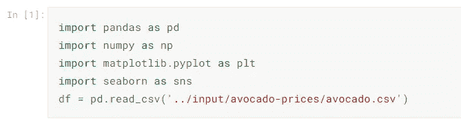

显示数据

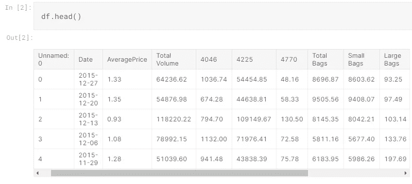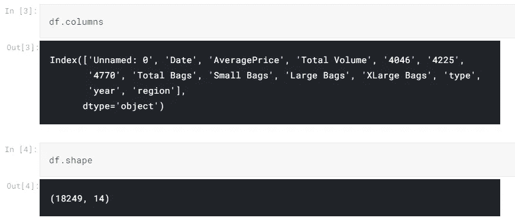

**现在我们来描述数据**

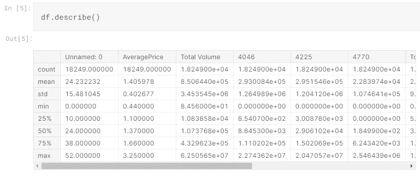

**第一列是索引，因此我们删除它以获得干净的数据。**

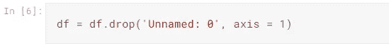

# 缺失数据

**让我们看看是否有缺失数据**。

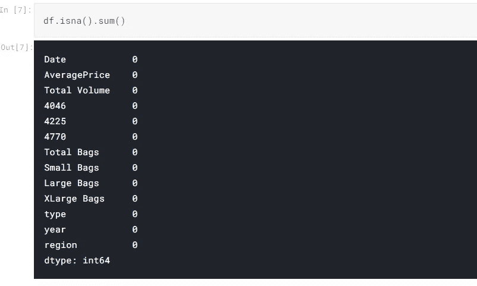

太好了，没有丢失数据，这使工作变得简单而准确。

# 数据可视化

**我们将关注平均价格，并找出它与其他特征之间的关系。**

**所以首先让我们展示一下分布来理解价值观。**

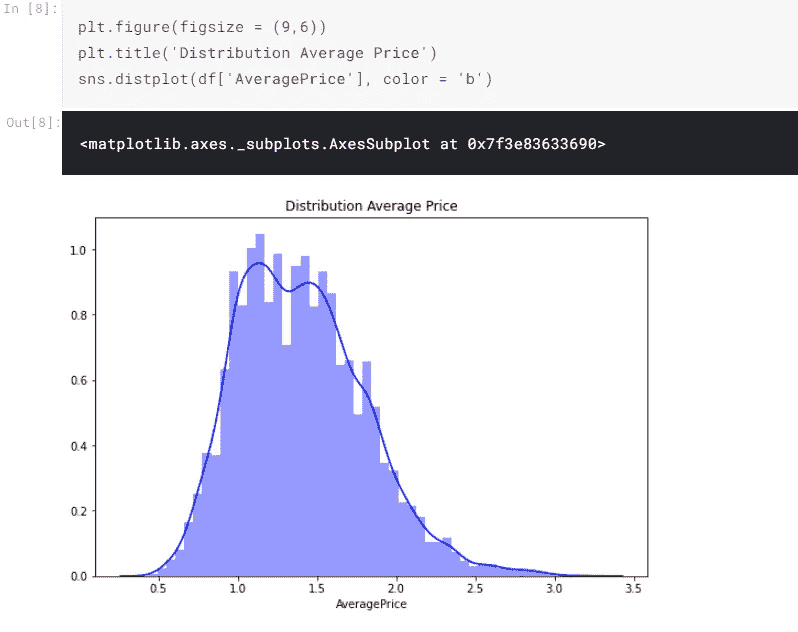

**平均价格的数据分布范围似乎在 0.3 & 3.4 之间，分布的上限值为 1.1，大部分数据集中在 0.9 到 1.8 之间**。

数据中有两种类型的鳄梨:有机的和常规的，所以让我们看看每种有多少。

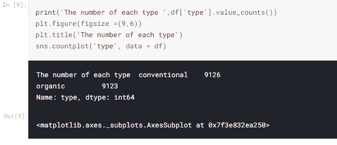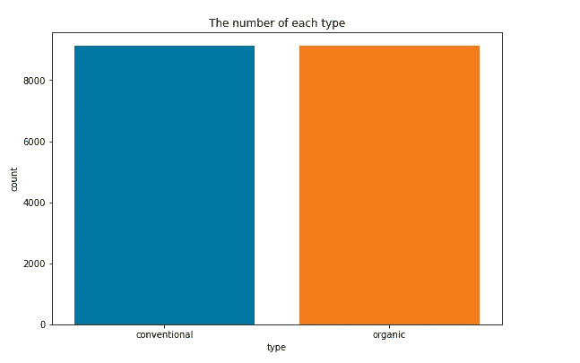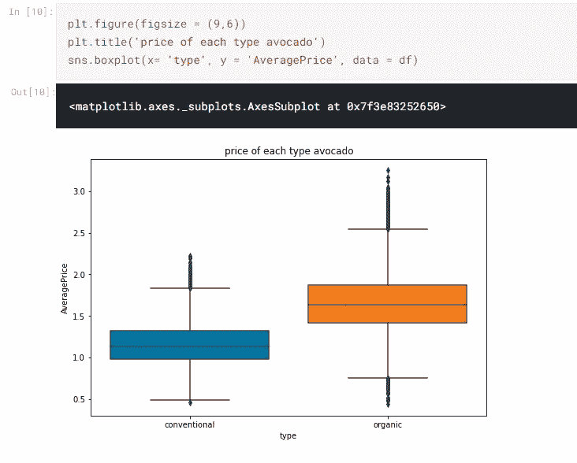

看起来有机的价格比传统的价格要贵。

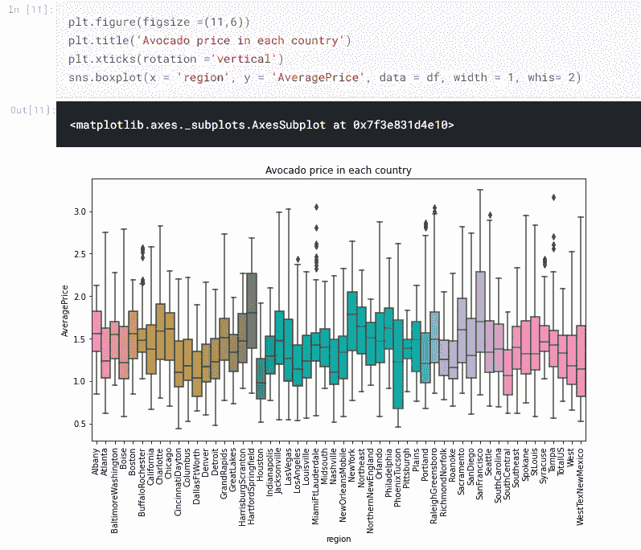

**关于与地区相关的价格，我们发现旧金山是鳄梨最贵的城市，休斯顿是最便宜的地区。**

**现在让我们来处理一下数据，我们将根据鳄梨的类型分离数据，然后根据地区和年份找出每种类型的价格。为了澄清更多，让我们工作。**

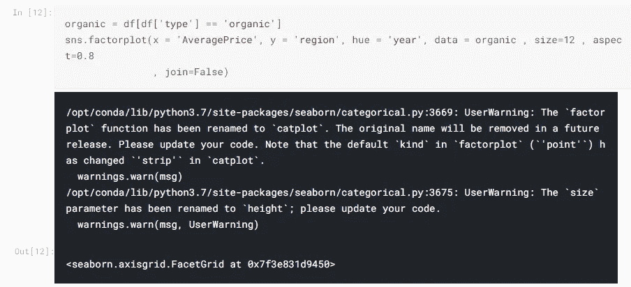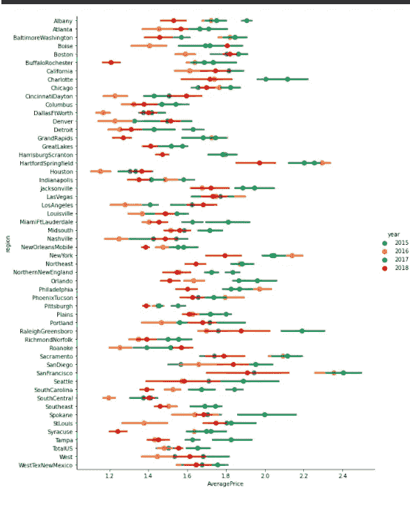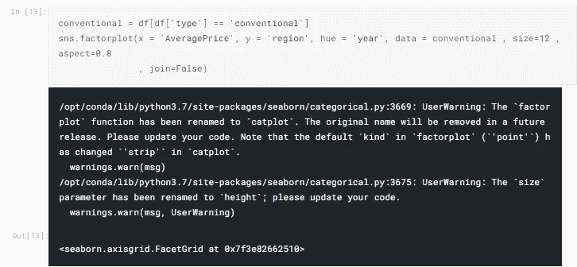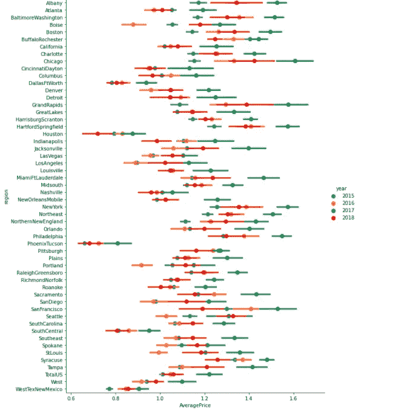

当数据按类型分类时，我们发现价格最低的城市是凤凰城，而最贵的城市是芝加哥。

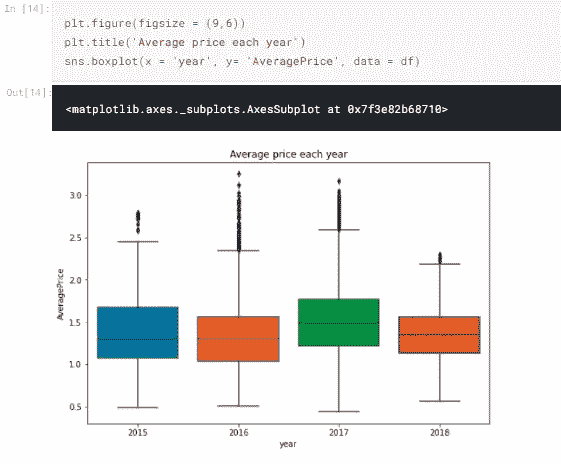

**2017 年充满了费用:)**

现在我们将找到价格和月份之间的关系，因为我们有了日期，我们可以提取月份来找到与价格的关系。

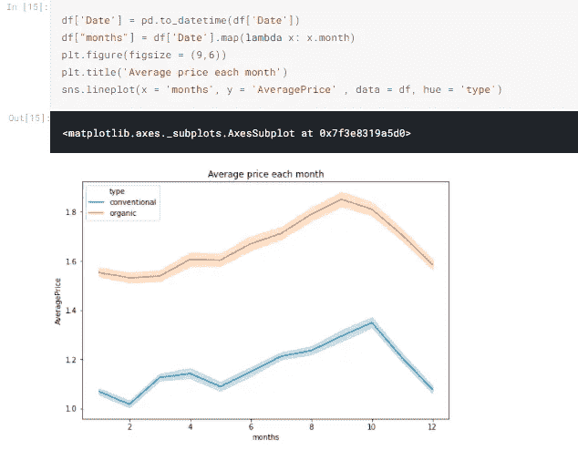

**果然不出我所料！有些月份会增加，有些月份会减少，两种情况都有。似乎这件事让我们想到一年中每个季节的其他事情。**

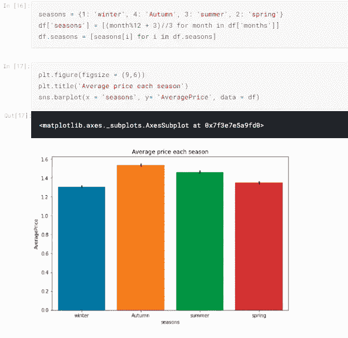

**秋季上升明显，冬季下降。**

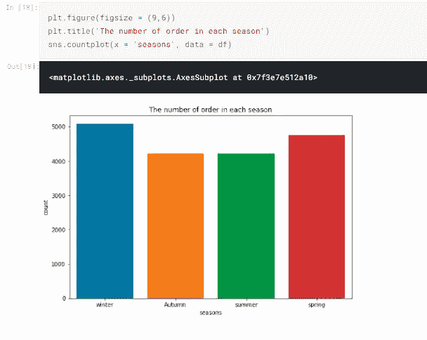

**最后让我们找到热图。**

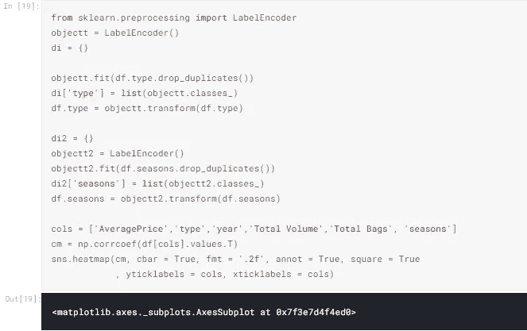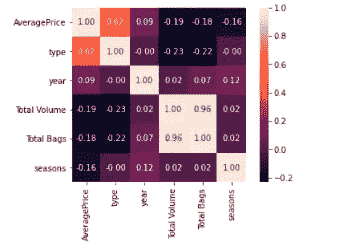