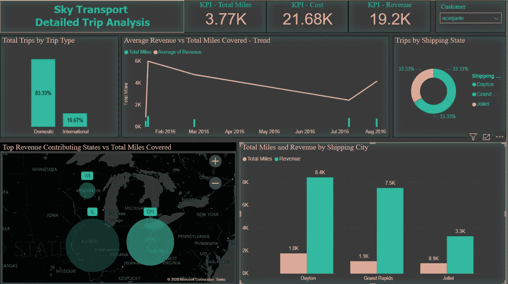

# Power BI 初学者完全指南

> 原文：<https://medium.com/analytics-vidhya/a-complete-beginners-guide-on-power-bi-ed7d54a0b73e?source=collection_archive---------17----------------------->

嘿，你好！我很高兴在 power BI 上分享我的第一个博客，你也可以写自己的博客了。Power BI 是一个强大的数据可视化工具，广泛应用于分析领域。最让人兴奋的是，拥有桌面版是绝对免费的。那么为什么要等呢？下载它，让我们进一步潜水！

*Power BI 让您可以从 Excel、Text/CSV、XML、JSON、PDF、多个数据库、Power 平台、Azure、在线来源和多个其他来源加载数据。*

*在本文中，让我们将存储在本地文件夹中的运输数据集加载到 power BI，使用 power query 进行基本的数据转换，并将其可视化。*

***加载数据:***

*Power BI home —获取数据— Excel —让您浏览本地文件夹，选择正确的 Excel 文件，然后单击确定。*

*选择适当的工作表—单击“转换数据”—这将加载数据以支持查询，并允许您进行数据转换。*

***转换数据:***

***“现在数据加载完毕？马上开始观想合适吗？一个大大的不！”***

为了获得精确的可视化，在可视化之前，数据探索和基本的数据转换是至关重要的。Power query 允许您估算缺失值、更改适当的数据结构、基于可用列添加新列以及多种其他有用的功能。

*power query 的另一个漂亮特性是，它捕获用户在“* ***应用步骤”*** *中所做的所有更改，并且用户可以通过简单的点击来恢复所做的任何更改。*

我们加载的数据看起来很干净，不需要太多的转换。让我们开始想象。

***将数据可视化:***

*好！等待结束了。让我们想象一下！*

一份好的报告不是基于它看起来有多花哨，而是基于它能有多简单和信息量多大！

“Sky Transport”公司的运输数据集包括多个列，其中包含有关其日常业务的信息。我们的重点是关键栏目，如他们的顶级客户、收入、总里程和顶级服务州/城市。

***(一)顶级概述:***

1.1 概述—天空运输

*以下包括使用的可视化类型和获得的结果*

*A '* ***表*** *'仅具有如客户、旅行类型、总里程、收入等列，向顶级股东提供完整信息以了解他们的顶级客户。我们注意到客户“Quotefix”是最大的收入来源，其次是 Lazap & Zonecone。*

*可视化“* ***卡*** *”清楚地显示了总里程和总收入。难道你不认为这是每个股东第一眼看到的结果吗？*

*A’****饼状图****’根据不同的旅行类型显示收入&里程，清楚地表明天空运输的客户更喜欢国内旅行，其次是国际旅行。*

*A’****切片器*** *是我个人最喜欢的选项，即让用户查看单个客户的报告和他们的偏好。*

***(二)详细分析:***

这是第二份详细分析天空运输的报告。

1.2 详细分析—天空运输

***‘一条线和簇状柱形图****’显示平均收入趋势在这段时间内是静态的。这是天空运输公司找出原因并采取必要措施增加收入的有力指标。*

*A '****map****'比任何其他可视化工具更有助于可视化顶部位置。在这里，我们看到，天空运输的主要业务发生在伊利诺伊州，其次是密歇根州&威斯康星州。*

*A '* ***聚类图*** *'永远是简单有效的工具。在这里，我们看到了航运城市的最高收入和英里覆盖。埃尔金是天空运输的顶级航运城市。*

***KPI*** *是强大的可视化工具，可以显示实际值与目标值，并定期监控。这里的 KPI 只显示实际值，没有提供目标值。*

*我最喜欢的原因是,* ***切片器*** *因为，只要选择一个随机的客户‘ace quote’，就能让我了解该客户的每一个细节。*

1.3 切片机的重要性

*呜呜！您刚刚学习了如何提取、转换、加载数据集&使用 power BI 创建基本视觉效果。*

特别感谢 Amit Bose 和 iNeuron 激励我写我的第一篇博客！

*链接下载数据集:*【github.com】Power-BI-Dataset/Sky _ Transport _ corp . xlsx at main pras Anna-c/Power-BI-Dataset(

*如果你喜欢这篇文章，与你的朋友和同事分享吧！*