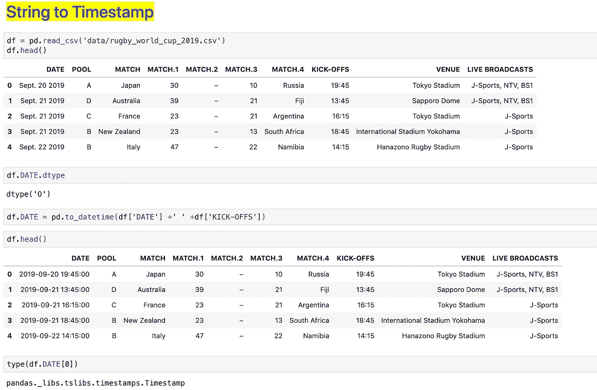
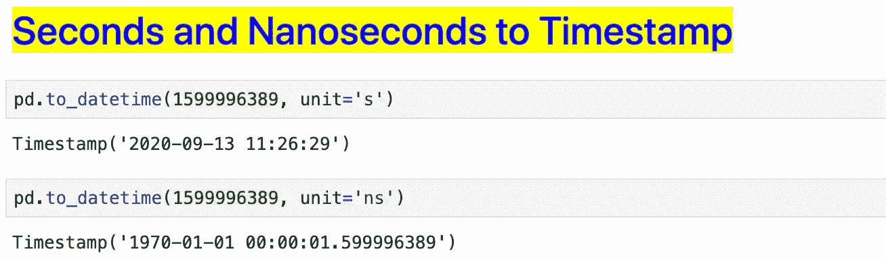
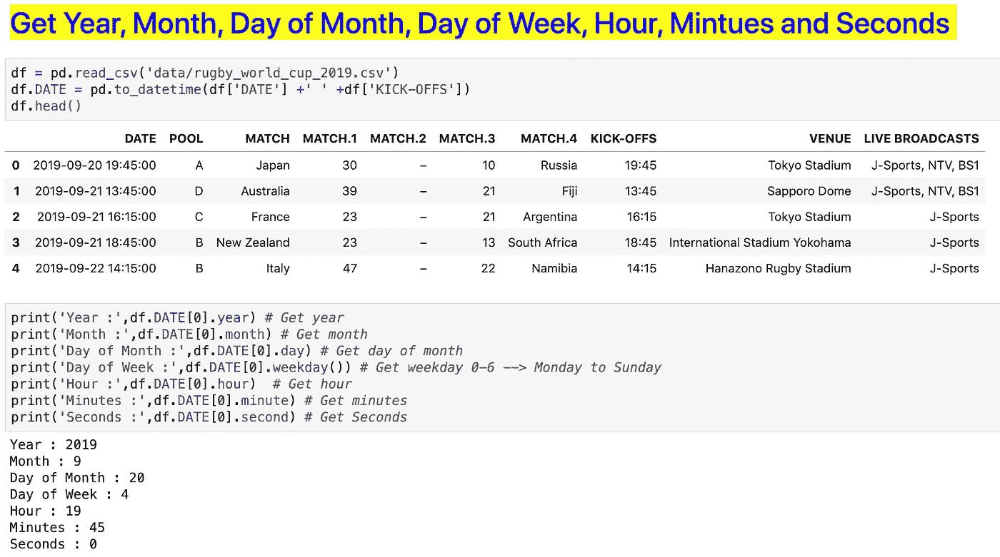
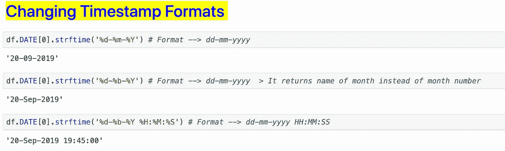
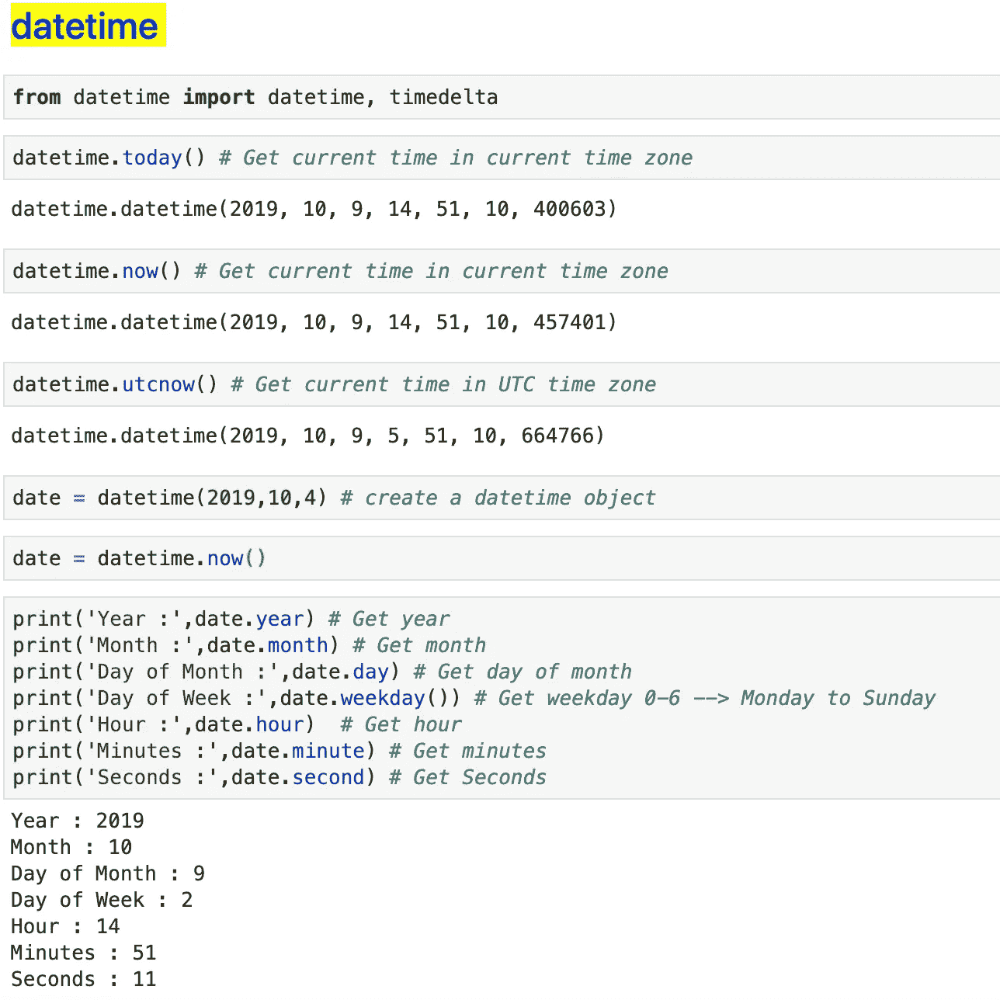
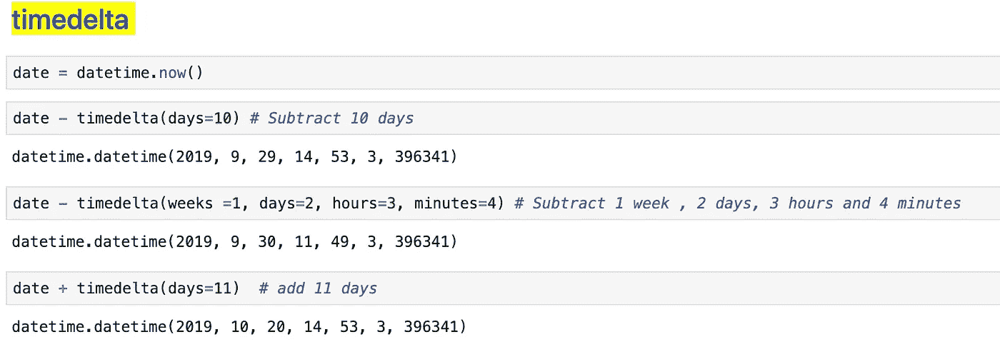
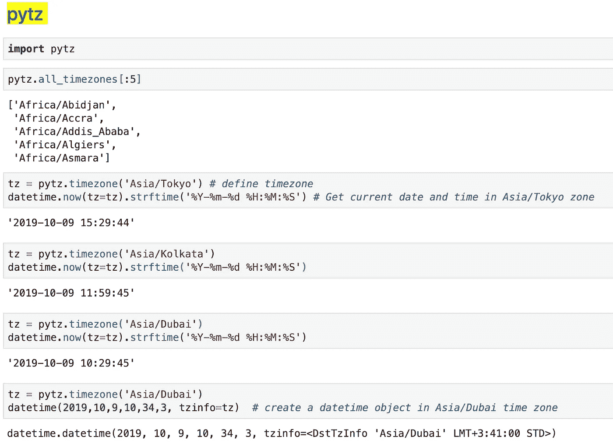
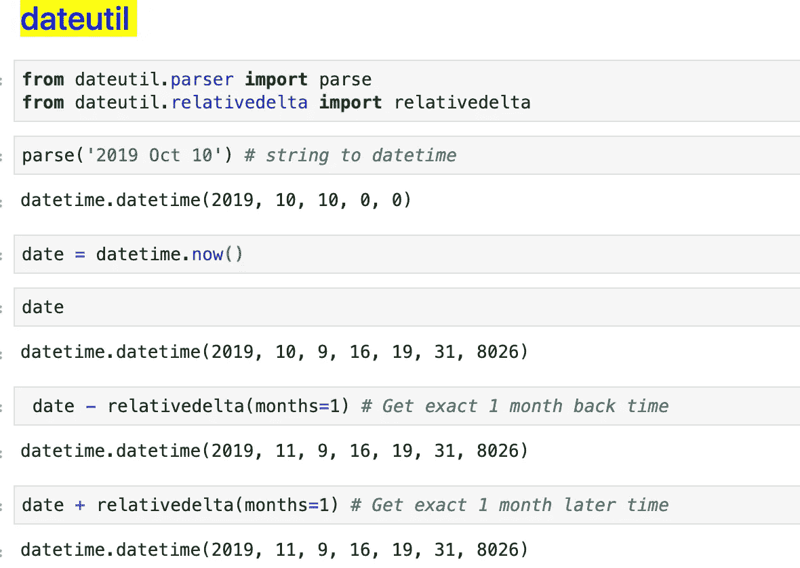

# Python 中数据科学家的完整日期时间指南

> 原文：<https://medium.com/analytics-vidhya/a-complete-date-time-guide-for-data-scientist-in-python-cd0b1cfb5e74?source=collection_archive---------2----------------------->


皮皮岛🌴，泰国

## 使用不同的 python 包在 python 中处理日期和时间数据的完整指南

在数据科学工作的某些方面，每个人都需要处理日期和时间数据。日期和时间数据有助于发现重要的信息，例如一周中的哪一天你的网站点击率最高，哪一小时交易量最高，或者哪一小时密码/股票交易量最高等。

在本文中，我将展示几个非常重要的 python 包对日期和时间数据的用处。让我们开始吧，别再废话了。

# **1。熊猫**

pandas 和 numpy 是数据科学中使用最多的 python 包。熊猫可以用来清理和处理日期和时间数据。

**1.1 字符串到时间戳**
当我们使用`pd.read_csv('data.csv')`命令读取 CSV 文件时，pandas 将日期列作为对象(字符串)读取。熊猫可以用来将字符串转换成时间戳对象。

首批进口熊猫:`import pandas as pd`

本文我会用[橄榄球世界杯 2019 数据](https://www.rugbyworldcup.com/matches)。



字符串到时间戳

> **好处 1 :** 我们可以使用`pd.to.datetime()`将秒或纳秒转换成日期时间



秒和纳秒到时间戳的转换

## **1.2 处理时间戳**

一旦我们将日期和时间作为时间戳，我们就可以从中获得年、月、月中的某一天、星期几、小时、分钟、秒钟。



时间戳为年、月、日、周、小时、分钟和秒

> **加成:** *如何改变时间戳格式？* `*strftime(format="desired_format")*` *是选项。参见下面的例子。*



**注:** `strftime()`返回一个字符串。这应该使用`pd.to_datetime()`更改为时间戳。

# **2。日期时间**

datetime python 包是另一个处理日期和时间数据的导入包。

从日期时间导入子包，如下所示:

```
from datetime import datetime, timedelta, timezone
```

**日期时间**用于创建和处理日期时间对象。我们来看看`datetime`的几个重要用法。

**datetime.now()** →当前时区的当前日期和时间

**datetime.utcnow()** →当前 UTC 时间

**datetime.taoday()** →当前时区的当前日期和时间

**日期时间(年、月、日、小时、分钟、秒)** →创建日期时间对象

> 我们还可以从与时间戳对象相同的 datetime 对象中获取年、月、月、日、星期、小时、分钟和秒的值。



日期时间示例

**timedelta** 主要用于从 datetime 对象中加减时间。

> 示例:
> 
> datetime timedelta(周=0，天=0，小时=0，分钟=0，秒钟=0)，其中 datetime 是 datetime 对象。



时间增量

# **3。pytz**

这个库允许使用 Python 2.4 或更高版本进行精确的跨平台时区计算。

通过 pip 安装`pytz`。`pip install pytz`。

pytz 可用于获取特定时区日期和时间，也可用于创建特定时区的 datetime 对象。见下图中的例子。



**pytz**

# **4。日期工具**

我发现了 dateutil 包的两个重要应用:I .解析和 II。获取相对日期和时间(datetime 对象)

一、**解析**:解析是将字符串转换为日期时间的过程。

二。**获取相对日期和时间**:我们刚刚学习了 timedelta 的时间减法和加法。timedelta 加上或减去精确的数字，但是如果我们想要获得相对时间，例如从今天算起的一个月之前或之后的时间。在这种情况下，细节非常有用。见下图中的例子。



日期示例

> P **ro 提示:**

1.  总是使用`relativedelta` 从特定的时间获得准确的时间，因为每个月的天数不一样，这使得很难使用`timedelta`。
2.  如果你知道两个时区的时差，那么用`timedelta`代替`pytz`。
3.  使用`pandas dataframe`时，使用`pandas`将字符串转换为日期&时间(时间戳)。

在 Github 上找到 [Jupyter 笔记本查看代码。](https://github.com/dc-aichara/DS-ML-Public/blob/master/Medium_Files/Date_Time.ipynb)

如果您有任何疑问，请通过 LinkedIn 或 twitter 联系我。

感谢您阅读文章。