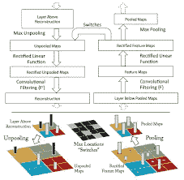
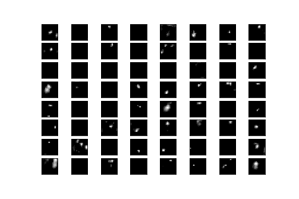

# 可视化和理解卷积网络的完整指南

> 原文：<https://medium.com/analytics-vidhya/a-complete-guide-for-visualising-and-understanding-convolutional-networks-dc26f71c979f?source=collection_archive---------2----------------------->

*免责声明:如果您只对 DeConvNet 的代码感兴趣，它会在文章的最后以 ConvNet 为例给出。*

最近，由 LeCun 等人于 1989 年提出的卷积网络(ConvNets)在挑战视觉分类任务方面取得了最先进的成果。

**是什么引起了人们对 ConvNet 模型的兴趣？**

1.  训练集的可用性
2.  计算能力显著提高
3.  新型模型正则化技术

*从业者之间有一个普遍的类比，即洞察这些模型的内部操作和行为，或者它们如何实现如此好的性能的原因是一项繁琐的任务(如果不是不可能的话)。*

**但是这个类比正确吗？**

没有对 CNN(或任何其他模型)的架构和功能背后的原因的清楚理解，这些模型被简化为试错法。从模型可解释性的角度来看，这是非常不令人满意的。

**是否有可能解读一个 ConvNet 模型？**

的确是！

**泽勒等人。艾尔。** 提出了 **DeConvNet** (多层去卷积网络)。提议的**去配置网络**的主要特征如下:

1.  想象激发个体特征的输入刺激。
2.  将特征激活投影回输入像素。
3.  分类器输出的灵敏度分析。
4.  观察训练过程中特征的演变。

**DeConvNet 是如何工作的？**

图(1):由泽勒等人提出的 DeConvNet 架构。艾尔。在可视化和理解卷积网络，计算机视觉 ECCV 2014

DeConvNet 连接到 ConvNet 的每一层。图(1)显示了一个解卷积网络的架构。

*图片在此*

从图(1)中可以看出，执行了以下步骤

1.  **Unpooling** :要理解这一点，我们需要先理解池。池化是一种降低输入图像维数的技术。最常用的池技术是最大池。
    **Max-Pooling** :给定过滤器中的所有元素，我们返回最大值。现在，凭着一个非常基本的直觉，很明显池化是不可逆的，我们将永远无法检索相同的元素！然而，我们可以通过记录每个汇集区域内的最大值的位置来获得近似的倒数。DeConvNet 根据找到的最大值将来自上一层的重构放置到适当的位置。
2.  **校正** : ConvNet 使用 ReLU 非线性校正特征图。为了在每一层获得有效的特征重构，重构的信号因此也通过 ReLU 非线性。
3.  **过滤** : ConvNet 使用学习过的过滤器将特征图卷积到一个较低的维度。去卷积网络使用该学习滤波器转置到来自上述步骤的校正表示，以重构去卷积层输出。

**实现**

下面使用 Keras 和 Tensorflow 实现的示例代码给出了一个 DeConvNet 的上述功能的小例子。

尝试使用不同的权重和偏差，检查卷积-2D 转置的功能。

图(2):去卷积图像(左)和实际图像(右)

查看以下 VGG 网的代码，用于可视化 VGG Net 卷积块的特征映射。

图 3:由 VGGNet 卷积块重建的特征图

**可选阅读**

进一步以“袋鼠”为例，我们可以使用 DeConvNet 或 Conv2DTranspose 重建图像。下面的代码是一个典型的例子。

Protip:尝试使用不同的数据集、卷积网络、内核和过滤器进行试验。

干杯！

快乐学习！

# **参考文献**

[1][https://cs.nyu.edu/~fergus/papers/zeilerECCV2014.pdf](https://cs.nyu.edu/~fergus/papers/zeilerECCV2014.pdf):泽勒等人。艾尔。，计算机视觉 ECCV 2014

[2][https://www . tensor flow . org/API _ docs/python/TF/keras/layers/conv 2d transpose](https://www.tensorflow.org/api_docs/python/tf/keras/layers/Conv2DTranspose)