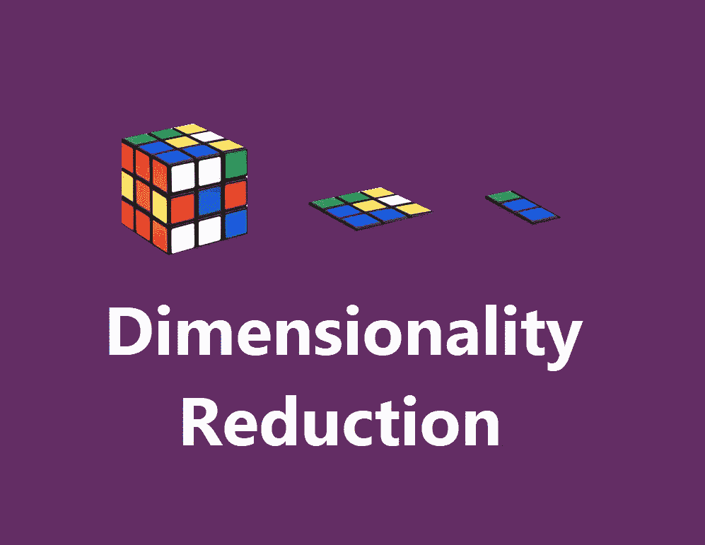
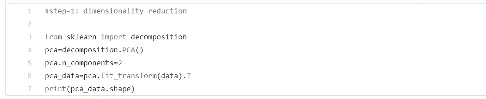
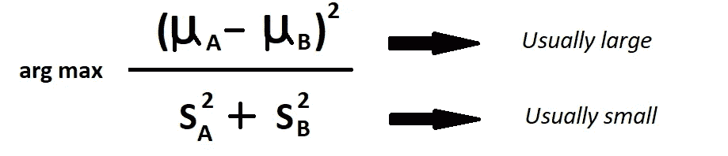
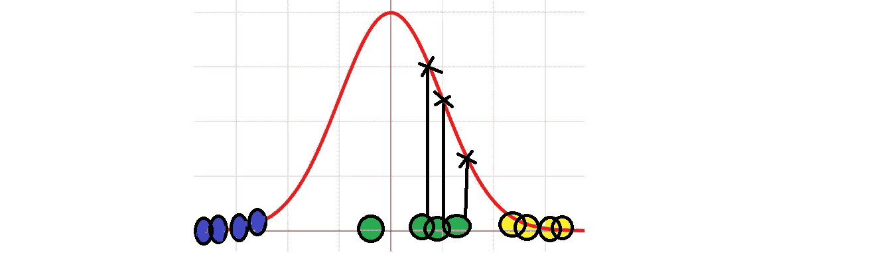
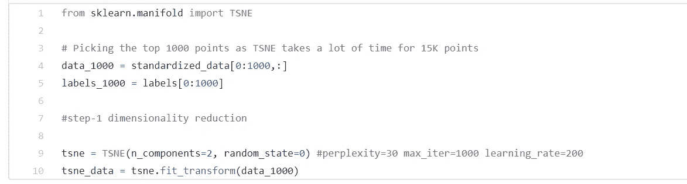

# 降维完全指南

> 原文：<https://medium.com/analytics-vidhya/a-complete-guide-on-dimensionality-reduction-62d9698013d2?source=collection_archive---------1----------------------->

> 嗨，伙计们，这篇文章的本质是给出一个直觉，并通过 python 给出一个降维的完整指导。我希望你喜欢读它，就像我喜欢为人们写它一样。

你知道吗，感兴趣的用户每天产生 2.5 万亿字节的数据？数据可以来自任何地方。假设数据是从

*   像 facebook、instagram 这样的社交应用收集你喜欢的东西、分享、帖子、你最近去过的地方、你喜欢的餐馆等数据。
*   在线营销网站，如 youtube、google，它保存了与您最近的搜索、兴趣、帖子浏览等相关的数据..,
*   购物应用程序，如 Myntra、amazon、flipkart，收集您购买的商品、产品的浏览量和点击率，以及您放在购物车中的产品等数据。,

**I** 基于互联网的应用程序每天都在产生大量的数据。他们更多地参与数据收集、提炼和提取。然而，随着数据生成和提取的不断增加——可视化、控制和绘制模式将脱离我们的掌控。

例如，我们有 1000 个特征和 100 万个数据点。假设我们将它存储在一个矩阵格式中，其单元数为 1000 * 100 万= 1000 万。这是非常好的，尤其是当我们有记忆限制的时候。我们收集了大量的数据来解决问题，这很好，但是处理和应用这些数据的模型并不容易。这就是降维发挥作用的地方。因此，不浪费时间，让我们深入了解这个概念。

四维数据表示

## **目录:**

## **第一章:降维介绍**

## **第二章:主成分分析**

*   步骤 2–1:引入和需要 PCA。
*   步骤 2–2:工作方法。
*   步骤 2–3:优势和劣势。
*   step _ 2–4:通过 python 代码片段对 MNIST 数据集进行 PCA。

## **第三章:线性判别分析**

*   步骤 3–1:简介
*   步骤 3–2:LDA 的工作。
*   步骤 3–3:LDA 的扩展
*   step _ 3–4:Python sk learn 在 IRIS 数据集上实现 LDA

## **第四章:T 分布随机邻域嵌入**

*   步骤 4–1:SNE 霸王龙简介。
*   第 4 步–第 2 步:工作方法。
*   步骤 4–3:处理拥挤问题。
*   step _ 4–4:优点和缺点。
*   步骤 4–5:通过 python 代码片段对 MNIST 数据集进行 T-SNE 分析。

## 第 5 章:数据规范化

## **第 6 章:结论**

> *第一章:降维介绍:*

W什么是降维？

在统计学、机器学习、信息论中，降维或降维是将 n 维降维为 k 维的过程，其中 k <

Dimensionality Reduction of Data.

## Visualization of Data:

Data visualization brings easiness in understanding and increases effectiveness. The human mind learns fast from visuals than that of text and tables. It is applied to a large population, for e.g., one can remember dialogues and scenes of a movie which he might have watched years before, on the other hand, it is difficult for him to recall the subject he recently read.

Now-a-days we have a good number of tools for data visualization tools, which are fast and effective. Data visualization creates a better selling strategy. Data visualization boosts the ability to process information in an easy and faster way to compare and make conclusions out of it.

Let’s have a look at the data of various dimensions.

**1 维数据:**

在这里，我们通常称维度为特征。作为一个例子，我们已经采取了一个 1D 数组，并开始绘制一个数轴上的值。

数据的 1D 表示法。

**二维数据:**

现在我们已经有了一个 2D 阵列，并开始在 X 轴和 Y 轴上绘制数据，这两个轴是相互正交的。

数据的 2D 表示法。

**三维数据:**

现在，我们将使用 3D 数组，并将其绘制在 X、Y 和 Z 轴上。

数据的三维表示。

我们可以看到，随着维度的增加，数据的可视化变得越来越困难。

**多维数据:**

现在，对于 N-D 数据，我们需要 N 维空间，我们不能再把它可视化。因此，对于任何超过 3D 的数据的可视化，我们将使用称为**维度减少的技术将其减少到 2 或 3 维。**

## 降维的本质:

在微观层面上分析高维数据中的每一个维度是不可行的。我们可能需要几天或几个月的时间来进行任何有意义的分析，这需要大量的时间、金钱和人力，而这在我们的业务中是不被鼓励的。训练高维数据会给我们带来如下问题:

*   存储数据所需的空间随着维度的增加而增加。
*   在训练模型时，维度越少，时间复杂度越低。
*   随着维度的增加，过度拟合模型的可能性也会增加。
*   我们无法将高维数据可视化。通过降维，我们将把数据减少到 2D 或 3D 以便更好地可视化。
*   这将移除我们数据中的所有相关要素。

## 降维的组成部分:

这里将详细讨论降维的两个主要组成部分。

I)特征选择:

大多数情况下，这些功能与我们的问题无关。例如，我们正在训练一个预测身高的模型，我们有一些特征数据(体重、颜色、痣、婚姻状况、性别)。我们可以看到，肤色、痣和婚姻状况等特征与人的身高无关，也就是说，与我们寻找身高的问题无关。因此，我们需要想出一个解决方案，找到对我们的任务最有用的特性。我们可以通过以下方式实现这一目标:

*   业务理解、领域知识和专家解决方案可以帮助我们选择影响响应变量(目标)的预测因素(特征)。但是，如果我们找不到有用的预测指标，或者错过了有用的特征，就有可能丢失信息。
*   我们建立了一个经典的最大似然模型，我们将根据与目标变量的相关性来选择特征。与具有低拟合度的特征相比，具有高拟合度的特征更可能被选择。
*   减少特征也可以帮助我们解决这个问题。假设使用主成分分析(将在后面的课程中讨论),它可以帮助我们找到将数据投影到更低维度的组件，同时减少信息损失。
*   另一种方法是移除所有相关的特征。例如，如果我们有与其他要素线性组合的要素(f1=2f2+3f3 ),那么它们不会向我们的数据添加任何附加信息。因此，这些特征对我们的模型训练不再有用。

特征选择包括寻找原始数据的子集，使得它们的信息损失最小。它有以下三个策略:

1.  过滤策略:获取更多数据信息的策略。
2.  包装策略:基于模型的准确性，我们将选择特性。
3.  嵌入式策略:基于模型预测误差，我们将决定是保留还是删除所选特征。

II)特征投影:

特征投影也称为特征提取，用于将高维空间中的数据转换到低维空间中。数据转换可以线性和非线性两种方式进行。

对于线性变换，我们有主成分分析(PCA)、线性判别分析(LDA ),对于非线性变换，我们应用 T-SNE。

> *第二章:主成分分析:*

在进入内容之前，让我们先来欣赏一下这项技术背后的数学家。

**步骤 2–1:引入和需要 PCA:**

PCA 是**卡尔·皮尔逊**在 1901 年发明的，作为力学中主轴定理的类比；后来在 20 世纪 30 年代由哈罗德·霍特林独立开发并命名。根据应用领域的不同，它还被称为信号处理中的离散 KLT，多变量质量控制中的霍特林变换，固有正交分解， **X** 的奇异值分解(SVD)，特征值分解，因子分析，噪声和振动中的频谱分解，以及结构动力学中的经验模态分析。

主成分分析主要用作探索性数据分析(EDA)和制作预测模型的工具。它通常用于可视化种群间的遗传距离和亲缘关系。PCA 可以通过数据协方差(或相关性)矩阵的特征值分解或数据矩阵的奇异值分解来完成。

**步骤 2–2:常设仲裁院的工作方法:**

为了更好地理解 PCA 的工作原理，让我们以 2D 数据为例。

数据的 2D 表示法。

1.  首先，我们将标准化数据，使平均值移动到原点，所有数据位于一个单位正方形内。
2.  现在，我们将尝试对数据进行拟合。为此，我们将尝试随机线。现在我们将旋转这条线，直到它最适合数据。

最终我们得到了下面的拟合(高度拟合)，它解释了一个特征的最大方差。

最佳拟合线。

**PCA 如何找到最佳拟合线？**

让我们用一个点来计算。

现在，为了量化直线与数据的拟合程度，PCA 将数据投影到直线上。

I)然后，它可以测量从数据到线的距离，并尝试找到一条最小化这些距离的线。

ii)或者它可以试图找到使从投影点到原点的距离最大化的线。

**数学直觉:**

为了理解这项技术背后的数学原理，让我们回到单个数据点的概念。

> 将数据投影到直线上后，我们将得到一个直角三角形。现在从勾股定理我们得到 A = B + C。
> 
> 我们可以看到，B 和 C 是成反比的。这意味着如果 B 变大，那么 c 一定变小，反之亦然。

因此，PCA 可以最小化到直线的距离，或者最大化从投影点到原点的距离。

> 更容易找到从投影点到原点的最大距离。因此，PCA 找到了使从投影点到原点的平方距离之和最大化的最佳拟合线。

距离的最大平方和。

主成分分析的成本函数

**注意:**这里我们取距离的平方，这样负值不会抵消正值。

现在我们得到了最佳拟合线 **y = mx + c.** 这叫做 PC1(主成分 1)。假设比例为 4:1，这意味着 X 轴上有 4 个单位，Y 轴上有 1 个单位，这说明数据主要分布在 X 轴上。

来自勾股定理

a = b + c => a = 4 + 1 => sqrt(17)=> 4.12，但数据是按比例缩放的，因此我们用 4.12 除每一边，以获得单位向量。即，

F1 = 4 / 4.12 = 0.97 并且

F2 = 1 / 4.12 = 0.242

我们刚刚计算的单位向量称为**特征向量或 PC1** ，特征的**和**比例(0.97 : 0.242)称为**加载分数。**

SS(PC1 的距离)= PC1 的特征值。

sqrt(PC1 的特征值)=**PC1 的奇异值**。

现在我们对其他特征做同样的事情来获得主成分。为了投影数据，现在我们将旋转轴，使 PC1 与 X 轴平行(水平)。

旋转轴，使 PC1 保持水平

基于主成分的数据投影。

为了可视化，让我们根据两个主成分上的投影点来投影数据。

我们可以看到它等于点的原始投影。

**如何计算变异？**

我们可以使用在 PCA 中计算的特征值来计算它。

假设 PC1 = 0.83，PC2 = 0.17

现在，如果我们想将数据从 2D 转换到 1D，我们选择要素 1 作为最终 1D，因为它覆盖了总变化的 83%。

这就是 PCA 的工作方式，它基于使用主成分获得的方差来估计为了降维而要消除的特征。

**Step _ 2–3:优缺点:**

优势:

*   它会移除相关的特征。
*   提高模型效率。
*   减少过度拟合。
*   提高可视化。

缺点:

*   PCA 是一种线性算法，它对多项式或其他复杂函数不太适用。我们可以知道如何使用核主成分分析来处理这些数据。
*   在 PCA 之后，如果我们不选择正确的维数来消除，我们可能会丢失很多信息。
*   较少的可解释性，因为原始特征转换为不像原始特征那样可读的主要成分。
*   它保留全局形状而不是局部形状。

**步骤 2–4:通过 python 代码片段对 MNIST 数据集进行 PCA:**

我已经从 kaggle 下载了[数据(train.csv)](https://www.kaggle.com/c/digit-recognizer/data) ，其中包含了一张图片的 784 个像素值。csv 格式。

正在加载 mnist 数据

mnist 图像的维度表示

作为预处理步骤，我们将数据标准化，使平均值移至原点，所有数据位于单位正方形内。

数据标准化

PCA 可以以两种方式应用，一种是通过寻找特征向量，另一种是通过使用 sklearn 实现。在大多数情况下，两种实现都会给出相似的结果。

**方法-1:**

这里我们将找到协方差矩阵，它实际上是用来寻找特征值和特征向量的。

在将数据转换成二维数据后，我们将使用这两个特性来实现数据的可视化。

通过特征向量的主成分分析

**方法:2**

现在我们将使用 PCA 的 sklearn 实现，它实际上只用几行代码就完成了。

Sklearn 的实现

通过 sklearn 进行主成分分析

让我们看看每个特性解释的差异百分比。

每个特征解释的差异百分比

如果我想保留 80%的数据信息，那么我可以将维度减少到 110。这些图将帮助我们选择要消除的特征的正确数量。

> *第三章:线性判别分析(LDA):*

**步骤 3–1:简介:**

LDA 是机器学习和统计、模式识别中预处理步骤中最常用的降维技术。而该算法的目标是将数据集投影到具有类别可分离性的低维空间，以避免过拟合并降低机器的计算能力。

最初的判别分析是由**罗纳德·费雪**于 1936 年提出的，描述的是两类分类问题，后来由 **CR Rao** 于 1948 年推广为多类判别分析，现在称为线性判别分析或正态判别分析和判别函数分析。

**步骤 3–2:LDA 的工作:**

PCA 和 LDA 都是线性归约技术，但是不同于 PCA，LDA 集中于最大化两组的可分性。

LDA 使用特征创建一个新的轴，并尝试将数据投影到一个新的轴上，以最大化两个类别或组的分离。这就是为什么 LDA 是一种监督学习算法，因为它利用目标值来寻找新的轴。

PCA 试图找到最大化方差的分量，而另一方面 LDA 试图找到

I)最大化类别的可分性，并且

ii)最小化类别之间的差异。

通过最小化方差，我们可以很好地分离各个组的聚类。因此，它和最大化群体的平均值一样重要。

现在，LDA 根据最大化以下公式的标准找到新的轴

LDA 的成本函数

**超过 2 个类别的 LDA:**

考虑具有多于 2 组的数据，在这种情况下，LDA 找到整个数据的平均值和各个组的中心，现在它试图最大化从中心平均值到各个组平均值的距离。为了更好地理解，请看以下三类数据。

现在，我们可以找到一个平面来最好地分隔这三个组。

**算法:**

1.  计算数据集中不同类别的 d 维平均向量。
2.  计算散布矩阵(类间和类内散布矩阵)。
3.  计算散射矩阵的特征向量(e1，e2，…，ed)和相应的特征值(λ1，λ2，…，λd)。
4.  按特征值递减对特征向量进行排序，选择 k 个特征值最大的特征向量，形成 d×k 维矩阵 W(其中每列代表一个特征向量)。
5.  使用这个 d×k 特征向量矩阵将样本变换到新的子空间上。这可以通过矩阵乘法来概括:Y=X×W(其中 X 是表示 n 个样本的 n×d 维矩阵，Y 是新子空间中的变换后的 n×k 维样本)。

*   **步骤 3–3:LDA 的扩展:**

当分布的平均值是共享的(具有高方差的组)时，线性判别分析失败，因为 LDA 不可能找到使两个类线性分离的新轴。LDA 在数据不是线性可分的情况下也会失败。在这种情况下，我们可以使用非线性判别分析。

1.  **二次判别分析(QDA):** 每一类都使用自己的方差(或有多个输入变量时的协方差)估计。
2.  **灵活判别分析(FDA):** 使用非线性输入组合，如样条。
3.  **正则化判别分析(RDA):** 将正则化引入方差(实际上是协方差)的估计，调节不同变量对 LDA 的影响。

*   **Step _ 3–4:Python sk learn 在 IRIS 数据集上实现 LDA:**

让我们把用于 LDA 的虹膜数据集作为降维技术。

正在导入虹膜数据集。

像 PCA 一样，LDA 也可以使用 sklearn 实现。我们使用 LDA 将数据从 4 维减少到 2 维。

虹膜数据集上的 LDA。

为了知道 PCA 和 LDA 工作的不同，让我们看下面的图。其中 PCA 试图最大化方差，不像 LDA 试图最大化三个类别的可分性。

主成分分析与线性判别分析。

我们可以看到这两个图之间的差异。在主成分分析中，数据有一些重叠，很难找到将两组分开的线。LDA 可以帮助我们区分这三个组，因为它们在数据中的重叠较少。

> *第四章:T 分布随机邻域嵌入(T-SNE):*

**步骤 4–1:T-SNE 简介:**

T-SNE 是一种经常用于可视化的机器学习算法，由**劳伦斯·范德马腾和杰弗里·辛顿**(深度学习之父)开发。这是一种非线性降维技术，非常适合于在二维或三维的低维空间中嵌入用于可视化的高维数据。具体而言，它通过二维或三维点对每个高维对象进行建模，以这种方式，相似的对象通过附近的点进行建模，而不相似的对象通过远处的点以高概率进行建模。

T-SNE 已经在广泛的应用中用于可视化，包括计算机安全研究、音乐分析、癌症研究、生物信息学和生物医学信号处理。它通常用于可视化由人工神经网络学习的高级表示。

**步骤 4–2:工作方法:**

在进入数学直觉之前，让我们学习一些与 SNE 霸王龙有关的术语。

**邻域:**

点的邻域被定义为几何上彼此接近的点的簇。

N(X1) = { xj S.T xi，xj 彼此更近}

**嵌入:**

嵌入是通过创建 xi 将高维空间中的点投影到低维空间中的过程。

**随机:**

首先，T-SNE 在成对的高维对象上构建概率分布，使得相似的对象具有被挑选的高概率，而不相似的点具有被挑选的极小概率。这就是 T-SNE 被称为随机(概率)的原因。

现在，T-SNE 在低维地图中的点上定义了一个类似的概率分布，并且它最小化了关于地图中点的位置的两个分布之间的**kull back–lei bler 散度** (KL 散度)。请注意，虽然原始算法使用对象之间的欧几里德距离作为其相似性度量的基础，但这应该适当地改变。

所以现在 T-SNE 的成本函数是

T-SNE 成本函数

**步骤 4–3:处理拥挤问题:**

拥挤是一种情况，我们试图在一个更小的空间里投射点，由于空间不足，一切都变得混乱。例如，假设你在一辆城市公交车上，所有的座位都坐满了，但售票员仍然允许人们上车。在这种情况下会发生拥挤。

**T 分布:**

正态分布

通过使用高斯分布，所有低相似度值都落在曲线的尾部区域，我们可以看到尾部的空间非常小，不像 t 分布在曲线的两端更高，有更多的空间来保持这些簇的分离(就像公共汽车增加了几个座位)。最终，低相似性值与不同聚类的其他低相似性值混合在一起。为了克服这个问题，传统的 SNE 算法被 T-SNE 算法所取代，其中 T 表示 T-分布。

高斯分布与 t 分布

**Step _ 4–4:优缺点:**

优势:

*   与 PCA 不同，T-SNE 是一种非线性归约技术，这意味着它可以很好地处理任何多项式或非线性数据。
*   T-SNE 能够保持局部和全局结构，而 PCA 试图将高 D 投影到低 D，这解释了数据中的大部分差异。因此，它只关心全局结构。
*   T-SNE 广泛用于可视化任务。

缺点:

*   T-SNE 具有二次时间和空间复杂度，因为我们正在寻找数据中每隔一个点的点之间的相似性(0(N)阶)。这是巨大的，尤其是当我们有时间和内存的限制。
*   不建议在处理大型数据集时使用 T-SNE。
*   T-SNE 是一种非参数映射方法，这意味着它没有将给定点映射到低维空间的显式函数。T-SNE 基于点的邻域将点嵌入到低维中。因此，当一个测试数据点出现时，由于它以前不存在，我们需要重新训练整个 T-SNE 算法进行嵌入，这是很少使用的，因为它的二次时间复杂度。

**巴恩斯-胡特 SNE (BHTSNE):**

这项技术于 2014 年推出，与 SNE 霸王龙非常相似，但略有变化。该算法利用 **Barnes-Hut 算法**，天文学家使用该算法进行 N 体模拟，以近似对应点之间的力。

这些算法导致了优于标准 T-SNE( O(N log N))计算优势，其远优于二次时间复杂度。这可以使用 sklearn manifold 轻松实现。TSNE 库通过使用 method = 'barnes-hut '属性。

**步骤 4–5:通过 python 代码片段对 MNIST 数据集进行 T-SNE:**

我们已经看到了 PCA 对 MNIST 的作用。现在让我们用同样的数据集来试试 SNE 霸王龙。与 PCA 不同，T-SNE 有两个参数:困惑度和 n_iter。我们将尝试用这些参数的不同值来拟合数据。

困惑度= 30 且 n_iter = 1000:

困惑的= 30，马克西特=1000

困惑度= 50，n_iter = 1000:

困惑的= 50，马克西特=1000

困惑度= 2，n_iter =1000

困惑的= 2，马克西特=1000

我们可以看到，困惑度降低了，数据与所有聚类混在一起。因此，选择正确的参数值总是很重要的。

困惑度= 100，n_iter =1000:

困惑的= 100，马克西特=1000

在所有的值中，困惑=100 在我们的数据中表现良好。但是请注意，我们只在 5000 个数据点上尝试了 T-SNE，因为它的时间复杂性需要很多时间。

> *第五章:数据规范化:*

通过数据规范化，我们可以将数据从无限范围转换到有限范围。数据标准化的主要目的是让你的数据一致清晰。一致性是指确保输出是可靠的，以便可以使用通用术语和格式识别相关数据。

通过数据规范化，我们可以将数据从无限范围转换到有限范围。数据标准化的主要目的是让你的数据一致清晰。一致性是指确保输出是可靠的，以便可以使用通用术语和格式识别相关数据。

**降维前数据归一化的需求:**

假设有两个特征，其中一个特征的值在 1 到 10 的范围内(市场中每小时的购买者数量)，而另一个特征的值在 50 到 1000 的范围内(市场的访问者数量)。大概每小时的访客数是>>每小时的买家数。

由于像 PCA 这样的技术是基于最大化方差，如果我们在应用 PCA 来寻找特征向量之前不应用归一化，它们将更多地集中在较大值的维度上，因此特征向量将不会捕获其他维度中存在的信息。

因此，特征标准化被用于去除诸如千克、厘米、毫米、升等刻度..归一化后，当我们绘制时，所有的数据都位于一个单位正方形内。

数据标准化

**数据归一化技术:**

数据可以通过多种方式进行转换。一些最常用的技术是:

1.  线性缩放或最小-最大缩放:

公式

其中 X =数据点

Xmin =最小数据点

Xmax =最大数据点

当我们知道数据的近似上限和下限，并且很少或没有异常值时，我们将使用这种技术。当我们知道我们的数据在整个范围内近似均匀分布时。重新调整比例后，所有值将位于范围[0，1]内。

2.特征剪辑:

当数据包含极端异常值时，这些技术将高于或低于某个值的特征值限制为固定值。例如，将所有超过 120 厘米的高度值裁剪为正好 120 厘米。这意味着我们将值压缩到一个固定的范围。

3.对数标度:

公式

当数据的分布遵循幂律或者是帕累托分布(即一个值有很多点，而其他值只有很少点)时，使用它。例如，拿两部电影来说，一部受欢迎，另一部失败。与失败的电影相比，我们会在热门电影上获得更多的收视率。

4.z 分数或标准化:

公式

标准化后，平均值转换为 0，标准差转换为 1。当我们有一些异常值时，这是有用的，但不是极端的，我们需要剪辑。

> *第六章:结论:*

处理成千上万的要素是任何数据科学家的必备技能。我们每天生成的数据量是前所未有的，我们需要找到不同的方法来使用它。降维是一种非常有用的方法，对我来说非常有用，无论是在专业场合还是在机器学习黑客马拉松中。

此外，降维可能不是在所有情况下都能很好地工作。在这种情况下，我们需要打破常规，将数据转换到低维空间，同时对相同的数据使用不同的新约简算法也很重要。

今天到此为止。希望你已经对在现实世界中使用降维有了一些基本的概念。

## 参考资料:

*   https://sebastianraschka.com/Articles/2014_python_lda.html
*   https://www.youtube.com/watch?v=azXCzI57Yfc&t = 786s
*   [https://www . applied ai course . com/lecture/11/applied-machine-learning-online-course/2892/PCA-for-dimensionalization-reduction-and-visualization/2/module-2-data-science-explorative-data-analysis-and-data-visualization](https://www.appliedaicourse.com/lecture/11/applied-machine-learning-online-course/2892/pca-for-dimensionality-reduction-and-visualization/2/module-2-data-science-exploratory-data-analysis-and-data-visualization)
*   [https://www . applied ai course . com/lecture/11/applied-machine-learning-online-course/2900/geometric-intuition-of-t-SNE/2/module-2-data-science-explorative-data-analysis-and-data-visualization](https://www.appliedaicourse.com/lecture/11/applied-machine-learning-online-course/2900/geometric-intuition-of-t-sne/2/module-2-data-science-exploratory-data-analysis-and-data-visualization)
*   [https://en.wikipedia.org/wiki/Dimensionality_reduction](https://en.wikipedia.org/wiki/Dimensionality_reduction)
*   [https://www.youtube.com/watch?v=2cngQxtbkDc&t = 68s](https://www.youtube.com/watch?v=2cngQxtbkDc&t=68s)

一旦我找到新的简化算法，我会更新这个页面。作为一名渴望成为数据科学家的人，我来到了这里。这包括我对这个概念的最后工作。谢谢你阅读我的文章。

可以查一下**。ipynb** 在我的 [**Github 资源库中获取本文的完整代码片段。**](https://github.com/ChaitanyaNarva/dimensionality-reduction-on-mnist) 你也可以查看我在 kaggle 的第一个关于 [**价格建议挑战**](/@chaitanyanarava/mercari-price-suggestion-challenge-66500ac1f88a) 的案例研究。

请关注我，获取更多关于不同真实世界案例研究和数据科学文章的文章和实现！也可以通过[**LinkedIn**](http://www.linkedin.com/in/sai-chaitanya-narava-20b3571a0)**和 [**Github**](https://github.com/ChaitanyaNarva/ChaitanyaNarva) 与我联系**

**我希望你喜欢读我的文章。这方面的学习永无止境，所以快乐学习吧！！签署再见:)**