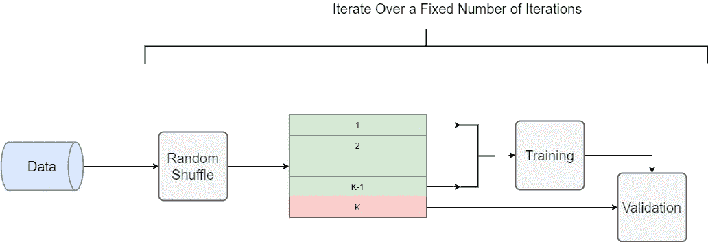
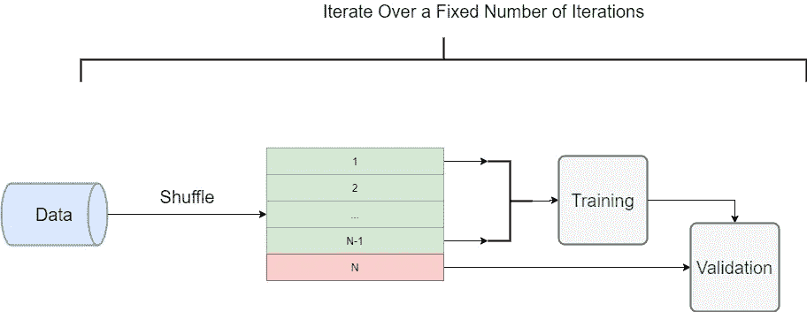
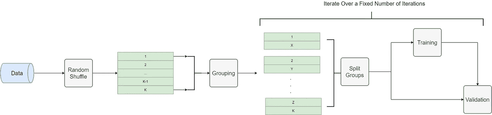
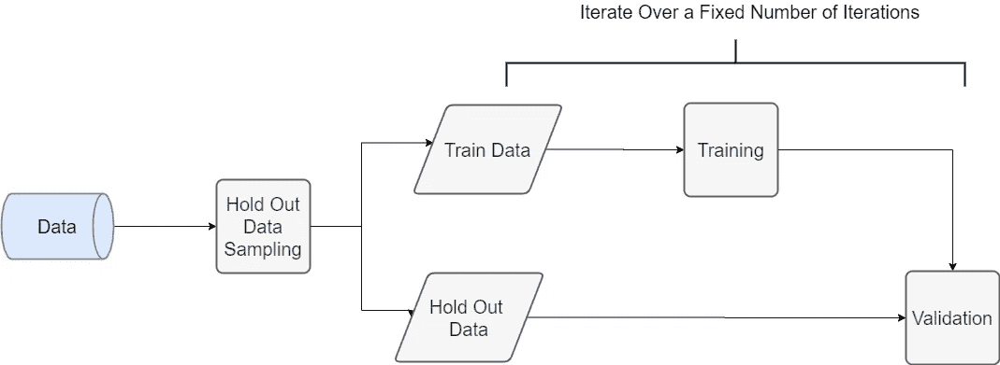

# 选择正确交叉验证技术的完整指南

> 原文：<https://medium.com/analytics-vidhya/a-complete-guide-to-choose-the-correct-cross-validation-technique-d70810a02f27?source=collection_archive---------3----------------------->

本文是在回归或分类设置中，预测分析解决方案开发周期中经常使用的各种交叉验证技术的完整指南。它还提供了一个用 Python 编写的示例使用代码，使用真实数据集介绍了每种 CV 技术。

什么是交叉验证？

验证模型，以确定/评估它是否与数据精确拟合，同时确保它不会过度拟合。

**过度拟合**:模型完全符合训练数据，但不能概括/在测试数据上表现不佳。

从我的经验来看，我认为 CV 是构建生产就绪的 ML 模型的重要步骤。(将数据清理和预处理、特征工程视为特征丰富过程的一部分，而不是模型构建。)

*注意:——交叉验证技术取决于底层数据分布。因此，需要对使用 CV 技术有很好的理解。*

代码:读取数据

## 不同类型的交叉验证技术

K-Fold 交叉验证:这是我们讨论的 CV 技术的最简单的形式，其他的 CV 技术可以被认为是这种技术的变体。
下图清楚地说明了不同的 CV 技术-
数据被随机混洗，并且创建了具有相同数量样本(大多数)的 K-唯一数据集。该模型连续地建立在任何(K-1)个数据集(折叠)上，同时在遗漏的数据集上进行验证，并保持对所建立模型的先前评估度量的跟踪。

图(1) : K 倍交叉验证

代码:K 折叠交叉验证

**分层 K 重交叉验证**:一种 CV 技术，可视为 K 重交叉验证技术的衍生版本。这种技术保持折叠(任何 K-1 数据集)中每个标签的比率恒定。因此，每个折叠基本上具有相同的每种标记的比率。
您可能已经发现了这一点，分层 K-Fold CV 主要用于倾斜数据集。

图(2):分层交叉验证

代码:分层 K 折叠交叉验证

**留一交叉验证**:这种 CV 技术针对除一个样本之外的所有样本进行训练。它是一个 K 倍 CV，其中 K = N，N 是数据中的样本数。
由于在数据的 N 个不同可能组合上的训练在用于训练的计算能力方面成本很高&验证模型，当处理小数据集时，这种 CV 技术是优选的。

图(3):省去一个交叉验证

代码:省去一个交叉验证

**组 K-折叠交叉验证**:一种 CV 技术，它创建训练和测试组，使得同一组不会出现在两个不同的折叠中，并且不同组的数量在每个折叠中是相同的。
因此，在分层抽样的调整中，K-Fold CV 组通常用于大数据集。

图(4):组 K 倍交叉验证

代码:K 组折叠交叉验证

**基于保持的交叉验证**:一种 CV 技术，它不同于其他 CV 技术，在其他 CV 技术中，数据被分成两组，而不是 K 倍:-
a. **训练组**:在这个数据集上训练模型。
b. **搁置集**:在此数据集上验证模型。该数据集必须保持标签的比率为常数。
这种 CV 技术通常在处理大型数据集时使用，因为对于上述 CV 技术来说，它的计算量很大。

图 5:支持交叉验证

代码:支持交叉验证

为了方便用户，本文主要关注回归设置，因为 scikit-learn 库可以直接用于分类设置。

*注意:-在回归设置中，K 倍 CV、组 K 倍 CV、留一 CV 可以按原样使用。对于使用基于保留的 CV，分组 K 倍 CV 与分层抽样，K 倍分层 CV，目标变量应被划分为多个箱，然后以类似于分类设置的方式使用。*

*共享的代码包含了宁滨的概念。*

干杯！

快乐学习！