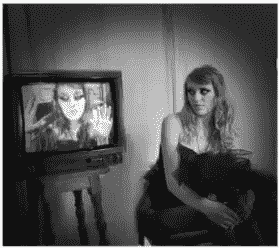
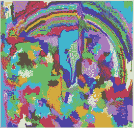
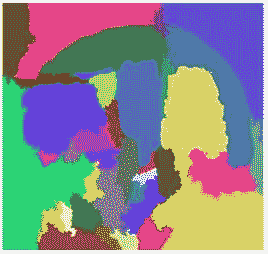
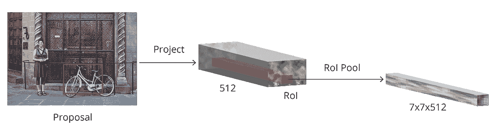

# RCNN 完全指南

> 原文：<https://medium.com/analytics-vidhya/a-complete-guide-to-rcnn-2dc92c00243f?source=collection_archive---------14----------------------->

**原 RCNN:** 区域 CNN 的概念是 Girshick 在他的论文中给出的[12]。
原始 RCNN 的算法工作如下:

1.  输入图像。
2.  使用选择性搜索算法提取潜在目标区域。
3.  将学习特征提取转移到计算特征。
4.  将它们分类。

原始 CNN 的问题是它非常慢，并且没有使用深度神经网络进行分类。

**选择性搜索:** 基本上有 4 个区域组成一个物体:变化的尺度、颜色、
纹理和包围。选择性搜索识别图像中的这些模式，并在此基础上提出各种区域。流程工作如下:
1 .拍摄输入图像

2.生成初始子分割，以便我们在图像中有多个区域。

3.然后组合相似的区域以形成更大的区域(基于颜色
相似性、纹理、大小和形状)。

4.把这个发给康文网。

**快速 RCNN:**
使用 RPN 的概念来预测潜在区域的位置。
流程如下:
1。区域建议(我们将在更快的 RCNN 部分简要讨论)
2。特征提取
3。计算包围盒坐标
4。提供类别标签

**更快的 RCNN:**
是由提出上述两种方法的 Girshick [8]提出的。
其架构由以下组件组成:

1.  *基本网络*:在 ImageNet 数据集上预训练的 CNN。我们使用 ResNetor MobileNet 作为基础网络，而原始文件使用 VGG 网络。这里我们简单地通过使用全卷积深度神经网络来提取特征图。我们将完全连接的网络从
    架构中移除。这里我们的主要目的是获得特征图。然后，区域建议网络和 ROI 汇集模块使用特征
    图。
2.  *锚盒*:锚是物体
    检测中使用最多的技术之一。使用不同形状的盒子来检测同一网格中的不同对象。输出 y 的形状与我们输出中的所有锚盒一致。创建锚点始于每 r 个像素对图像坐标进行采样的过程[在最初的快速 RCNN 纸中 r = 16。例如，我们可以创建以每个采样(x，y)坐标为中心的九个锚点。这里的九个锚点是 64 x 64、128 x 128 和 256 x 256 的组合，长宽比为 1:1、2:1、1:2。这里，仅使用锚点的问题是，如果我们在 600 x 800 的图像上使用 16 像素的步幅，我们将获得总共 1989 个位置。在 1989 个位置的每个位置周围有 9 个锚，我们总共有 1989 x 9 = 17901 个边界框位置供 CNN 评估。
3.  *区域提议网络*:如果生成锚点的目标是在对象的所有可能的尺度和尺寸上获得良好的
    覆盖，
    区域提议网络的目标是将边界框的数量削减到
    可管理的大小。接受锚点并预测其客观分数。
    涉及将 ROI 标记为前景或背景。前景锚定被提前发送，而背景锚定被丢弃。两条并行路径中的 RPN 输出。RPN 的第一个输出是指示图像是背景还是前景的分数。对于 k 个锚，我们有 2k 个输出。第二个输出是我们的边界框回归器，用于调整锚点以更好地适应对象。这是通过 1 x 1 卷积实现的。对于 k 个滤波器，输出为 4k 体积，提供 4 个δx、δy、δh、δw 值。此外，我们应用非最大抑制来减少要传递给 ROI 合并模块的位置数量。然后，我们选择前 N 名提案。Girshick 使用 N = 2000。所以总结一下 RPN 的训练:

    a .把我们的主播分为后台和前台。
    b .保持两个
    c .两个损失函数:一个测量前景
    相对于背景的准确度，第二个损失函数用于我们的边界框
    回归，其仅在我们的前景锚上操作。
4.  *ROI 合并模块*:ROI 合并模块的主要目标是取所有 N 个
    提案位置，然后从 conv
    特征图中提取相应的 ROI 特征。ROI 汇集模块然后将 ROI 的
    提取特征的尺寸调整为 7 x 7 x D。该固定尺寸为两个即将到来的 FC 层准备
    特征。其功能如下:
    a .使用数组切片从特征图中提取相应的面片
    。
    b .将其大小调整为 14 x 14 x D 其中 D 是特征图的深度。
    c .应用 2 x 2 步幅的最大池，产生 7 x 7 x D 特征
    矢量。

最终的特征向量然后被馈送到基于区域的 CNN，用于最终的
边界框。

5.*基于区域的卷积神经网络*:该模块有两个
用途。一个是基于来自 ROI 合并模块的裁剪特征 mp 获得每个边界框位置
的最终类别标签。进一步优化
边界框预测(x，y)坐标，以获得更高的精确度。通过两个完全连接的网络实现
。这里的额外节点是背景。第二个
FC 为每个类别提供了 4 个增量值。这两个输出意味着我们将采用
两个损失函数，一个分类交叉熵用于分类，平滑
L1 损失用于回归。最后一步是对我们的边界框应用非最大抑制类别
。我们可以依次训练 RPN 和 RCNN，或者
将所有四个损失函数组合起来，一起训练。一般来说，将他们一起训练效果会更好。

**总结更快的 RCNN:**
1 .用于特征提取的基网络。
2。RPN 接受锚点集合，并输出它认为对象在图像中的位置的建议。
3。然后使用 ROI 池从每个建议中提取特征图。
4。最后，基于区域的 RCNN 获得最终类别标签，并进一步细化
建议位置以获得更好的准确性。

**参考文献**

[1]吴恩达。卷积神经网络，deeplearning.ai。
[2]皮埃尔·塞尔马内，大卫·艾根。过吃:使用卷积网络的综合识别、定位和
检测。
【3】约瑟夫·雷德蒙，桑托什·迪夫瓦拉，罗斯·吉尔希克。你只看一次:
统一的，实时的物体检测。
【4】IOU-
[https://www . pyimagesearch . com/2016/11/07/intersection-over-union-IOU-for-ob](https://www.pyimagesearch.com/2016/11/07/intersection-over-union-iou-for-ob)
object-detection/
【5】Saptarshi Chakraborty，Dhrubajyoti Das。活性检测综述。
【6】LBP-
[https://www . pyimagesearch . com/2015/12/07/local-binary-patterns-with-python-openc](https://www.pyimagesearch.com/2015/12/07/local-binary-patterns-with-python-openc)
v/
【7】RCNN-
[https://www . analyticsvidhya . com/blog/2018/11/implementation-faster-r-CNN-python-object-d](https://www.analyticsvidhya.com/blog/2018/11/implementation-faster-r-cnn-python-object-d)
etection/。更快的 R-CNN:走向实时-
用区域建议网络进行实时目标检测。
【9】阿德里安·罗斯布鲁克。用 Python 进行计算机视觉的深度学习
【10】mogel mose A，Trivedi MM，Moeslund TB。智能驾驶辅助系统的基于视觉的交通标志检测和
分析:前景和调查。
【11】Lin，Tsung-Yi 等.微软 coco:上下文中的常见对象
【12】Ross Girshick，Jeff Donahue，Trevor Darrell，Jitendra Malik 用于精确对象检测和语义分割的丰富特征层次