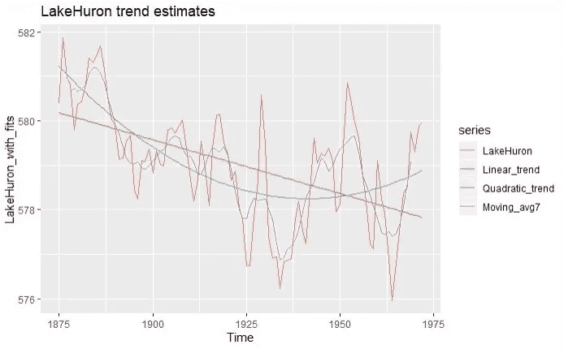

# 时间序列分析完全介绍(附 R)

> 原文：<https://medium.com/analytics-vidhya/a-complete-introduction-to-time-series-analysis-with-r-9882f2d44c9d?source=collection_archive---------12----------------------->

休伦湖(1875-1972)数据的多重趋势估计。

在 Covid19 疫情期间，你可能听说过利用时间序列分析预测新 Covid19 病例的合作努力(如果你还没有，请查阅这篇精彩的文章:[https://towards data science . com/forecasting-新冠肺炎-印度病例-c1c410cfc730](https://towardsdatascience.com/forecasting-covid-19-cases-in-india-c1c410cfc730) )。事实上，我们很多人都知道时间序列分析在现代生活中的重要性:天气…