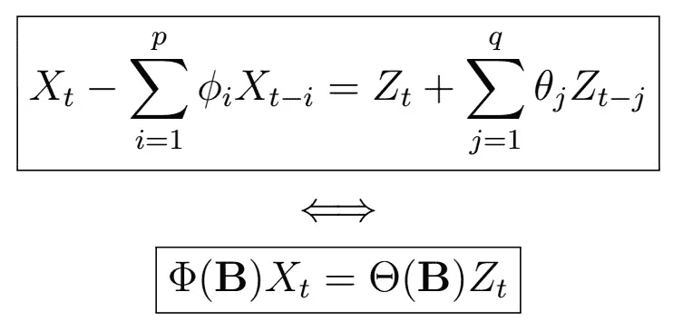

# 时间序列分析完全介绍(附 R):ARMA 过程(第一部分)

> 原文：<https://medium.com/analytics-vidhya/a-complete-introduction-to-time-series-analysis-with-r-arma-processes-part-i-f7fba4586ece?source=collection_archive---------14----------------------->

或许最著名和研究最深入的处理时间序列的方法之一，是 ARMA(p，q)模型及其衍生模型，至今仍被广泛使用。正如您所猜测的，这些基本上引入了我们之前看到的 AR(1)和 MA(1)过程的推广。在我们开始之前，让我们介绍一些有用的操作符，它们将…