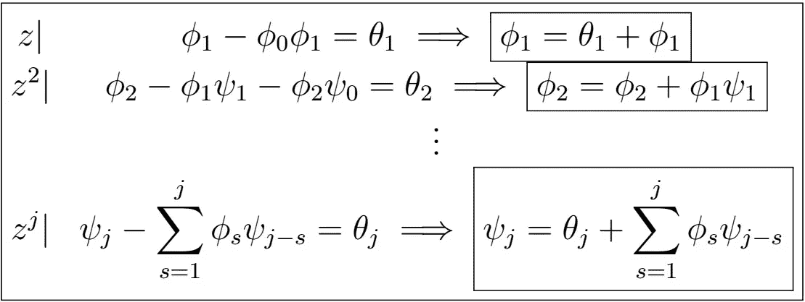

# 时间序列分析完全介绍(附 R):ARMA 过程(第二部分)

> 原文：<https://medium.com/analytics-vidhya/a-complete-introduction-to-time-series-analysis-with-r-arma-processes-part-ii-85a6bb5becae?source=collection_archive---------7----------------------->

ARMA(p，q)过程的因果表示的系数由上述递推关系给出。

在[的上一篇文章](/@hair.parra/a-complete-introduction-to-time-series-analysis-with-r-arma-processes-part-i-f7fba4586ece)中，我们看到一般的 **ARMA(p，q)** 过程可以借助自回归和移动平均算子写成