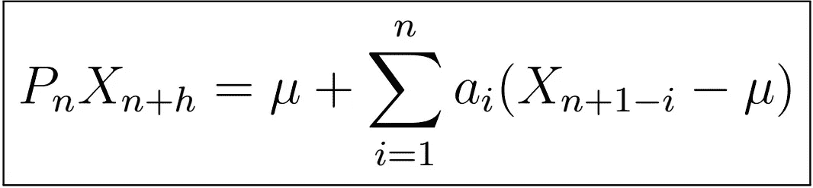

# 时间序列分析完全介绍(附 R):最佳线性预测器(上)

> 原文：<https://medium.com/analytics-vidhya/a-complete-introduction-to-time-series-analysis-with-r-best-linear-predictor-part-i-e4e7b547e42c?source=collection_archive---------13----------------------->

最佳线性预测的形式

在本系列文章的第五章中，我们发现 *n+h* -th 滞后的**最佳预测值是由给定 *X_{n}* 的条件期望 *X_{n+h}* 给出的，即**

或者扩展到使用所有观测值 *X_{1}，X_{2}，…，X_{n}，*我们可以通过给定 *X_{1}，…，X_{n}* …，X _ { n }*X _ { n+h }*的条件期望来预测