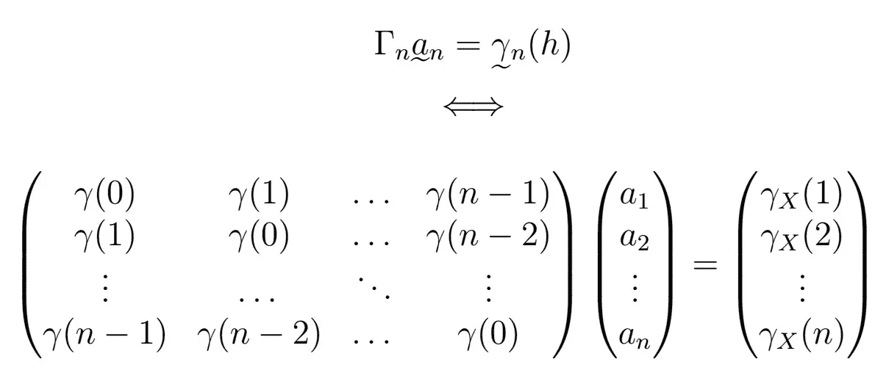

# 时间序列分析完全介绍(附 R):最佳线性预测器(第二部分)

> 原文：<https://medium.com/analytics-vidhya/a-complete-introduction-to-time-series-analysis-with-r-best-linear-predictor-part-ii-3b9719010a59?source=collection_archive---------13----------------------->

最佳线性预测器的系数满足这个方程。

在上一篇文章中，我们看到使用所有之前的观测值直到 *n* 的 *X_{n+h}* 的**最佳线性预测值**具有以下形式

或者，包括(不一定)零均值:

其中，其系数满足

为