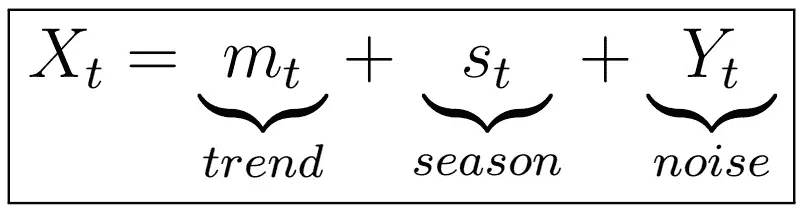

# 时间序列分析完全介绍(附 R):经典分解模型第一部分

> 原文：<https://medium.com/analytics-vidhya/a-complete-introduction-to-time-series-analysis-with-r-classical-decomposition-model-a4548a0c99b9?source=collection_archive---------7----------------------->

在最后一章中，我们研究了平稳过程的定义以及几个重要的例子:IID 噪声、白噪声、随机游动、AR(1)和 MA(1)过程，以及它们各自的期望和自协方差函数。我们现在将切换到我们前一段时间看到的…