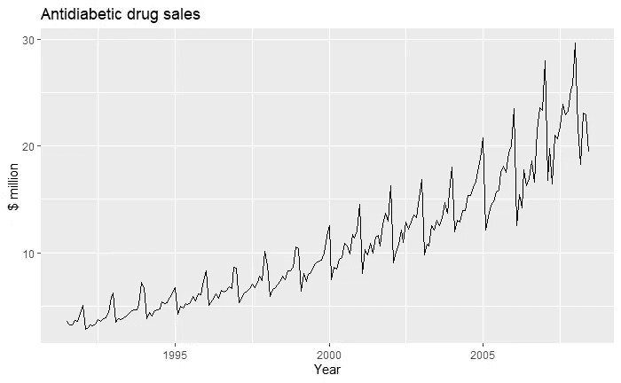

# 时间序列分析完全介绍(附 R):经典分解模型第二部分

> 原文：<https://medium.com/analytics-vidhya/a-complete-introduction-to-time-series-analysis-with-r-classical-decomposition-model-part-ii-aa43b524680d?source=collection_archive---------20----------------------->

抗糖尿病药物的销售数据显示了一个明显的模式:到每年年底，抗糖尿病药物的销售都会激增。也许这些圣诞糖果和饼干是罪魁祸首！

[在上一篇文章](/analytics-vidhya/a-complete-introduction-to-time-series-analysis-with-r-classical-decomposition-model-a4548a0c99b9)中，我们介绍了经典的分解模型，并对**趋势估计、**进行了全面的讨论，特别是使用了**移动平均滤波器**。这一次，我们将讨论最后缺失的部分:**季节性。**

## 估计季节性