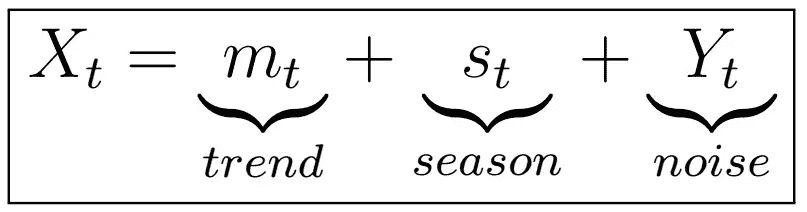

# 时间序列分析完全介绍(带 R)::差分

> 原文：<https://medium.com/analytics-vidhya/a-complete-introduction-to-time-series-analysis-with-r-differencing-db94bc4df0ae?source=collection_archive---------9----------------------->

对时间序列应用差分可以删除趋势和季节成分

在[的最后两篇文章](https://medium.com/p/a4548a0c99b9/edit)中，我们研究了**经典分解模型**，它允许我们以如下方式解释我们的时间序列:

