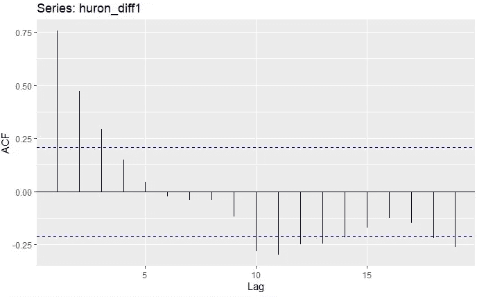

# 时间序列分析完全介绍(带 R):估计自相关

> 原文：<https://medium.com/analytics-vidhya/a-complete-introduction-to-time-series-analysis-with-r-estimating-autocorrelation-8271448937c2?source=collection_archive---------22----------------------->

过度差分湖休伦系列数据。理想情况下，平稳序列应该在置信界限内具有最大的滞后。

在上一篇文章中，我们回顾了自协方差函数的几个重要属性，在之前的文章中，我们多次使用了`ggAcf`和`ggPacf`函数来分别绘制 ACF 和 PACF。但是这些实际上是如何估计的呢？我们如何知道它们被正确地估计了(希望不要太…