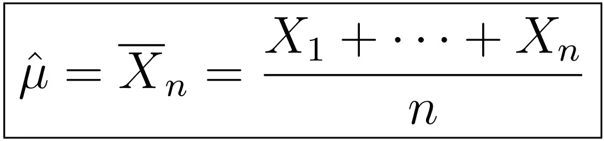

# 时间序列分析完全介绍(带 R)::μ(均值)的估计

> 原文：<https://medium.com/analytics-vidhya/a-complete-introduction-to-time-series-analysis-with-r-estimation-of-mu-mean-cc262c3af459?source=collection_archive---------10----------------------->

样本均值

当然，我们在统计学中经常问的第一个问题是:“趋势/均值是什么？”或者“这平均表现如何”？在本文中，我们考虑估计趋势的问题，以及它的统计特性。“何必呢？”—你可能会问。通过了解它的基本统计性质，如**偏倚**和**一致性，**我们有一个…