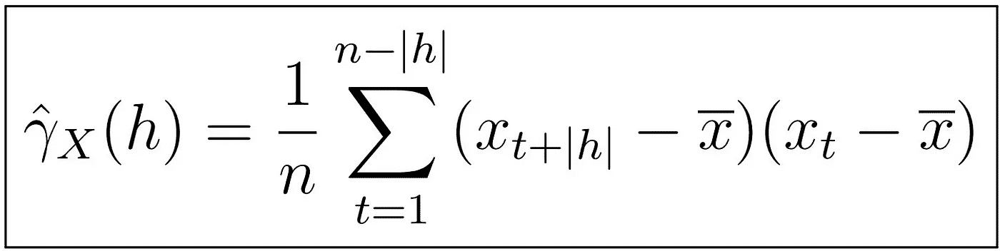

# 时间序列分析的完整介绍(附 R):ACF 的估计

> 原文：<https://medium.com/analytics-vidhya/a-complete-introduction-to-time-series-analysis-with-r-estimation-of-the-acf-96291759b488?source=collection_archive---------5----------------------->

自协方差函数的样本估计

[上次](/@hair.parra/a-complete-introduction-to-time-series-analysis-with-r-estimation-of-mu-mean-cc262c3af459)，我们看到了如何估计任何时间序列的趋势以及有意义的统计属性，如无偏性和方差。这一次，我们将着手对 ACVF 和 ACF 进行可靠的统计估计。

## 样本 ACVF 和样本 ACF 的渐近行为