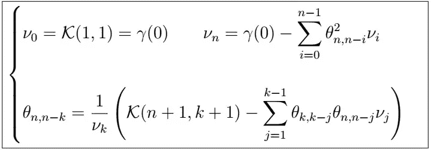

# 时间序列分析完全介绍(附 R):新息算法

> 原文：<https://medium.com/analytics-vidhya/a-complete-introduction-to-time-series-analysis-with-r-innovations-algorithm-1f1e72fc4061?source=collection_archive---------7----------------------->

新息算法递归计算

在上一篇文章中，我们深入研究了著名的 Durbin-Levinson 算法，该算法允许我们递归计算由下式给出的最佳线性预测器的系数

满足以下条件