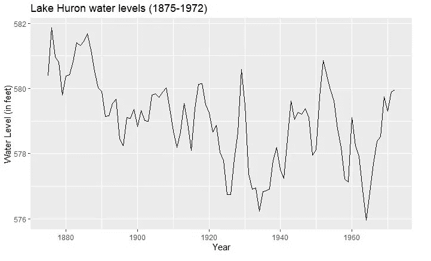

# 时间序列分析完全介绍(附 R)::简介

> 原文：<https://medium.com/analytics-vidhya/a-complete-introduction-to-time-series-analysis-with-r-introduction-eef74f8f2ab3?source=collection_archive---------22----------------------->

让我们首先考虑下面这张漂亮的图表

你能看见什么？嗯…如果我是你，真的不会太多。也许你会看到，总的来说，分数似乎随着时间的推移而减少。你可能还会注意到这里和那里有一堆峰值。但是这些意味着什么呢？